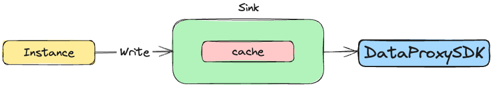
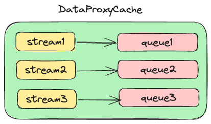
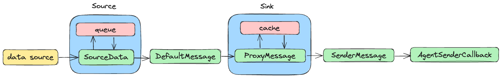

## 概述
本文主要介绍 Agent 数据在子模块间流转以及对应的数据结构。
## 数据流转


在 Agent 模块介绍时我们知道 Agent 中有 Source 和 Sink 模块，其中 Source 负责从数据源采集数据；Sink 负责将数据发送到下游，当
前我们认为下游只有 DataProxy；Instance 则是负责将数据从 Source 搬运到 Sink。
## 数据格式
### Source


Source 主要有 3 个功能：

- 从数据源采集数据，每条数据填充到一个新的 SourceData 对象。

- 将填充完成的 SourceData 对象放入 Source 模块的缓存队列中。

- 外部调用 Source 模块 Read 方法时从缓存队列中取出一个 SourceData 组装成 Message 并返回。
#### SourceData
```java 
public class SourceData {
    private byte[] data;
    private String offset;
}
```
从数据源采集的数据可能会有各种各样的格式，因此我们用 byte[] 来存放（原始数据在后续各个环节流转时均保持 byte[]）。同时每一条数据都会有对应的位点信息，
并且由于位点信息多种多样，我们用 String 来存放位点信息。
#### 缓存队列
顾名思义，我们将 SourceData 放到 Queue 中以达到缓存的目的，这样可以解决数据源和 Agent 内部处理速度不匹配的问题。Queue 类
型是 LinkedBlockingQueue，防止多线程访问出现问题，由于是纯内存操作，可以保证性能。
#### Message 
```java
public interface Message {

    byte[] getBody();
    Map<String, String> getHeader();
}
```
Source 提供的 Read 方法返回类型是 Message，具体实现如下：
```java
public class DefaultMessage implements Message {

    private final byte[] body;
    protected final Map<String, String> header;
    
    ...
}
```
上文说过，Message 是由 SourceData 来填充，具体情况是 DefaultMessage::body 由 SourceData::data 来填充；DefaultMessage
::header 由 SourceData::offset 以及其他属性一起填充，每种属性都是 DefaultMessage::header 的一个 k/v 对。一般我们还会在这
里填充这条消息的 inlongStreamId。
### Instance
Instance 主要功能是从 Source 取出 Message 然后写入到 Sink，过程中并没有产生新的数据格式。
### Sink


当前我们的实现里 Sink 可以认为只有一种类型，那就是 DataProxy Sink。DataProxy Sink 主要有 4 个功能：

- 外部调用 Write 方法将 Message 类型数据写入到 DataProxy Sink，方法内部用 Message 填充 ProxyMessage。

- 将 ProxyMessage 放入 ProxyMessageCache 中，ProxyMessageCache 会将不同 inlongStreamId 的 ProxyMessage 分开存放。

- 从 cache 中获取 SenderMessage（由多个 ProxyMessage 构成），并调用 SenderManager::sendBatch 进行发送。

- SenderManager 接收到 SenderMessage 后构造 DataProxy SDK 方法所需回调对象 AgentSenderCallback 进行异步发送。

#### ProxyMessage
```java
public class ProxyMessage implements Message {

    private final byte[] body;
    private final Map<String, String> header;
    OffsetAckInfo ackInfo;
```
ProxyMessage 的 body 与 header 都是从 Message 复制而来。另外，新增 ackInfo 用于记录发送情况：
```java
public class OffsetAckInfo {

    private String offset;
    private int len;
    private Boolean hasAck;
}
```
其中 offset 来自于 Message::header；len 来自于 Message::body 的 len；hasAck 则是标识该信息是否发送成功，初始化为 false。
#### ProxyMessageCache


填充完成的 ProxyMessage 首先会放到 ProxyMessageCache：
```java
public class ProxyMessageCache {

    private final String taskId;
    private final String instanceId;
    private final int maxPackSize;
    private final int maxQueueNumber;
    private final String groupId;
    // streamId -> list of proxyMessage
    private final ConcurrentHashMap<String, LinkedBlockingQueue<ProxyMessage>> messageQueueMap;
    private long dataTime;
}
```
ProxyMessageCache 的核心属性是 messageQueueMap，其 key 是 inlongStreamId，value 是一个队列。除此之外 ProxyMessageCache 
会通过 fetchSenderMessage 方法返回 SenderMessage，SenderMessage 由多个 ProxyMessage 构成，这样就可以批量发送数据。
#### SenderMessage
```java
public class SenderMessage {

    private List<byte[]> dataList;
    private Map<String, String> extraMap;
    private List<OffsetAckInfo> offsetAckList;
}
```

SenderMessage 在 ProxyMessageCache 内部构建，由多个相同 inlongStreamId 的 ProxyMessage 组成：

- dataList 则由多个 ProxyMessage::body 填充；

- extraMap 包含了审计版本、预定义字段（从任务配置里获取）；

- offsetAckList 由多个 ProxyMessage::ackInfo 填充；
#### SenderManager
SenderManager 内部直接调用 DataProxy SDK 进行数据发送，需要 3 个核心参数：
- 原始数据内容
- 扩展属性
- 回调对象
其中原始数据内容由 dataList 提供；扩展属性由 extraMap 提供；回调内容则需要构造 AgentSenderCallback 来提供：
```java
private class AgentSenderCallback implements SendMessageCallback {

    private final SenderMessage message;
  
    AgentSenderCallback(SenderMessage message, int retry) {
        this.message = message;
    }

    @Override
    public void onMessageAck(SendResult result) {
    ...
    }
}
```
回调对象 onMessageAck 方法会携带发送结果，返回成功后遍历 SenderMessage::offsetAckList，将 OffsetAckInfo::hasAck 设
置成 true。
## 总结
数据在 Agent 内部从数据源到 DataProxy SDK 经过如下数据结构：



上面介绍的各个数据类型中我们可以看到，各个结构的原始数据内容都是用 byte[] 来存放。一方面可以保留原始数据信息不受编码格式影响，另一方面也是可
以减少字符串转换的开销使得整体效率更高。
