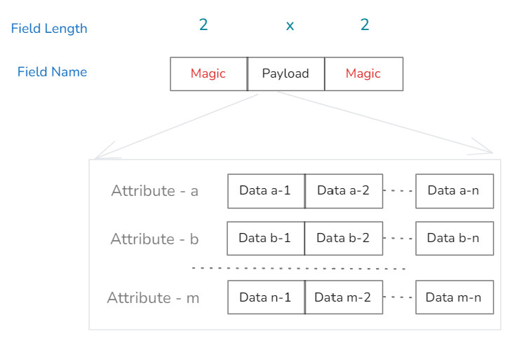

import {siteVariables} from '../../version';

## 概述

用户通过 SDK、HTTP、Agent 等数据上报方式将数据上报到 InLong 系统，InLong 的 DataProxy 组件将接收到的数据打包成 `InLongMsg` 格式并存储到 MQ 消息的消息体里。用户从 MQ 消费数据后需要按照 `InLongMsg` 格式解码才能获得原始上报数据。本文主要介绍 `InLongMsg` 格式的数据结构，以及用户收到这类数据后如何解析。

## InLongMsg 数据格式

### 格式框架

InLongMsg 是自定义格式的二进制数据包，由前后各 2 个字节的相同魔术数字（Magic）封装带格式的承载（Payload）信息组成，如下图示：



Magic 字段在 InLongMsg 的当前实现里一共有 4 个有效值，分别标识 Payload 部分可携带的 4 种不同的数据版本（MAGIC0 为无效值）：

```java
private static final byte[] MAGIC0 = {(byte) 0xf, (byte) 0x0};
private static final byte[] MAGIC1 = {(byte) 0xf, (byte) 0x1};
private static final byte[] MAGIC2 = {(byte) 0xf, (byte) 0x2};
private static final byte[] MAGIC3 = {(byte) 0xf, (byte) 0x3};
private static final byte[] MAGIC4 = {(byte) 0xf, (byte) 0x4};
```
Payload 部分根据上述 Magic 字段的定义携带对应格式的数据内容，这些内容不论采用什么样的格式最终都映射为用户按照 {属性集合，单条数据}，或者 {属性集合，多条数据} 上报的原始数据信息。

接下来我们按照不同的 Magic 版本值介绍对应的 Payload 定义。

### InLongMsg V1

对于 InLongMsg V1 格式 Magic 字段值为 0x0f01，在该值时 Payload 部分格式如下图所示：


其中：

- CreatTime: 字段标识该条 InLogMsg 消息的构造时间;

- AttrDataCnt: 字段标识该条消息里携带了多少个 {属性，数据} 对;
  
AttrDataCnt 接下来的信息则逐条存储 {属性，数据} 对信息

- AttrLen, AttrData: 字段定义属性信息的长度及值；

- ItemsLen: 字段标识该属性包含的整个数据长度信息，该字段包含接下来的 Compress 字段长度信息；

- Compress: 字段标识紧接着的数据部分是否被压缩，如果被压缩则解压后按照接下来的格式进行组织，InLongMsg 目前仅支持 Snappy 数据压缩方式；

由于属性携带的数据可能是多条，因而数据部分要支持多条数据的情况：

- ItemLen: 字段标识该项数据的长度；

- ItemData: 字段标识数据值。

### InLongMsg V2

对于 InLongMsg V2 格式 Magic 字段值为 0x0f02，在该值时 Payload 部分格式如下图所示：


相比 InLongMsg V1 格式，InLongMsg V2 格式除了新增的 MsgCnt、ItemCnt 字段外，其他字段含义与 V1 格式定义相同：

- MsgCnt: 用来标识该消息携带的数据总条数；

- ItemCnt：用来标识该 {属性，数据} 对信息里总数据个数。

### InLongMsg V3

对于 InLongMsg V3 格式 Magic 字段值为 0x0f03，在该值时 Payload 部分格式如下图所示：


相比 InLongMsg V1 和 V2 格式，InLongMsg V3 格式主要解决 {属性集合，多条数据} 对信息里，每条数据携带私有属性的数据上报情况，在 V3 格式定义里通过在每个数据部分增加数据私有属性字段来完成，具体如下：

- RecordLen：用来标识单项数据记录总长度；

- IAttrLen：用来标识单项数据携带的私有属性长；

- IitemAttr：用来标识单项数据携带的私有属性数据值。


### InLongMsg V4

对于 InLongMsg V4 格式 Magic 字段值为 0x0f04，在该值时 Payload 部分格式如下图所示：


相比之前的 InLongMsg V1，V2，V3 格式定义，InLongMsg V4 有 2 点改进：

1. 将公共属性里的固定字段从属性键值对里抽取出来以固定字段形式保存，从而减小总的消息长度；

2. 通过将部分固定字段的不同位携带不同的值标识不同的功能开启或类型定义。

相关字段定义如下：

- TotalLen：标识整个消息总长度；

- MsgType：该字段是一个复合字段，标明消息的类型和压缩类型。其中低 5 位表示消息类型，高 3 位表示压缩方式，不同位标识不同含义；

- GroupId：标识 group 对应的 ID 值，传递数字 group 信息时使用；

- StreamId：标识 stream 对应的 ID 值，传递数字 stream 信息时使用；

- ExtField：标识扩展功能启用字段，用来传递消息启用的扩展功能，不同位标识不同含义，具体参见 ExtField 各位定义表；

- DataTime：标识数据时间，精度秒；

- MsgCnt：标识携带的消息总条数；

- UniqueId：标识消息 8 字节 long 型的唯一标记；

- BodyLen：标识消息体总长度，标识接下来的二进制消息体数据长度；

- BodyData：标识该消息携带的二进制消息内容;

- AttrLen：标识属性长度；

- AttrData：标识属性值内容。
  
对于 ExtField 字段，各位定义如下：

| 位 | 含义                  | 备注             |
|---|---------------------|----------------|
| 0 | 保留                  |                |
| 1 | 每个数据是否包含私有属性        | 1 标识包含，0 标识不包含 |
| 2 | 是否启用数字 group，stream | 0 标识启用，1 标识不启用 |
| 3 | 保留                  |                |
| 4 | 保留                  |                |
| 5 | 多条数据是否启用按换行符分隔      | 1 标识启用，0 标识不启用 |
| 6 | 保留                  |                |
| 7 | 保留                  |                |


对于 BodyData 字段值，其格式如下：


- ItemLen：标识数据长度；

- ItemData：标识数据值；

- IAttrLen：标识私有属性长度；

- IitemAttr：标识私有属性值。


## 解析 InLongMsg 类型的消息

直接从 InLong 的消息队列（InLong TubeMQ 或 Pulsar)消费数据，需要先对`InLongMsg` 进行解析。可通过以下方式可以解析出源数据。

### 增加 maven 依赖

```xml
<dependency>
    <groupId>org.apache.inlong</groupId>
    <artifactId>inlong-common</artifactId>
    <version>${siteVariables.inLongVersion}</version>
</dependency>
```

### 增加解析逻辑

```java
public static List<byte[]> parserInLongMsg(byte[] bytes) {
    List<byte[]> originalContentByteList = new ArrayList<>();
    InLongMsg inLongMsg = InLongMsg.parseFrom(bytes);
    Set<String> attrs = inLongMsg.getAttrs();
    if (CollectionUtils.isEmpty(attrs)) {
        return originalContentByteList;
    }
    for (String attr : attrs) {
        if (attr == null) {
            continue;
        }
        Iterator<byte[]> iterator = inLongMsg.getIterator(attr);
        if (iterator == null) {
            continue;
        }
        while (iterator.hasNext()) {
            byte[] bodyBytes = iterator.next();
            if (bodyBytes == null || bodyBytes.length == 0) {
                continue;
            }
            // 上报方发送的原始用户数据
            originalContentByteList.add(bodyBytes);
        }
    }
    return originalContentByteList;
}
```