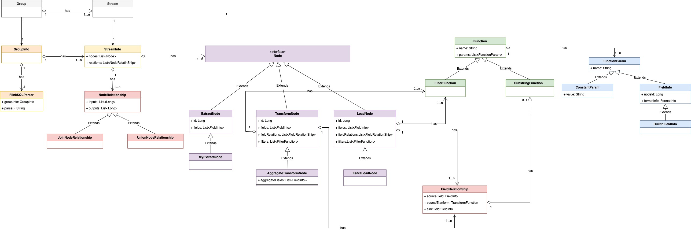

# Sort 扩展 Connector

## 总览

InLong Sort 是一个基于 Apache Flink SQL 的 ETL 服务。Flink SQL 强大的表达能力带来的高可扩展性、灵活性，基本上 Flink SQL 支持的语意，InLong Sort 都支持。
当 Flink SQL 内置的函数不满足需求时，还可通过 UDF 来扩展。这对于曾经使用过 SQL 尤其是 Flink SQL 的开发者非常友好。

本文介绍如何在 InLong Sort 中扩展一个新的 source（在 InLong 中抽象为 Extract Node）或一个新的 sink（在InLong中抽象为 Load Node ）。
InLong Sort 架构的 UML 对象关系图如下：



其中各个组件的概念为：

| **名称**          | **描述**                                                   |
| ----------------- | --------------------------------------------------------- |
| Group             | 数据流组，包含多个数据流，一个 Group 代表一个数据接入             |
| Stream            | 数据流，一个数据流有具体的流向                                 |
| GroupInfo         | Sort 中对数据流向的封装，一个 GroupInfo 可包含多个 DataFlowInfo |
| StreamInfo        | Sort 中数据流向的抽象，包含该数据流的各种来源、转换、去向等        |
| Node              | 数据同步中数据源、数据转换、数据去向的抽象                       |
| ExtractNode       | 数据同步的来源端抽象                                         |
| TransformNode     | 数据同步的转换过程抽象                                       |
| LoadNode          | 数据同步的去向端抽象                                         |
| NodeRelationShip  | 数据同步中各个节点关系抽象                                    |
| FieldRelationShip | 数据同步中上下游节点字段间关系的抽象                            |
| FieldInfo         | 节点字段                                                   |
| MetaFieldInfo     | 节点 Meta 字段                                             |
| Function          | 转换函数的抽象                                              |
| FunctionParam     | 函数的入参抽象                                              |
| ConstantParam     | 常量参数                                                   |


## 扩展 Extract & Load Node

Extract 节点是基于 <a href="https://flink.apache.org/">Apache Flink<sup>®</sup></a> 的
Source Connectors 用于从不同的源系统抽取数据。
Load 节点是基于 <a href="https://flink.apache.org/">Apache Flink<sup>®</sup></a> 的 Sink
Connectors 用于将数据加载到不同的存储系统。

Apache InLong Sort 启动时通过将一组 Extract 和 Load Node 配置翻译成对应的 Flink SQL 并提交到 Flink
集群，拉起用户指定的数据抽取和入库任务。

### 增加 Extract & Load Node 定义

自定义 `Extract Node` 需要继承 `org.apache.inlong.sort.protocol.node.ExtractNode`
类，自定义 `Load Node` 需要继承 `org.apache.inlong.sort.protocol.node.LoadNode` 类，
两者都至少需要选择性实现 `org.apache.inlong.sort.protocol.node.Node` 接口中的方法

| 方法名                | 含义               | 默认值                      |
|--------------------|------------------|--------------------------|
| getId              | 获取节点ID           | Inlong StreamSource Id   |
| getName            | 获取节点名            | Inlong StreamSource Name |
| getFields          | 获取字段信息           | Inlong Stream 定义的字段      |
| getProperties      | 获取节点额外属性         | 空 Map                    |
| tableOptions       | 获取 Flink SQL 表属性 | 节点额外属性                   |
| genTableName       | 生成 Flink SQL 表名  | 无默认值                     |
| getPrimaryKey      | 获取主键             | null                     |
| getPartitionFields | 获取分区字段           | null                     | 

### 扩展 ExtractNode
扩展一个 ExtractNode 分为三个步骤：

**第一步**：继承 ExtractNode 类，类的位置在:
```bash
inlong-sort/sort-common/src/main/java/org/apache/inlong/sort/protocol/node/ExtractNode.java
```
在实现的 ExtractNode 中指定 connector；

```java
// 继承 ExtractNode 类，实现具体的类，例如 MongoExtractNode
@EqualsAndHashCode(callSuper = true)
@JsonTypeName("MongoExtract")
@Data
public class MongoExtractNode extends ExtractNode implements Serializable {
    @JsonInclude(Include.NON_NULL)
    @JsonProperty("primaryKey")
    private String primaryKey;
    ...

    @JsonCreator
    public MongoExtractNode(@JsonProperty("id") String id, ...) { ... }

    @Override
    public Map<String， String> tableOptions() {
        Map<String， String> options = super.tableOptions();
      	// 配置指定的 connector，这里指定的是 mongodb-cdc
        options.put("connector", "mongodb-cdc");
        ...
        return options;
    }
}
```

**第二步**：在 ExtractNode 和 Node 中的 JsonSubTypes 添加该 Extract

```java
// 在 ExtractNode 和 Node 的 JsonSubTypes 中添加字段
...
@JsonSubTypes({
        @JsonSubTypes.Type(value = MongoExtractNode.class， name = "mongoExtract")
})
...
public abstract class ExtractNode implements Node{...}

...
@JsonSubTypes({
        @JsonSubTypes.Type(value = MongoExtractNode.class， name = "mongoExtract")
})
public interface Node {...}
```

**第三步**：扩展 Sort Connector，查看此（`inlong-sort/sort-connectors/mongodb-cdc`）目录下是否已经存在对应的 connector。如果没有，则需要参考 Flink 官方文档 [DataStream Connectors ](https://nightlies.apache.org/flink/flink-docs-release-1.13/docs/connectors/datastream/overview/#datastream-connectors) 来扩展，
调用已有的 Flink-connector（例如`inlong-sort/sort-connectors/mongodb-cdc`）或自行实现相关的 connector 均可。

### 扩展 Load Node

扩展一个 LoadNode 分为三个步骤：

**第一步**：继承 LoadNode 类，类的位置在:
```bash
inlong-sort/sort-common/src/main/java/org/apache/inlong/sort/protocol/node/LoadNode.java
```
在实现的LoadNode 中指定 connector；

```java
// 继承 LoadNode 类，实现具体的类，例如 KafkaLoadNode
@EqualsAndHashCode(callSuper = true)
@JsonTypeName("kafkaLoad")
@Data
@NoArgsConstructor
public class KafkaLoadNode extends LoadNode implements Serializable {
    @Nonnull
    @JsonProperty("topic")
    private String topic;
    ...

    @JsonCreator
    public KafkaLoadNode(@Nonnull @JsonProperty("topic") String topic, ...) {...}

    // 根据不同的条件配置使用不同的 connector
    @Override
    public Map<String， String> tableOptions() {
        ...
        if (format instanceof JsonFormat || format instanceof AvroFormat || format instanceof CsvFormat) {
            if (StringUtils.isEmpty(this.primaryKey)) {
                // kafka connector
                options.put("connector", "kafka");
                options.putAll(format.generateOptions(false));
            } else {
                // upsert-kafka connector
                options.put("connector", "upsert-kafka");
                options.putAll(format.generateOptions(true));
            }
        } else if (format instanceof CanalJsonFormat || format instanceof DebeziumJsonFormat) {
            // kafka-inlong connector
            options.put("connector", "kafka-inlong");
            options.putAll(format.generateOptions(false));
        } else {
            throw new IllegalArgumentException("kafka load Node format is IllegalArgument");
        }
        return options;
    }
}
```

**第二步**：在 LoadNode 和 Node 中的 JsonSubTypes 添加该 Load

```java
// 在 LoadNode 和 Node 的 JsonSubTypes 中添加字段
...
@JsonSubTypes({
        @JsonSubTypes.Type(value = KafkaLoadNode.class, name = "kafkaLoad")
})
...
public abstract class LoadNode implements Node{...}

...
@JsonSubTypes({
        @JsonSubTypes.Type(value = KafkaLoadNode.class, name = "kafkaLoad")
})
public interface Node {...}
```

**第三步**：扩展 Sort Connector，Kafka 的 sort connector 在 `inlong-sort/sort-connectors/kafka` 目录下。

### 集成到 Entrance

将 Extract 和 Load 集成到 InLong Sort 主流程中。
InLong Sort 的入口类在:
```bash
inlong-sort/sort-core/src/main/java/org/apache/inlong/sort/Entrance.java
```

Extract 和 Load 如何集成至 InLong Sort，可参考下面的 UT，首先构建对应的 ExtractNode、LoadNode，再构建 NodeRelation、StreamInfo、GroupInfo，最后通过 FlinkSqlParser 执行。

```java
public class MongoExtractToKafkaLoad extends AbstractTestBase {

    // 构建 MongoExtractNode
    private MongoExtractNode buildMongoNode() {
        List<FieldInfo> fields = Arrays.asList(new FieldInfo("name", new StringFormatInfo()), ...);
        return new MongoExtractNode(..., fields, ...);
    }

    // 构建 KafkaLoadNode
    private KafkaLoadNode buildAllMigrateKafkaNode() {
        List<FieldInfo> fields = Arrays.asList(new FieldInfo("name", new StringFormatInfo()), ...);
        List<FieldRelation> relations = Arrays.asList(new FieldRelation(new FieldInfo("name", new StringFormatInfo()), ...), ...);
        CsvFormat csvFormat = new CsvFormat();
        return new KafkaLoadNode(..., fields, relations, csvFormat， ...);
    }

    // 构建 NodeRelation
    private NodeRelation buildNodeRelation(List<Node> inputs， List<Node> outputs) {
        List<String> inputIds = inputs.stream().map(Node::getId).collect(Collectors.toList());
        List<String> outputIds = outputs.stream().map(Node::getId).collect(Collectors.toList());
        return new NodeRelation(inputIds, outputIds);
    }

    // 测试主流程 MongoDB to Kafka
    @Test
    public void testMongoDbToKafka() throws Exception {
        EnvironmentSettings settings = EnvironmentSettings. ... .build();
        StreamExecutionEnvironment env = StreamExecutionEnvironment.getExecutionEnvironment();
      	...
        StreamTableEnvironment tableEnv = StreamTableEnvironment.create(env, settings);
        Node inputNode = buildMongoNode();
        Node outputNode = buildAllMigrateKafkaNode();
        StreamInfo streamInfo = new StreamInfo("1", Arrays.asList(inputNode, outputNode), ...);
        GroupInfo groupInfo = new GroupInfo("1", Collections.singletonList(streamInfo));
        FlinkSqlParser parser = FlinkSqlParser.getInstance(tableEnv, groupInfo);
        ParseResult result = parser.parse();
        Assert.assertTrue(result.tryExecute());
    }
}
```

同时，Sort 还增加了 `InlongMetric` 和 `Metadata` 两个额外的接口用来支持更丰富的语义。

## InlongMetric
如果自定义节点需要上报 Inlong 指标，则需要实现 `org.apache.inlong.sort.protocol.InlongMetric` 接口。
Inlong Sort 解析配置时会向 table option 中增加 
`'inlong.metric.labels' = 'groupId={g}&streamId={s}&nodeId={n}'` 启动参数，并以此来配置 Inlong Audit。
详情请查看
[如何集成 Inlong Audit 到自定义 Connector](#jump1)

## Metadata
如果自定义节点需要指定某个字段为 Flink SQL 的 Metadata 字段，则需要实现 `org.apache.inlong.sort.protocol.Metadata` 接口。
Inlong Sort 解析配置时会自动将对应的字段标记为 Metadata。

## 扩展 Apache Flink Connector

Sort 基于 Apache Flink 1.15 版本实现。如何扩展 Apache Flink Connector
可以参考 <a href="https://nightlies.apache.org/flink/flink-docs-release-1.15/zh/docs/dev/table/sourcessinks/">
User-defined Sources & Sinks</a>

## <span id="jump1">如何集成 Inlong Audit 到自定义 Connector</span>
Inlong Sort 将指标上报的流程封装在了 `org.apache.inlong.sort.base.metric.SourceExactlyMetric` 
和 `org.apache.inlong.sort.base.metric.SinkExactlyMetric` 类中。开发者只需要根据 Source/Sink 类型初始化对应的 `Metric` 对象，则可以实现指标上报。

通常的做法是在构造 Source/Sink 时传递例如 InLong Audit 地址，在初始化 Source/Sink 算子调用 open() 方法时进行初始化 `SourceExactlyMetric/SinkExactlyMetric` 对象。
在处理实际数据后再调用对应的审计上报方法。

```java
public class StarRocksDynamicSinkFunctionV2<T> extends StarRocksDynamicSinkFunctionBase<T> {

    private static final long serialVersionUID = 1L;
    private static final Logger log = LoggerFactory.getLogger(StarRocksDynamicSinkFunctionV2.class);

    private transient SinkExactlyMetric sinkExactlyMetric;

    private String inlongMetric;
    private String auditHostAndPorts;
    private String auditKeys;
    private String stateKey;

    public StarRocksDynamicSinkFunctionV2(StarRocksSinkOptions sinkOptions,
            TableSchema schema,
            StarRocksIRowTransformer<T> rowTransformer, String inlongMetric,
            String auditHostAndPorts, String auditKeys) {
        this.sinkOptions = sinkOptions;
        
        // pass the params of inlong audit
        this.auditHostAndPorts = auditHostAndPorts;
        this.inlongMetric = inlongMetric;
        this.auditKeys = auditKeys;
    }

    @Override
    public void open(Configuration parameters) {

        // init SinkExactlyMetric in open()
        MetricOption metricOption = MetricOption.builder().withInlongLabels(inlongMetric)
                .withAuditAddress(auditHostAndPorts)
                .withAuditKeys(auditKeys)
                .build();

        if (metricOption != null) {
            sinkExactlyMetric = new SinkExactlyMetric(metricOption, getRuntimeContext().getMetricGroup());
        }
    }
    
    @Override
    public void invoke(T value, Context context)
            throws IOException, ClassNotFoundException, JSQLParserException {
        Object[] data = rowTransformer.transform(value, sinkOptions.supportUpsertDelete());

        sinkManager.write(
                null,
                sinkOptions.getDatabaseName(),
                sinkOptions.getTableName(),
                serializer.serialize(schemaUtils.filterOutTimeField(data)));

        // output audit after write data to sink
        if (sinkExactlyMetric != null) {
            sinkExactlyMetric.invoke(1, getDataSize(value), schemaUtils.getDataTime(data));
        }
    }
}    
```

