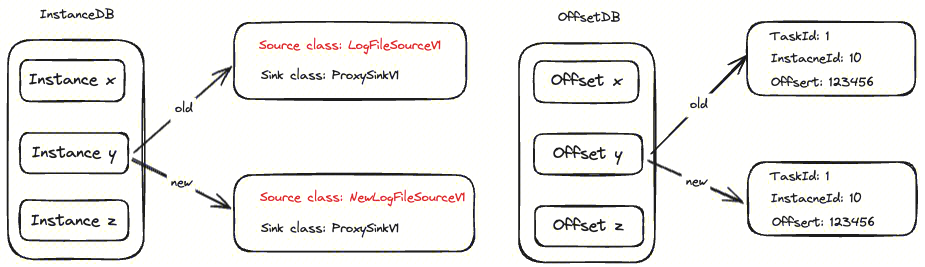

InLong Agent 属于 InLong 数据链路的采集层，是一个支持多种数据源类型的收集工具，致力于实现包括 File、MySQL、Pulsar、Metrics 等多种异构数据源稳定高效的数据采集功能。

### 整体架构

InLong Agent 本身作为数据采集框架，为了方便扩展数据源，将数据源抽象成为 Source 插件，纳入到整个框架中。
- Source：Source 为数据采集模块，负责采集数据源的数据。
- Agent 配置同步线程 Manager Fetcher 从 Manager 拉到采集配置
- Instance：Instance 用于将数据从 Source 取出并写入到 DataProxy Sink

### 设计理念
为了解决数据源多样性问题，InLong Agent 将多种数据源抽象成统一的 Source 概念，并抽象统一的 DataProxy Sink 将数据写入 InLong 链路。当需要接入一个新的数据源的时候，只需要配置好数据源的格式与读取参数便能做到高效读取。

### 基本概念

#### Task 和 Instance
- Task
  代表用户配置的采集任务

- Instance
  采集任务的实例化，由 Task 生成，负责具体执行采集任务

以文件采集为例，Manager 上有个采集任务的配置： `127.0.0.1 -> /data/log/YYYYMMDDhh.log._[0-9]+`，表示用户需要在 `127.0.0.1` 这台机器上采集符合 `/data/log/YYYYMMDDhh.log._[0-9]+` 这个路径规则的数据，`这就是一个 Task`。假设满足这个路径规则的文件有 3 个：/data/log/2024040221.log.0，/data/log/2024040221.log.1，/data/log/2024040221.log.3, Task 会生成 3 个 Instance 分别采集这 3 个文件。

#### Source 和 Sink
Source 和 Sink 属于 Instance 下一级的概念，每个 Instance 都有一个 Source 和一个 Sink，Source 从数据源读取数据，Sink 把数据写入目标存储。在 InLong 体系中，数据经过 Agent 采集会统一写入 DataProxy 服务，即只有  DataProxy Sink 类型。

## InLong Agent 实现原理
### 生命周期

Agent 数据采集任务包括配置拉取、Task/Instance 生成、Task/Instance 执行等过程。以文件采集为例，采集任务的整个过程包括：
- Step 1: Agent 配置同步线程 Manager Fetcher 从 Manager 拉到采集配置，比如 Config 1、Config 2
- Step 2: 同步线程将配置提交到任务管理器 Task Manager
- Step 3.1/3.2: Task Manager 会根据 Config1 和 Config 2 生成 Task 1、Task 2
- Step 4: Task 1 根据 Config 1，扫描到符合 Config 1 规则的文件，比如 File 1、File 2，将 File 1、File 2 的信息提交到实例管理器 Instance Manger（Instance Manager 是  Task 的成员变量）
- Step 5.1/5.2: Instance Manager 根据  File 1、File 2 的文件信息生成对应的 Instance，并运行
- Step 6.1/6.2: Instance 各自的 Source 将会根据文件信息去采集文件数据，并将采集到的数据通过 Sink 发送出去。文件采集、发送完成后将向 Instance Manager 发送 Instance 完成的信号，触发 Instance Manager 释放 Instance
- Step 7: Task 通过 Instance Manager 检测到所有的 Instance 执行完成后将向 Task Manager 发送 Task 完成的信号，触发 Task Manager 释放 Task

### 状态保存
Agent 数据采集有状态，为了保证采集数据的连续性，需要对采集的状态进行保存，防止 Agent 意外停止后任务无法恢复。Agent 将状态分成三大类：Task、Instance 和 Offset，分别对应 Task 任务状态、Instance 实例状态及采集过程中的位点状态。这三类状态数据通过 RocksDB 保存，存在在三个不同的 DB 目录。

InstanceDB 记录里保存着指定的 Source、Sink 类名，这是由于 Agent 升级后类名有可能发生变化，比如 Source class 由 LogFileSourceV1 变成 NewLogFileSourceV1。同时，一个 Task 会对应多个 Instance，为了避免不同的 Instance 之间的变更互相影响，将 Task 和 Instance 也放到了不同的 DB。将 Offset 放到独立 DB，为了解决 Agent 进行版本升级时能使用老版本的位点信息。

### 数据一致性
#### Offset 刷新机制
我们采取的是类似 “滑动窗口” 算法：Agent 在停止并等待确认前可以发送多条数据，不必每发一条数据就停下来等待确认，既确保了 ”ack 成功才更新 Offset“ 又能保持较快的发送速度。下面以采集 4 条数据为例：
- 首先，Source 有序从数据源读到 4 条数据
  

 
- 其次，从 Source 取了 4 条数据!!#ff0000 有序发往!! Sink，Sink 在接到数据时!!#ff0000 首先将数据的 Offset 记录到 OffsetList，并标识为未发送!!

  然后 Sink 将 4 条数据通过 SDK 发送，但是只有 1、2、4 三条数据返回成功，返回成功会!!#ff0000 将 OffsetList 中对应的标识置为 true!!

  

  Offset 更新线程则会遍历 OffsetList 发现 Offset 3 未 ack，于是就将 Offset 3 之前最近的 Offset 2 刷新到存储，这就保证了`数据一定是成功发送到下游之后才做 Offset 刷新`。

#### 重启恢复机制

如上所述，Task、Instance 和 Offset 的状态信息通过 RocksDB 存储，并且能保证数据一定成功发送到下游后才做 Offset 刷新。采集任务的重启恢复，也是依赖保存的状态，整个过程如下：
- Step 1: 启动时 Task Manager 读取 TaskDB
- Step 2: Task Manager 根据 TaskDB 的配置生成 Task 1、Task 2
- Step 3: Instance Manager 读取 InstanceDB
- Step 4: Instance Manager 根据 InstanceDB 的记录生成 Instance
- Step 5: Instance 读取 OffsetDB
- Step 6: Instance 根据 OffsetDB 的配置对 Source 进行初始化，恢复 Offset
- Step 7: 定时根据 Manager 配置更新任务

## InLong Agent 文件采集机制
### 文件夹扫描
把相应路径下的文件都扫一遍，然后匹配一下规则，匹配上就算是找到了。但是文件数量较多的情况下，扫描一遍需要较长的时间、也比较耗资源，扫描周期太小则资源消耗过大；扫描周期太大则响应速度过慢。

### 文件夹监听
上面的问题可以通过文件夹的监听来解决。我们只需要把文件夹注册到监听器，然后就可以通过这个监听器的接口查询是否有事件发生。监听的事件类型有增加、删除、修改等。一般我们监听文件的增加就可以，修改的很容易过多，而文件的删除事件则可以在文件读文件的过程中主动发现。但因为监听事件是触发式的，容易出现一致性问题。

### 文件夹扫描和监听结合
在实际应用中我们采取的是文件夹扫描和监听结合的模式，简单说就是对于一个文件夹我们同时做了 “定时扫描” 和 “监听”，这样既确保了一致性又能有较快的响应速度，具体过程如下：
- 首先，从文件监听器查询是否有新建文件，有则再查询是否已经缓存，没有缓存则放入待采集队列
- 其次，如果扫描时间间隔满足，则开始扫描文件，如果扫描到文件则再查询文件是否已经缓存，没有则放入待采集队列
- 最后，再处理待采集队列里的文件信息，也就是将其提交到 Instance Manager

### 文件读取
我们使用了 `RandomAccessFile` 类来读取文件， `RandomAccessFile` 的实例支持对随机访问文件的读取和写入。随机访问文件的行为类似存储在文件系统中的一个大型 byte 数组。存在指向该隐含数组的光标或索引，称为文件指针；从文件指针开始读取字节，并随着对字节的读取而前移此文件指针。举个例子：文件共有 13 字节，我们需要从 Offset 为 4 的地方开始读取 3 个字节。我们只需要把文件指针指向 Offset 为 4 的地方，然后读取 3 个字节即可。

