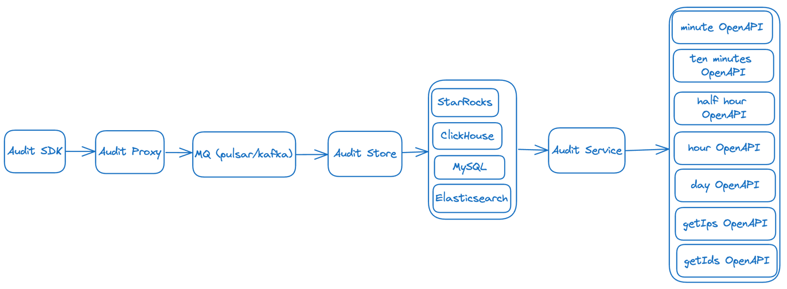

* InLong 审计是独立于 InLong 的一个子系统，对 InLong 系统的 Agent、DataProxy、Sort 模块的入流量、出流量进行实时审计对账。
* 对账的粒度有分钟、10分钟、30分钟、小时、天等等。

审计对账以日志上报时间为统一的口径，参与审计的各个服务将按照相同的日志时间进行实时对账。通过审计对账，我们可以清晰的了解
InLong
各个模块的传输情况，以及数据流是否有丢失或者重复

## 架构



- 审计SDK嵌套在需要审计的服务，对服务进行审计，将审计结果发送到审计接入层。
- 审计接入层将审计数据写到 MQ (Pulsar、Kafka 或者 TubeMQ)。
- 分发服务消费 MQ 的审计数据，将审计数据写到 MySQL、StarRocks。
- 接口层将 MySQL、StarRocks 的数据进行实时聚合并且 cache,对外提供 OpenAPI。
- 应用场景主要包括报表展示、审计对账等等。
- 支持数据补录场景的审计对账。
- 支持 Flink CheckPoint 场景的审计对账。

## 模块

| 模块            | 描述                                                 |
|:--------------|:---------------------------------------------------|
| audit-sdk     | 审计埋点上报，各个模块使用该 SDK 上报审计数据                          |
| audit-proxy   | 审计代理层，接收 SDK 上报数据，转发到 MQ (pulsar / kafka / tubeMQ) |
| audit-store   | 审计存储层，支持通用的 JDBC 协议                                |
| audit-service | 审计服务层，提供聚合、cache、OpenAPI 等能力                       |

## 审计维度

|       |       |       ||          |       |                 |                  |     |     |
|-------|-------|-------|----------|-------|-----------------|------------------|-----|-----| ---- |
| 机器 ip | 容器 ID | 线程 ID | 日志时间(分钟) | 审计 ID | inlong_group_id | inlong_stream_id | 条数  | 大小  | 传输时延(ms) |

## 审计项 ID

每个模块的接收与发送分别为一个独立的审计项 ID

| InLong 服务模块            | 审计 ID |
|------------------------|-------|
| InLong API 接收成功	       | 1     |
| InLong API 发送成功	       | 2     |
| InLong Agent 接收成功	     | 3     |
| InLong Agent 发送成功	     | 4     |
| InLong DataProxy 接收成功	 | 5     |
| InLong DataProxy 发送成功	 | 6     |

## 审计数据存储

Audit Store 能够支持所有兼容 JDBC 协议的存储组件的写入操作。因此，在选择兼容 JDBC 协议的存储组件时，只需确保其满足以下
Schema 即可:

```sql
CREATE TABLE IF NOT EXISTS `audit_data`
(
    `id`               int(32)      NOT NULL PRIMARY KEY AUTO_INCREMENT COMMENT 'Incremental primary key',
    `ip`               varchar(32)  NOT NULL DEFAULT '' COMMENT 'Client IP',
    `docker_id`        varchar(100) NOT NULL DEFAULT '' COMMENT 'Client docker id',
    `thread_id`        varchar(50)  NOT NULL DEFAULT '' COMMENT 'Client thread id',
    `sdk_ts`           TIMESTAMP    NOT NULL DEFAULT CURRENT_TIMESTAMP COMMENT 'SDK timestamp',
    `packet_id`        BIGINT       NOT NULL DEFAULT '0' COMMENT 'Packet id',
    `log_ts`           TIMESTAMP    NOT NULL DEFAULT CURRENT_TIMESTAMP COMMENT 'Log timestamp',
    `inlong_group_id`  varchar(100) NOT NULL DEFAULT '' COMMENT 'The target inlong group id',
    `inlong_stream_id` varchar(100) NOT NULL DEFAULT '' COMMENT 'The target inlong stream id',
    `audit_id`         varchar(100) NOT NULL DEFAULT '' COMMENT 'Audit id',
    `audit_tag`        varchar(100)          DEFAULT '' COMMENT 'Audit tag',
    `audit_version`    BIGINT                DEFAULT -1 COMMENT 'Audit version',
    `count`            BIGINT       NOT NULL DEFAULT '0' COMMENT 'Message count',
    `size`             BIGINT       NOT NULL DEFAULT '0' COMMENT 'Message size',
    `delay`            BIGINT       NOT NULL DEFAULT '0' COMMENT 'Message delay count',
    `update_time`      timestamp    NOT NULL DEFAULT CURRENT_TIMESTAMP ON UPDATE CURRENT_TIMESTAMP COMMENT 'Update time',
    INDEX group_stream_audit_id (`inlong_group_id`, `inlong_stream_id`, `audit_id`, `log_ts`)
) ENGINE = InnoDB
  DEFAULT CHARSET = UTF8 COMMENT ='InLong audit data table';
```

- ip：表示客户端的 IP 地址;
- docker_id：长度为 100 的字符串，表示客户端的 Docker ID;
- thread_id：长度为 50 的字符串，表示客户端的线程 ID;
- sdk_ts：TIMESTAMP 类型，表示 SDK 的时间戳，默认值为当前时间戳;
- packet_id：64 位整数，表示数据包的ID;
- log_ts：TIMESTAMP 类型，表示日志的时间戳，默认值为当前时间戳;
- inlong_group_id：长度为 100 的字符串，表示目标 Inlong 组的 ID;
- inlong_stream_id：长度为 100 的字符串，表示目标 Inlong 流的 ID;
- audit_id：长度为 100 的字符串，表示审计 ID;
- audit_tag：长度为 100 的字符串，表示审计标签，默认为空字符串;
- audit_version：64 位整数，表示审计版本，默认值为-1;
- count：64 位整数，表示消息数量，默认值为 0;
- size：64 位整数，表示消息大小，默认值为 0;
- delay：64 位整数，表示消息延迟数量，默认值为 0;
- update_time：TIMESTAMP 类型，表示更新时间，默认值为当前时间戳，当记录被更新时自动更新。