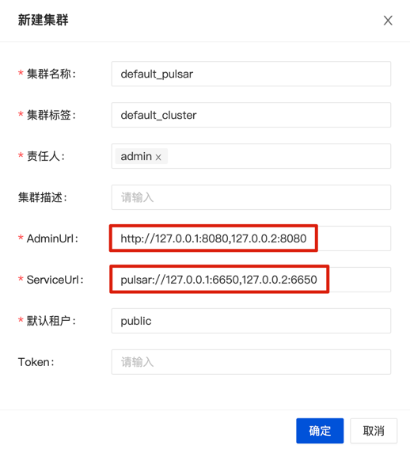

## 环境准备
- 安装并启动 MySQL 5.7+
- 初始化数据库
  `inlong-manager` 目录下有 `sql/apache_inlong_manager.sql`文件，通过下述命令加载此文件，完成表结构及基础数据的初始化：

  ```shell
  # 通过用户名和密码，创建DB和表：
  mysql -uDB_USER -pDB_PASSWD < sql/apache_inlong_manager.sql
  ```

## 添加依赖
- 下载 Sort [Connector Binary file](https://inlong.apache.org/zh-CN/download/), 并解压放入`inlong-sort/connectors`目录。
- 如果使用 MySQL 数据库，请下载 [mysql-connector-java-8.0.28.jar](https://repo1.maven.org/maven2/mysql/mysql-connector-java/8.0.28/mysql-connector-java-8.0.28.jar)，将其放入 `lib/` 目录。
- 如果使用 PostgreSQL 数据库，则无需额外下载依赖包。

## 修改配置
前往 `inlong-manager` 目录，修改 `conf/application.properties` 文件：
```properties
# manager 服务的端口号
server.port=8083

# 默认使用的配置文件为 dev
spring.profiles.active=dev
```

上面指定了 dev 配置，接下来修改 `conf/application-dev.properties` 文件中的配置项：
```properties
# database configuration
spring.datasource.druid.url=jdbc:mysql://127.0.0.1:3306/apache_inlong_manager?useSSL=false&allowPublicKeyRetrieval=true&characterEncoding=UTF-8&nullCatalogMeansCurrent=true&serverTimezone=GMT%2b8
spring.datasource.druid.username=root
spring.datasource.druid.password=inlong
# Audit Proxy Address
metrics.audit.proxy.hosts=127.0.0.1:10081
```

:::note
如果指定了 test 或 prod，则修改对应的 application-test.properties 或者 application-prod.properties 文件。
:::

## 配置 Flink 插件
InLong Manager 可启动 Sort 任务进行数据的消费和落地，需要先配置 Flink 环境信息。配置文件为 `plugins/flink-sort-plugin.properties`。
```properties
# Flink version, support [1.13|1.15]
flink.version=1.13
# Flink host split by coma if more than one host, such as 'host1,host2'
flink.rest.address=127.0.0.1
# Flink port
flink.rest.port=8081
# Flink job manager port
flink.jobmanager.port=6123
```

## 启动服务
```shell
bash +x bin/startup.sh
```

## 集群初始化
当所有容器都成功启动后，可以访问 InLong Dashboard 地址`http://localhost`，并使用以下默认账号登录:
```properties
User: admin
Password: inlong
```

### 创建集群标签
页面点击 [集群管理]->[标签管理]->[新建]，指定集群标签名称和负责人：


:::caution
由于各个组件默认上报集群标签为 `default_cluster`，请勿使用其它名称。
:::

### 注册 MQ 集群
只用注册你选择的 MQ 类型集群。

- 选择 1：注册 Pulsar 集群
页面点击 [集群管理]->[集群管理]->[新建集群]，注册 Pulsar 集群：


- 选择 2：注册 TubeMQ 集群
页面点击 [集群管理]->[集群管理]->[新建集群]，注册 TubeMQ 集群：


- 选择 3：注册 Kafka 集群
页面点击 [集群管理]->[集群管理]->[新建集群]，注册 Kafka 集群：


:::note
集群标签选择刚创建的 `default_cluster`，然后配置 MQ 集群信息。
:::

## (可选) 开启OpenAPI认证
### 开启认证
Manager 提供 OpenAPI 安全访问认证，默认关闭。如需开启，在 `conf/application.properties` 打开：

```properties
# Manager OpenAPI 安全认证开关
openapi.auth.enabled=true
```

### 配置认证
相关组件需配置由 Manager 分配的认证 secret id 和 secret key，例如 (建议使用新分配的替代默认值)：
- `Agent` conf 目录下 `agent.properties`：
```properties
agent.manager.auth.secretId=admin
agent.manager.auth.secretKey=87haw3VYTPqK5fK0
```

- `Dataproxy` conf 目录下 `common.properties`：
```properties
manager.auth.secretId=admin
manager.auth.secretKey=87haw3VYTPqK5fK0
```

### 创建认证 Key
管理员可以登录 InLong Dashboard 管理端来创建 secret id 和 secret key： **系统管理->用户管理->新建账号**.