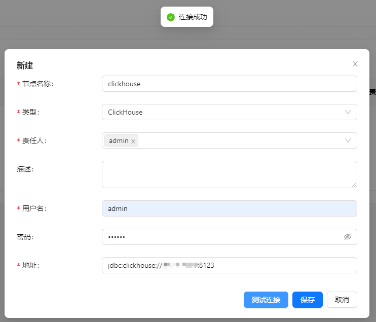
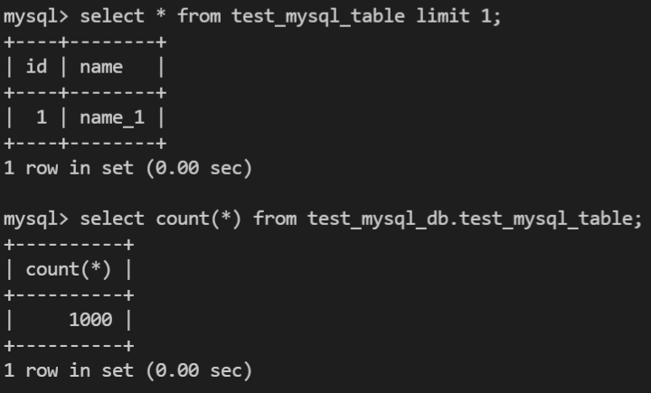
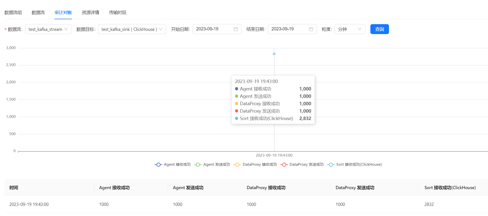
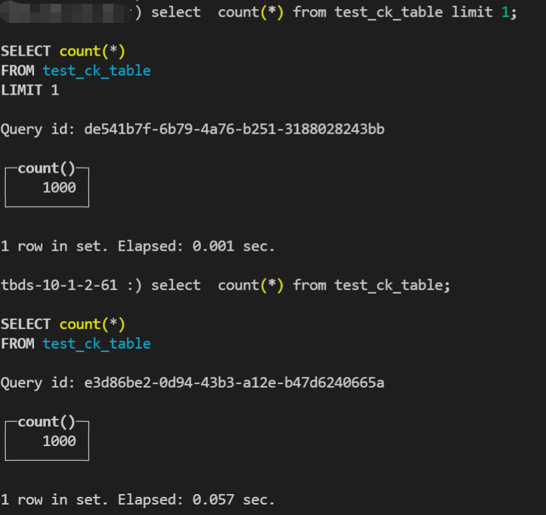

在下面的内容中，我们将通过一个完整的示例介绍如何使用 Apache InLong 创建 `MySQL -> Kafka -> ClickHouse` 数据接入。

## 环境部署
### 安装 InLong
在开始之前，我们需要安装 InLong 的全部组件，这里提供两种方式：
- [Docker 部署](deployment/docker.md)（推荐）
- [Bare Metal 部署](deployment/bare_metal.md)

### 安装 ClickHouse
```shell
docker run -d --rm --net=host --name clickhouse -e CLICKHOUSE_USER=admin -e CLICKHOUSE_PASSWORD=inlong -e CLICKHOUSE_DEFAULT_ACCESS_MANAGEMENT=1 clickhouse/clickhouse-server:22.8
```

### 安装Kafka
```shell
# 准备 Kafka 需要的 zookeeper
docker run -d --name zookeeper -p 2181:2181 -t wurstmeister/zookeeper
# 安装 Kafka 
docker run -d --name kafka -p 9092:9092 -e KAFKA_BROKER_ID=0 -e KAFKA_ZOOKEEPER_CONNECT=zookeeper:2181 --link zookeeper -e KAFKA_ADVERTISED_LISTENERS=PLAINTEXT://kafka:9092 -e KAFKA_LISTENERS=PLAINTEXT://0.0.0.0:9092 -t wurstmeister/kafka
```

## 集群初始化
容器启动成功后，访问 InLong Dashboard 地址 http://localhost，并使用以下默认账号登录：
```properties
User: admin
Password: inlong
```

### 创建集群标签
页面点击【集群管理】->【标签管理】->【新建】，指定集群标签名称和负责人：


**注：default_cluster 是各个组件默认上报集群标签，请勿使用其它名称**

### 注册 Kafka 集群
页面点击【集群管理】->【新建集群】，注册 Kafka 集群：


### 注册 Clickhouse 数据节点
页面点击【数据节点】->【新建】，新增 ClickHouse 数据节点：


## 任务创建
### 新建数据流组
页面点击【数据集成】->【新建数据流组】，填写 ID，选择 MQ 类型为 Kafka 即可：


### 新建数据流
点击【下一步】->【新建数据流】，配置数据流 ID 及测试源字段信息：


### 新建数据源
点击【新建数据源】->【MySQL】，配置数据源名称、地址、用户密码以及库表信息等：


:::note
请预先创建 `test_mysql_db.test_mysql_table` 库表，schema 为：
CREATE TABLE test_mysql_db.test_mysql_table (
id INT PRIMARY KEY,
name VARCHAR(50)
);
:::

### 新建数据目标
点击【新建数据目标】->【ClickHouse】，配置名称、库表、已创建的 ck 数据节点以及 Schema 映射信息等，完成后点击 【提交审批】：


### 审批数据流
页面点击【审批管理】->【我的审批】->【详情】->【选择集群标签】->【通过】：


返回【数据集成】，等待任务配置成功：


## 测试数据
### 发送数据

累计对 MySQL 添加 1000 条数据。

### 数据验证
查看审计页面发送数据：


然后进入 ClickHouse 容器，查看库表数据：


## 常见问题
### 任务配置失败
一般是 MQ 或者 Flink 集群配置错误导致，可以在页面查看错误信息，或者进入 Manager 容器查看详细日志。

### 发送数据生成脚本
```bash
#!/bin/bash

# MySQL数据库连接信息
DB_HOST="mysql"
DB_USER="root"
DB_PASS="inlong"
DB_NAME="test_mysql_db"
DB_TABLE="test_mysql_table"

# 循环插入数据
for ((i=1; i<=1000; i++))
do
    # 生成要插入的数据
    id=$i
    name="name_$i"

    # 构建插入语句
    query="INSERT INTO $DB_TABLE (id, name) VALUES ($id, '$name');"

    # 执行插入语句
    mysql -h $DB_HOST -u $DB_USER -p$DB_PASS $DB_NAME -e "$query"
done
```