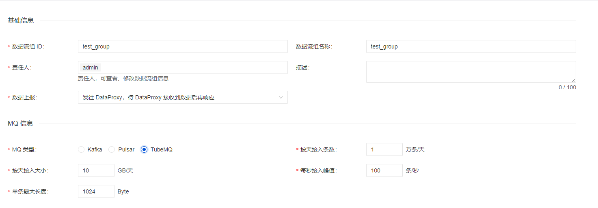
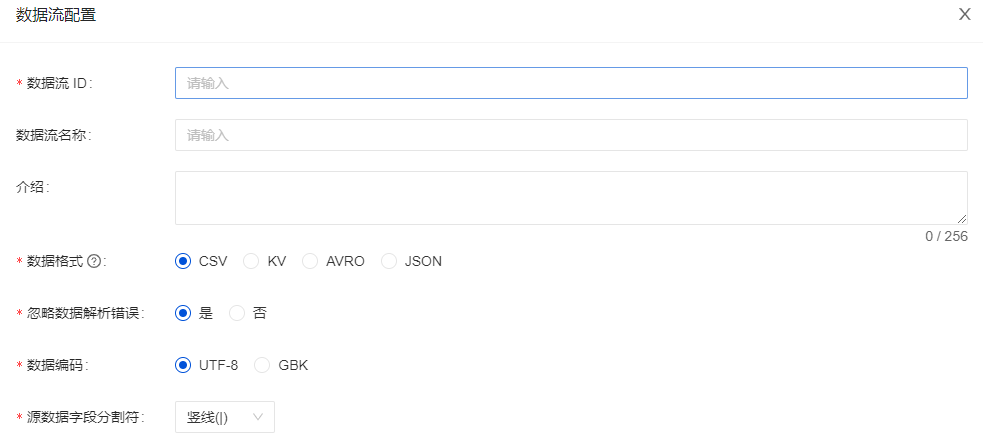
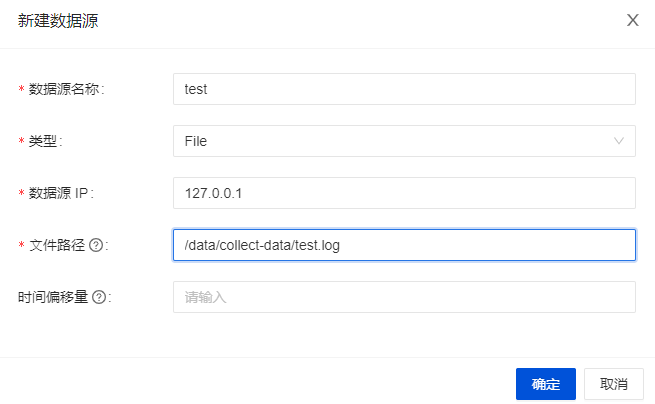
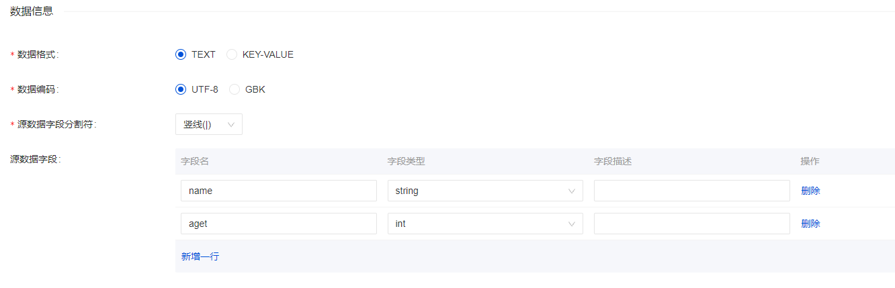
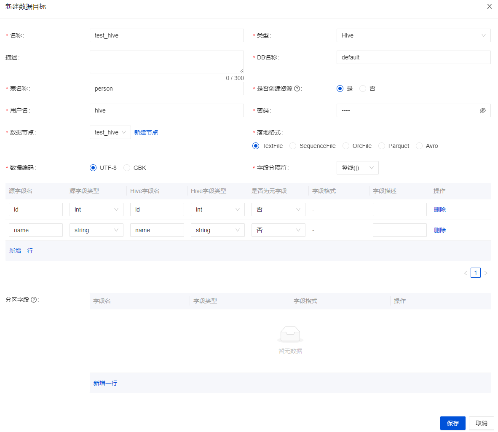

本节用一个简单的示例，帮助您快速体验 InLong 的完整流程。


## 安装 Hive
Hive 是运行的必备组件。如果您的机器上没有 Hive，这里推荐使用 Docker 进行快速安装，详情可见 [这里](https://github.com/big-data-europe/docker-hive)。

> 注意，如果使用以上 Docker 镜像的话，我们需要在 namenode 中添加一个端口映射 `8020:8020`，因为它是 HDFS DefaultFS 的端口，后面在配置 Hive 时需要用到。

## 安装 InLong
在开始之前，我们需要安装 InLong 的全部组件，这里提供两种方式：
1. 按照 [这里的说明](deployment/docker.md)，使用 Docker 进行快速部署。（推荐）
2. 按照 [这里的说明](deployment/bare_metal.md)，使用二进制包依次安装各组件。


## 新建接入
部署完毕后，首先我们进入 “数据接入” 界面，点击右上角的 “新建接入”，新建一条接入，按下图所示填入数据流 Group 信息



然后点击下一步，按下图所示填入数据流信息



注意其中消息来源选择“文件”，并“新建数据源”，配置 `Agent 地址`及采集`文件路径`：



然后我们在下面的“数据信息”一栏中填入以下信息



然后在数据流向中选择 Hive，并点击 “添加”，添加 Hive 配置



注意这里目标表无需提前创建，InLong Manager 会在接入通过之后自动为我们创建表。另外，请使用 “连接测试” 保证 InLong Manager 可以连接到你的 Hive。

然后点击“提交审批”按钮，该接入就会创建成功，进入审批状态。

## 审批接入
进入“审批管理”界面，点击“我的审批”，将刚刚申请的接入通过。

到此接入就已经创建完毕了，我们可以在 Hive 中看到相应的表已经被创建，并且在 TubeMQ 的管理界面中可以看到相应的 topic 已经创建成功。

## 配置 Agent 采集文件
接下来我们可以新建 `/data/collect-data/test.log` ，并往里面添加内容，来触发 agent 向 dataproxy 发送数据了。

``` shell
mkdir collect-data
END=100000
for ((i=1;i<=END;i++)); do
    sleep 3
    echo "name_$i | $i" >> /data/collect-data/test.log
done
```

可以观察审计数据页面，看到数据已经成功采集和发送。