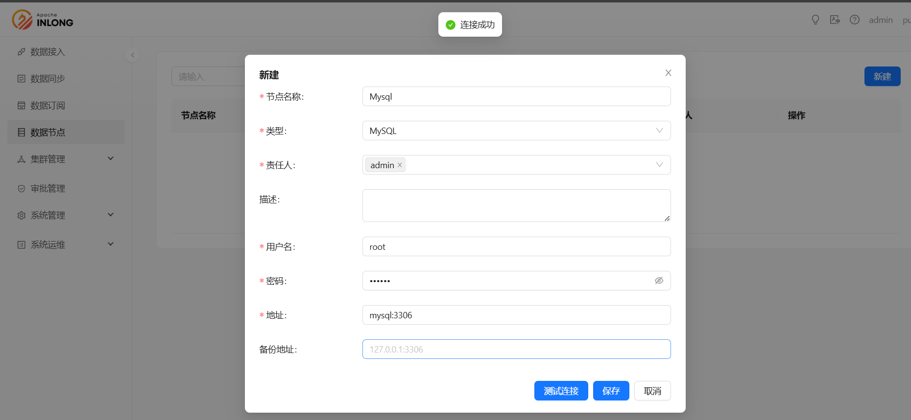
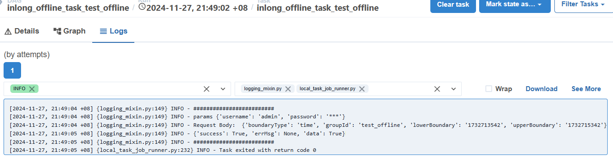

在下面的内容中，将通过一个完整的示例介绍如何使用 Apache InLong 创建 Airflow 调度任务，并完成 Pulsar -> MySQL 的离线数据同步。

## 环境部署
### 安装 InLong

在开始之前，我们需要安装 InLong 的全部组件，这里提供两种方式：
- [Docker 部署](deployment/docker.md)（推荐）
- [Bare Metal 部署](deployment/bare_metal.md)

### 添加 Connectors

下载与 Flink 版本对应的 [connectors](https://inlong.apache.org/zh-CN/downloads) ，解压后将 `sort-connector-jdbc-[version]-SNAPSHOT.jar` 放在 `/inlong-sort/connectors/` 目录下。
> 当前 Apache InLong 的离线数据同步能力只支持 Flink-1.18 版本，所以请下载 1.18 版本的 connectors。

## 创建集群和数据目标

### 创建集群标签


### 注册 Pulsar 集群


### 创建数据目标



执行如下 Sql 语句：

```mysql
CREATE TABLE sink_table (
    id INT AUTO_INCREMENT PRIMARY KEY,
    name VARCHAR(255) NOT NULL,
    create_time TIMESTAMP DEFAULT CURRENT_TIMESTAMP
);
```

## Airflow 初始化

### 获取初始 DAG

`dag_creator` 和 `dag_cleaner` 可以在 [Inlong](https://github.com/apache/inlong) 获取。


> Airflow 没有提供 DAG 创建的提供 API ，因此需要两个原始 DAG。`dag_creator` 用于创建离线任务，`dag_cleaner` 用于定时去清理离线任务。

### 创建初始 DAG

首先将 DAG 文件放到 Airflow 默认的 DAG 目录下面，等待一段时间，Airflow 调度器会去扫描该目录，并加载 DAG ：


### Airflow REST API

默认情况下，Airflow 会拒绝所有 REST API 请求。请参考 [Airflow 官方文档](https://airflow.apache.org/docs/apache-airflow-providers-fab/stable/auth-manager/api-authentication.html) 进行配置。

### Inlong Manager 配置

根据配置文件要求，对配置文件进行修改，并重启 Inlong Manager 。

```properties
# Airflow 能够访问到的 Inlong Manager 的 url
schedule.engine.inlong.manager.url=http://inlongManagerIp:inlongManagerPort
# Airflow 管理页面的 URL
schedule.engine.airflow.baseUrl=http://airflowIP:airflowPort
# 用于 Airflow 的 REST API 认证的用户名和密码
schedule.engine.airflow.username=airflow
schedule.engine.airflow.password=airflow
# 用来保存 Inlong Manager 认证信息的 Connection
schedule.engine.airflow.connection.id=inlong_connection
# 两个原始 DAG 的 id
schedule.engine.airflow.cleaner.id=dag_cleaner
schedule.engine.airflow.creator.id=dag_creator
```

## 离线同步任务创建

### 创建同步任务


### 创建数据流组


后续步骤请参照: [使用内置的 Quartz 调度引擎](./quartz_example.md)

### 创建 Airflow 离线任务

审批并配置成功后，Inlong Manager 会去通过 Airflow API 触发 `dag_creator` 去创建离线任务 DAG ：


>离线任务 DAG 可能不会立即进行调度，因为 Airflow 会定期去扫描 DAG 文件，再将其加入调度中，所以可能需要等待一段时间。

离线任务执行结果如下：



> Airflow 会根据`创建数据流组`小节中的配置，定期去调用 Inlong Manager 所提供的接口进行 Flink 任务的提交，这里也是为什么在 `Inlong Manager 配置` 小节中需要保存 Inlong Manager 的认证信息。

## 测试数据
### 发送数据

通过 Pulsar SDK 生产数据写入的 Pulsar topic 中，示例如下：
```java
// 创建 pulsar client 和 producer
PulsarClient pulsarClient = PulsarClient.builder().serviceUrl("pulsar://localhost:6650").build();
Producer<byte[]> producer = pulsarClient.newProducer().topic("public/default/test").create();

// 发送消息
for (int i = 0; i < 10000; i++) {
    // 字段分隔符为 |
    String msgStr = i + "|msg-" + i;
    MessageId msgId = producer.send(msgStr.getBytes(StandardCharsets.UTF_8));
    System.out.println("Send msg : " + msgStr + " with msgId: " + msgId);
}
```

### 数据验证

然后进入 Mysql，查看库表数据，可以看到数据已经同步到 MySQL 中。


