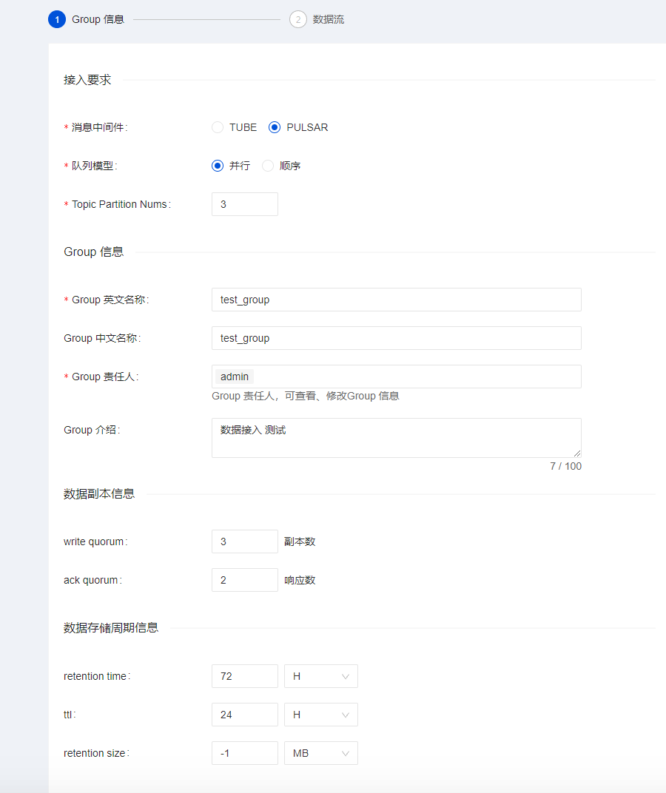

Apache InLong 增加了通过 Apache Pulsar 接入数据的能力，充分利用了 Pulsar 不同于其它 MQ 的技术优势，为金融、计费等数据质量要求更高的数据接入场景，提供完整的解决方案。
在下面的内容中，我们将通过一个完整的示例介绍如何通过 Apache InLong 使用 Apache Pulsar 接入数据。


## 安装 Pulsar
部署Apache Pulsar 集群可以参考[官方安装指引](https://pulsar.apache.org/docs/en/standalone/).

## 安装 Hive
Hive 是运行的必备组件。如果您的机器上没有 Hive，这里推荐使用 Docker 进行快速安装，详情可见 [这里](https://github.com/big-data-europe/docker-hive)。

> 注意，如果使用以上 Docker 镜像的话，我们需要在 namenode 中添加一个端口映射 `8020:8020`，因为它是 HDFS DefaultFS 的端口，后面在配置 Hive 时需要用到。

## 安装 InLong
在开始之前，我们需要安装 InLong 的全部组件，这里提供两种方式：
1. 按照 [这里的说明](deployment/docker.md)，使用 Docker 进行快速部署。（推荐）
2. 按照 [这里的说明](deployment/bare_metal.md)，使用二进制包依次安装各组件。

区别于 InLong TubeMQ，如果使用 Apache Pulsar，需要在 Manager 组件安装中配置 Pulsar 集群信息，格式如下：
```
# Pulsar admin URL
pulsar.adminUrl=http://127.0.0.1:8080,127.0.0.2:8080,127.0.0.3:8080
# Pulsar broker address
pulsar.serviceUrl=pulsar://127.0.0.1:6650,127.0.0.1:6650,127.0.0.1:6650
# Default tenant of Pulsar
pulsar.defaultTenant=public
```

## 创建数据接入
### 配置数据流 Group 信息

在创建数据接入时，数据流 Group 可选用的消息中间件选择 Pulsar，其它跟 Pulsar 相关的配置项还包括：
- Queue module：队列模型，并行或者顺序，选择并行时可设置 Topic 的分区数，顺序则为一个分区；
- Write quorum：消息写入的副本数
- Ack quorum：确认写入 Bookies 的数量
- retention time：已被 consumer 确认的消息被保存的时间
- ttl：未被确认的消息的过期时间
- retention size：已被 consumer 确认的消息被保存的大小

### 配置数据流

配置消息来源时，文件数据源中的文件路径，可参照 inlong-agent 中[File Agent的详细指引](https://inlong.apache.org/docs/next/modules/agent/file#file-agent-configuration)。

### 配置数据格式


### 配置 Hive 集群
保存 Hive 集群信息，点击“确定”。


## 数据接入审批
进入**审批管理**页面，点击**我的审批**，审批上面提交的接入申请，审批结束后会在 Pulsar 集群同步创建数据流需要的 Topic 和订阅。
我们可以在 Pulsar 集群使用命令行工具检查 Topic 是否创建成功：


## 配置文件 Agent
使用 curl agent 发送请求创建采集任务。
```
curl --location --request POST 'http://localhost:8008/config/job' \
--header 'Content-Type: application/json' \
--data '{
"job": {
"dir": {
"path": "",
"pattern": "/data/collect-data/test.log"
},
"trigger": "org.apache.inlong.agent.plugin.trigger.DirectoryTrigger",
"id": 1,
"thread": {
"running": {
"core": "4"
}
},
"name": "fileAgentTest",
"source": "org.apache.inlong.agent.plugin.sources.TextFileSource",
"sink": "org.apache.inlong.agent.plugin.sinks.ProxySink",
"channel": "org.apache.inlong.agent.plugin.channel.MemoryChannel"
},
"proxy": {
"inlongGroupId": "b_test_group",
"inlongStreamId": "test_stream"
},
"op": "add"
}'
```

至此，agent 就配置完毕了。接下来我们可以新建 `./collect-data/test.log` ，并往里面添加内容，来触发 agent 向 dataproxy 发送数据了。

``` shell
mkdir collect-data
END=100000
for ((i=1;i<=END;i++)); do
    sleep 3
    echo "name_$i | $i" >> ./collect-data/test.log
done
```

然后观察 agent 和 dataproxy 的日志，可以看到相关数据已经成功发送。

## 数据落地检查

最后，我们登入 Hive 集群，通过 Hive 的 SQL 命令查看 `test_stream` 表中是否成功插入了数据。

## 问题排查
如果出现数据未正确写入 Hive 集群，可以检查 `DataProxy` 和 `Sort` 相关信息是否同步：
- 检查 `InLong DataProxy` 的 `conf/topics.properties` 文件夹中是否正确写入该数据流对应的Topic 信息：
```
b_test_group/test_stream=persistent://public/b_test_group/test_stream
```

- 检查 InLong Sort 监听的 ZooKeeper 中是否成功推送了数据流的配置信息：
```
get /inlong_hive/dataflows/{{sink_id}}
```


