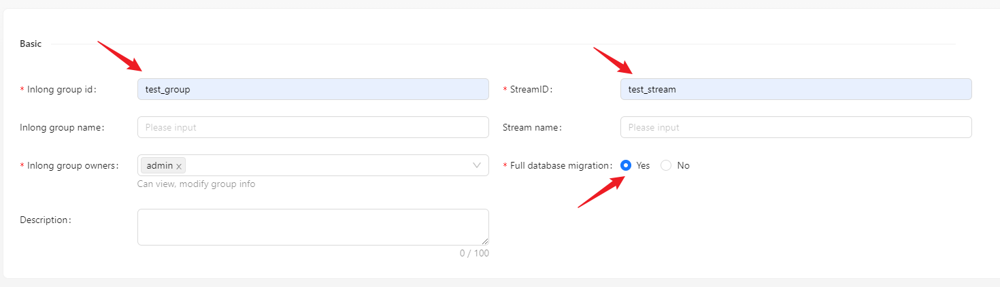
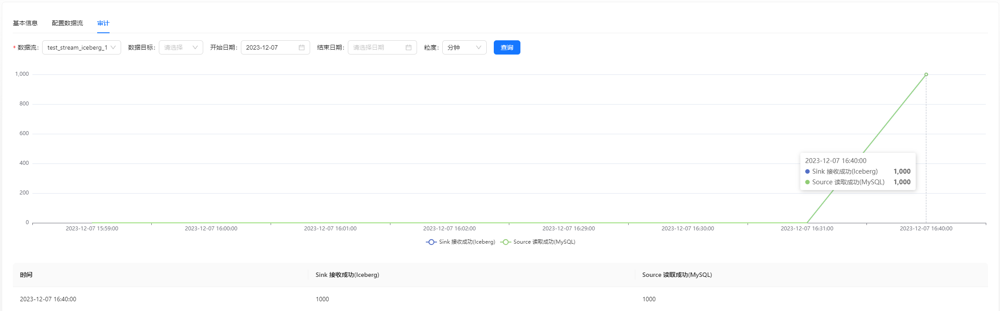

在下面的内容中，我们将通过一个完整的示例介绍如何使用 Apache InLong 创建 MySQL -> Iceberg 整库数据同步。

## 环境部署
### 安装 InLong

在开始之前，我们需要安装 InLong 的全部组件，这里提供两种方式：
- [Docker 部署](deployment/docker.md)（推荐）
- [Bare Metal 部署](deployment/bare_metal.md)

### 添加 Connectors
下载与 Flink 版本对应的 [connectors](https://inlong.apache.org/zh-CN/downloads)，解压后将 `sort-connector-iceberg-[version]-SNAPSHOT.jar` 放在 `/inlong-sort/connectors/` 目录下。

### 安装 Iceberg
请参考 Apache Iceberg 官网的[安装教程](https://iceberg.apache.org/hive-quickstart)

## 集群初始化
容器启动成功后，访问 InLong Dashboard 地址 http://localhost，并使用以下默认账号登录：
```properties
User: admin
Password: inlong
```

### 注册 Iceberg 数据节点
页面点击 [数据节点] -> [创建] ，新增 Iceberg 数据节点.


## 任务创建
### 新建数据流组
页面点击[数据同步] → [创建]，输入 Group ID、Steam ID 和 是否整库迁移：


### 创建数据源
数据源中点击 [新建] → [MySQL] 配置数据源名称、地址、库表信息等。


:::note
- 这里读取模式选择了 `全量+增量`，表中的存量数据也会被采集，`仅增量` 模式则不会。
- 表名白名单格式为 `<dbName>.<tableName>`，支持正则表达。
:::

### 创建数据目标
数据目标中点击 [新建] → [Iceberg]，设置数据目标名称并选择创建好的 Iceberg 数据节点,
库表名称我们可以选择与数据源一致，或者自定义。


:::note
自定义库表名称时，支持使用内置参数和字符串组合生成目标库表名称。

内置参数包括：
- 来源库名：${database}
- 来源表名：${table}

如：来源表名称为 `table1`，映射规则为 `${table}_inlong`，则 `table1` 的数据将被最终映射写入至 `table1_inlong` 中。
:::

### 审批数据流
点击 [审批管理] -> [我的审批] -> [审批] -> [Ok].


返回【数据集成】，等待任务配置成功：


## 测试数据
### 发送数据
```bash
#!/bin/bash

# MySQL info
DB_HOST="mysql"
DB_USER="root"
DB_PASS="inlong"
DB_NAME="test"
DB_TABLE1="source_table"
DB_TABLE2="source_table2"

# Insert data in a loop
for ((i=1; i<=500; i++))
do
    # Generate data
    id=$i
    name="name_$i"

    # Build an insert SQL
    query1="INSERT INTO $DB_TABLE1 (id, name) VALUES ($id, '$name');"
    query2="INSERT INTO $DB_TABLE2 (id, name) VALUES ($id, '$name');"

    # Execute insert SQL
    mysql -h $DB_HOST -u $DB_USER -p$DB_PASS $DB_NAME -e "$query1"
    mysql -h $DB_HOST -u $DB_USER -p$DB_PASS $DB_NAME -e "$query2"
done
```

根据实际环境修改脚本中的变量，向每个表中插入 500 条数据(这里 `source_table` 中有一条存量数据):


### 验证数据
进入 Iceberg，查看表数据


也可以在页面查看审计数据:

