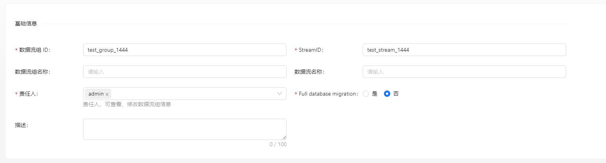
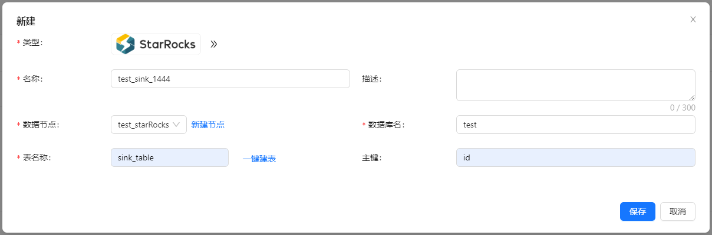
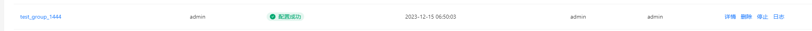
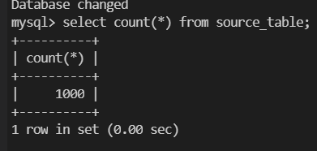
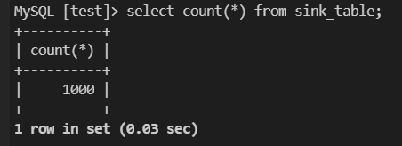
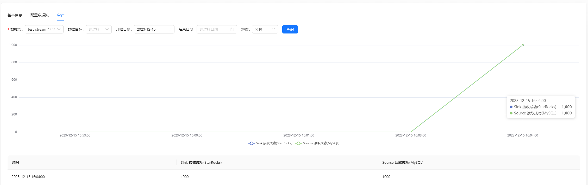

在下面的内容中，我们将通过一个完整的示例介绍如何使用 Apache InLong 创建 MySQL -> StarRocks 数据同步。

## 环境部署
### 安装 InLong

在开始之前，我们需要安装 InLong 的全部组件，这里提供两种方式：
- [Docker 部署](deployment/docker.md)（推荐）
- [Bare Metal 部署](deployment/bare_metal.md)

### 添加 Connectors

下载与 Flink 版本对应的 [connectors](https://inlong.apache.org/zh-CN/downloads)，解压后将 `sort-connector-starrocks-[version]-SNAPSHOT.jar` 放在 `/inlong-sort/connectors/` 目录下。

### 安装 StarRocks
请参考 StarRocks 官网的[安装教程](https://docs.starrocks.io/docs/quick_start/)。

## 集群初始化
容器启动成功后，访问 InLong Dashboard 地址 http://localhost，并使用以下默认账号登录：
```properties
User: admin
Password: inlong
```

### 注册 StarRocks 数据节点
页面点击 【数据节点】 -> 【创建】 ，新增 StarRocks 数据节点.


:::note
- LOAD URL 请勿携带 `http://`, 填写 IP + 端口即可。
:::

## 任务创建
### 新建数据流组
页面点击【数据同步】 → 【创建】，输入 Group ID、Steam ID 和 是否整库迁移：


### 创建数据源
数据源中点击 【新建】 → 【MySQL】 配置数据源名称、地址、库表信息等。


:::note
- 读取模式选择 `全量+增量` 时，表中的存量数据也会被采集，`仅增量` 模式则不会。
- 表名白名单格式为 `<dbName>.<tableName>`，支持正则表达。
:::

### 创建数据目标
数据目标中点击 【新建】 → 【StarRocks】，设置数据目标名称并选择创建好的 StarRocks 数据节点, 并填写库表名称。


### 审批数据流
点击 【审批管理】 -> 【我的审批】 -> 【审批】 -> 【通过】.


返回【数据集成】，等待任务配置成功：


## 测试数据
### 发送数据
```shell
#!/bin/bash

# MySQL info
DB_HOST="mysql"
DB_USER="root"
DB_PASS="inlong"
DB_NAME="test"
DB_TABLE="source_table"

# Insert data in a loop
for ((i=1; i<=1000; i++))
do
    # Generate data
    id=$i
    name="name_$i"

    # Build an insert SQL
    query="INSERT INTO $DB_TABLE (id, name) VALUES ($id, '$name');"

    # Execute insert SQL
    mysql -h $DB_HOST -u $DB_USER -p$DB_PASS $DB_NAME -e "$query"
done
```

根据实际环境修改脚本中的变量，执行脚本向 `source_table` 表中累计添加 1000 条数据:



### 验证数据
进入 StarRocks，查看 sink_table 表数据



也可以在页面查看审计数据:

