## 概述
本节的指南将向您展示如何通过 `Inlong` 仪表板管理数据流，并介绍一些管理配置。
通过本指南，您将学习执行数据访问、数据消费、数据同步和集群管理等操作。

## 入门
要开始使用 `InLong` 仪表板，请先部署。以下是几种部署方法：

- [Standalone](/deployment/standalone.md)
- [Docker](/deployment/docker.md)
- [Kubernetes](/deployment/k8s.md)
- [Bare Metal](/deployment/bare_metal.md)

:::tip
我们建议使用 `docker` 进行部署。
:::

## 用户登录

使用系统需要用户输入系统账号和密码，默认账户为 `admin`，默认密码为 `inlong`。

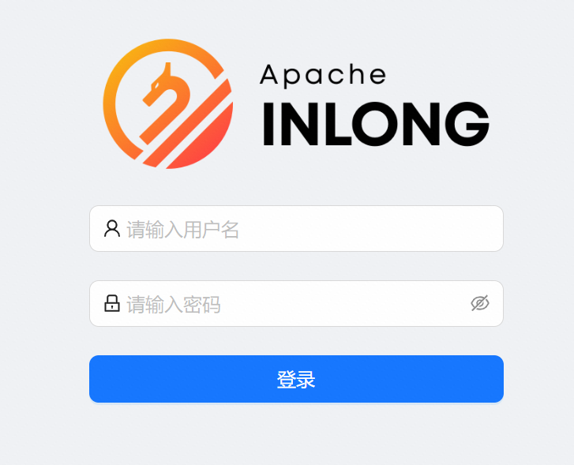

## 数据接入

数据访问模块负责将来自各种数据源的数据聚合到统一的存储服务中，以实现进一步的数据查询和分析。

### 创建数据流组

点击【新建接入】按钮，此步骤需要您填写数据流组的基本信息。

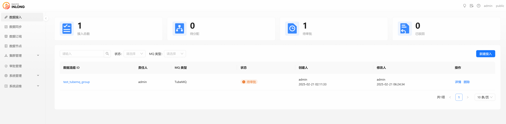

- **数据流组 ID**：统一小写英文名称，请尽量包含产品名称且简洁规范，例如pay_base。
- **数据流组名称**：自定义数据组名称。
- **责任人**：数据流群组拥有者可以查看、修改群组信息，添加、修改所有访问配置项。
- **描述**：数据流组简单介绍
- **MQ 类型**：选择MQ消息中间件。

目前支持三种MQ消息中间件，这里以TubeMQ为例。你也可以查看 [Kafka](/quick_start/data_ingestion/mysql_kafka_clickhouse_example.md) 数据接入示例
和 [Pulsar](/quick_start/data_ingestion/file_pulsar_clickhouse_example.md) 数据接入示例。

:::info MQ 类型
- Apache Kafka: 高吞吐量、低延迟，可以处理大规模数据流。
- Apache Pulsar: 高可靠性消息传输组件，适用于计费传输场景。
- InLong TubeMQ: 高吞吐量消息传输组件，适用于日志消息传输场景。
:::

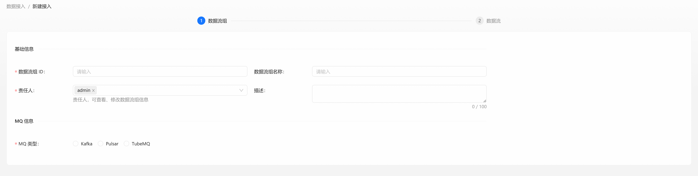

点击【下一步】按钮，进入数据流信息填写步骤。

### 创建数据流

数据流有特定的数据源、数据格式和数据接收器。点击【新建数据流】按钮可以创建新的数据流：

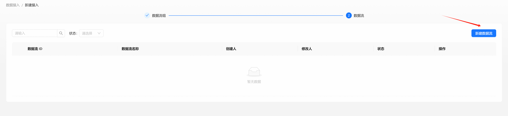

#### 步骤 1: 创建数据流信息

- **数据流 ID**： 前缀根据产品/项目自动生成，这在某个具体的接入中是唯一的，与数据源和入库的表中的数据流ID保持一致。
- **数据流名称**： 数据流的自定义名称，用于直观地识别数据流的用途或类型。
- **介绍**: 简单的介绍数据流。
- **数据格式**： 数据流中传输的数据格式类型。支持的类型有： `CSV`, `Key-Value`, `Avro`, `JSON`
- **忽略数据解析错误**：是否忽略数据解析错误。
    - `是`： 跳过无效数据并继续处理。
    - `否`： 遇到错误时停止处理。
- **数据编码**： 数据的字符编码，例如：`UTF-8`, `GBK`。
- **源数据字段分割符**： 源数据的字段分隔符。
- **源数据字段**： 源数据字段的映射。适用于结构化数据格式。
- **高级选项**： 用于数据处理的高级设置。

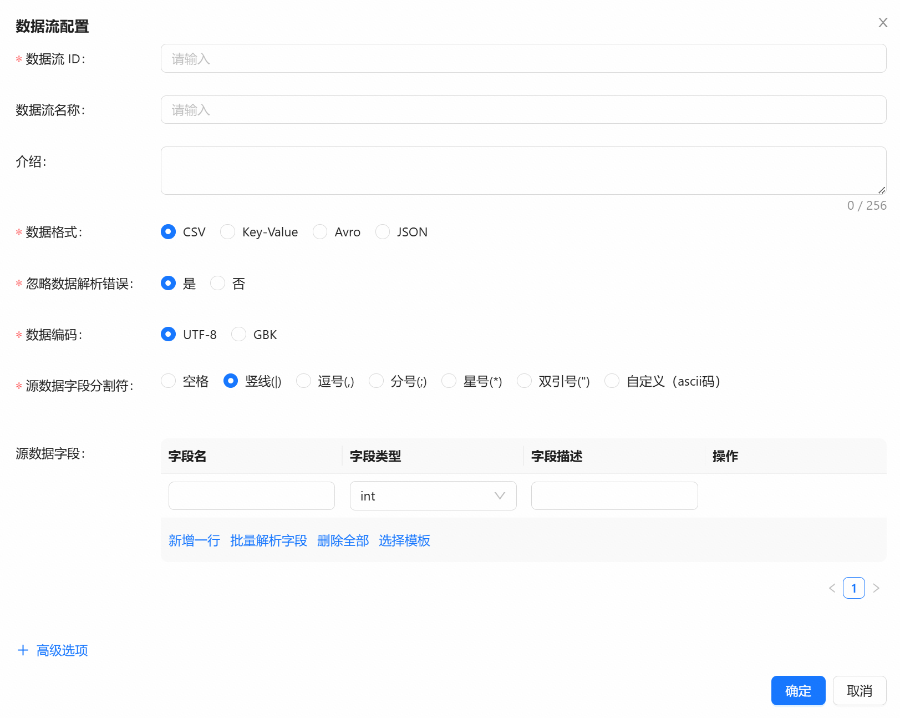

点击【确定】按钮，保存数据流信息。

#### 步骤 2: 创建数据源和数据目标

左侧是数据源，右侧是数据目标。您可以在**快速开始**下的**数据接入**部分中找到更多创建数据源和数据目标的示例。

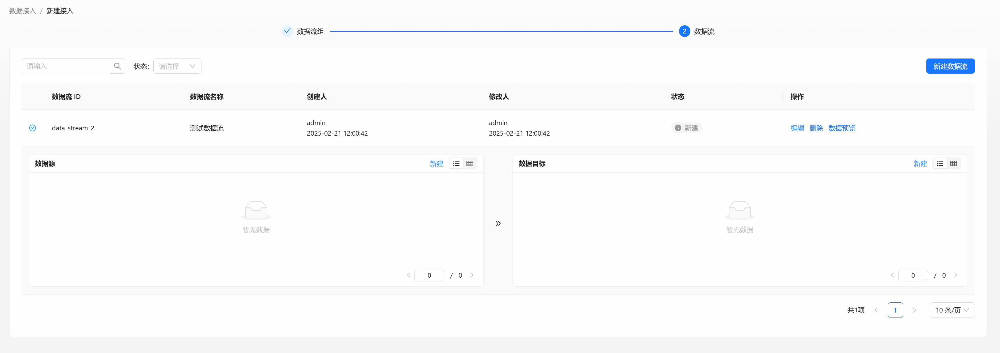

数据源支持的类型如下图：

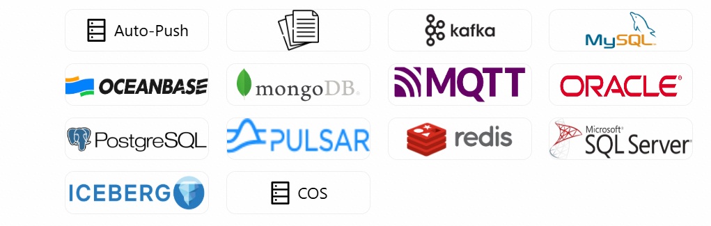

数据目标支持的类型如下图：

创建完数据源和数据目标后，点击【提交审批】按钮进入[审批管理](#审批管理)。

## 数据同步

数据同步是建立数据源和目标数据存储之间一致性的过程，可随着时间持续协调数据。
点击【新建数据同步】按钮创建数据同步组。

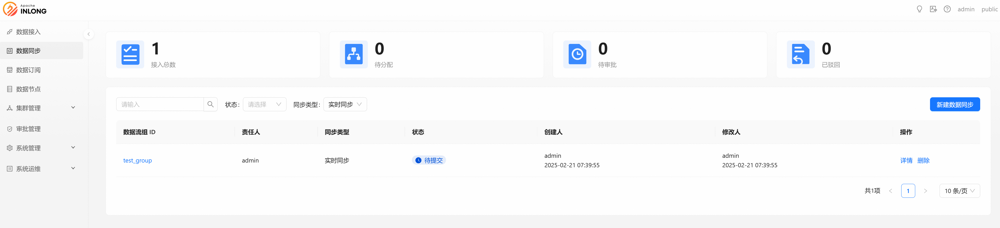

`InLong` 有两种数据同步模式，一种是实时数据同步，一种是离线数据同步。

### 实时数据同步

适用于实时监控、交易流同步等低延迟场景。

#### 步骤 1: 创建实时同步数据流组

选择【实时】同步类型

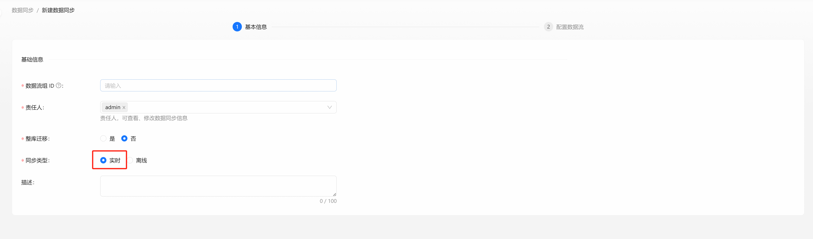

- **数据流组 ID**：统一小写英文名称，请尽量包含产品名称且简洁规范，例如pay_base。
- **责任人**：数据流群组拥有者可以查看、修改群组信息，添加、修改所有访问配置项。
- **整库迁移**：是否迁移整个数据库。
- **同步类型**： 实时或离线。
- **描述**：对数据流组进行简单的介绍。

点击【下一步】按钮，创建数据流。

#### 步骤 2: 创建实时同步数据流

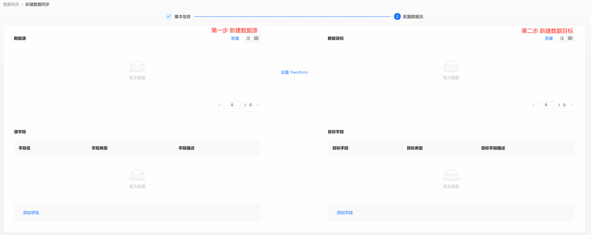

以下是创建实时数据同步的几个示例：

- [MySQL 到 ClickHouse 示例](/quick_start/realtime_data_sync/mysql_clickhouse_example.md)
- [MySQL 到 StarRocks 示例](/quick_start/realtime_data_sync/mysql_starrocks_example.md)
- [MySQL 到 Iceberg 示例](/quick_start/realtime_data_sync/mysql_iceberg_example.md)
- [Pulsar 到 ClickHouse 示例](/quick_start/realtime_data_sync/pulsar_clickhouse_example.md)

### 离线数据同步

适用于数据仓库构建，历史迁移等场景。

#### 步骤 1: 创建离线同步数据流组

选择同步类型为【离线】，除了填写基本的数据流组信息外，还需要填写离线同步相关信息，如调度规则、依赖配置等。

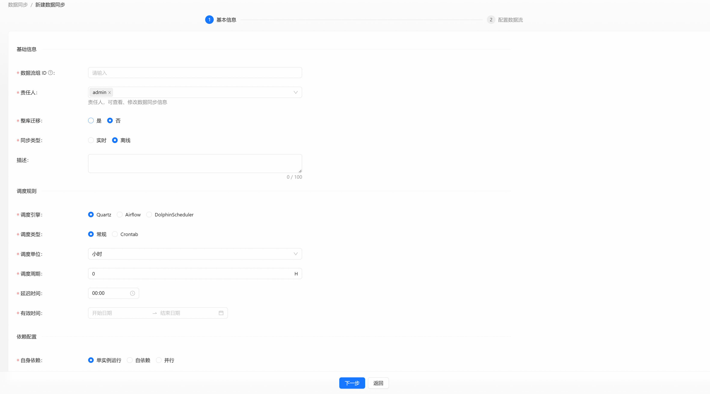

**调度规则**:

- **调度引擎**：选择 `quartz` 或 `airflow` 或 `dolphinScheduler` 调度引擎。
- **调度类型**：选择常规或 `Crontab` 类型.
- **调度单位**：选择分钟、小时、天、月等。
- **调度周期**：填写调度单位时间。
- **延迟时间**：填写所需的延迟时间。
- **有效时间**：配置离线规则的有效时间。
- **自身依赖**：选择依赖类型。

#### Step 2: 创建离线同步数据流

以下是创建离线数据同步的几个示例：

- [Quartz 调度引擎示例](/quick_start/offline_data_sync/quartz_example.md)
- [DolphinScheduler 调度引擎示例](/quick_start/offline_data_sync/dolphinscheduler_example.md)
- [Airflow 调度引擎示例](/quick_start/offline_data_sync/airflow_example.md)

## 数据订阅

数据订阅为订阅者提供他们有权访问的数据的批量数据源。

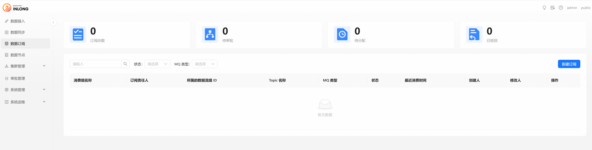

点击【新建订阅】按钮创建一个新的数据订阅。

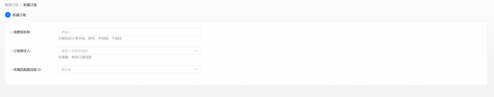

- **消费组名称**：消费者简称必须由小写字母、数字、下划线组成，最终审批将按照缩写拼接的方式分配消费者名称。
- **订阅责任人**：责任人可以查看、修改消费信息。
- **所属的数据流组 ID**：需要在下拉框中选择目标群体。

## 数据节点

数据节点模块展示当前用户权限范围内的数据节点列表，可以查看、编辑、更新、删除这些节点的详细信息。

点击【新建】按钮弹出创建新节点的弹框，可以选择不同的节点类型，如：`Redis`、`Kafka`、`MySQL` 等。

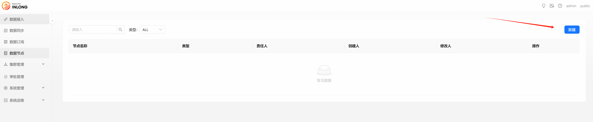

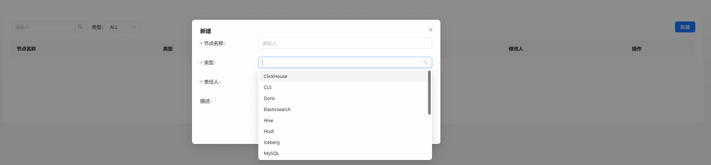

- **节点名称**：节点的简称，必须由小写字母、数字和下划线组成。
- **类型**：选择节点的类型。
- **责任人**：节点负责人可以查看、修改节点信息。
- **描述**：数据节点进行简单的介绍。

## 集群管理

集群管理模块分为集群标签管理和集群管理两个模块，集群标签管理用于管理集群标签，集群管理用于管理集群。

### 集群标签管理

集群标签管理可以添加、删除、修改集群标签，查看集群列表，绑定集群等。

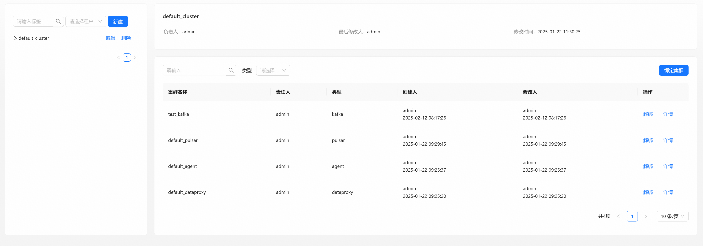

#### 创建新的集群标签

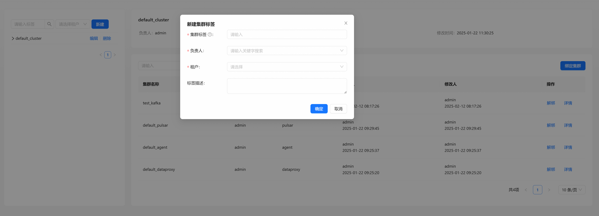

- **集群标签**：标签的简称，必须由小写字母、数字和下划线组成。修改集群标签名称会同时修改与该标签绑定的所有集群中的标签名称。
  请确保该标签未被InLong Group使用。
- **负责人**：T负责人可以查看、修改集群标签信息。
- **租户**：选择需要绑定的租户。
- **标签描述**：集群标签的文字介绍。

#### 绑定集群

点击【绑定集群】按钮，打开绑定集群信息框，选择需要绑定的集群。

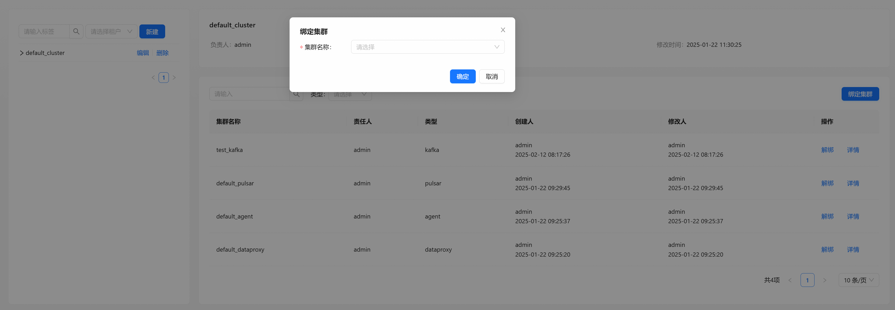

- **集群名称**：当集群列表为空时，需要前往集群管理页面创建集群，这样才能将集群标签绑定到集群上。

### 集群管理

集群管理可以添加、删除、修改集群，查看集群列表，查看集群详细信息，查看集群节点等。

#### 创建新集群

点击【新建集群】按钮，将弹出创建新集群的弹框。

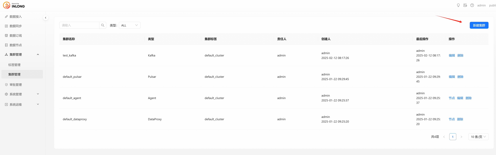

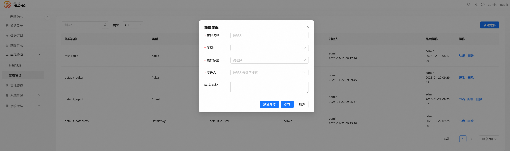

- **集群名称**：集群的简称，必须由小写字母、数字和下划线组成。
- **类型**：选择集群类型。您可以选择不同的集群类型，例如 `Agent`，`Kafka` 等。
- **责任人**：集群责任人可以查看、修改集群信息。
- **集群标签**：选择需要绑定的集群标签。
- **集群描述**：集群简单的文字介绍。

## 审批管理

审批管理功能模块目前包括我的申请和我的审批，以及管理系统中的所有数据访问、消费申请审批等任务。

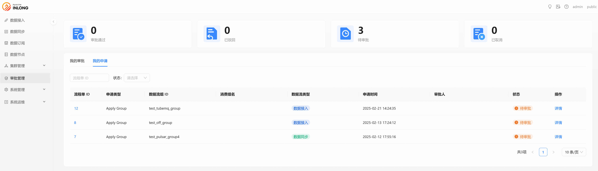

点击【详情】可以查看该任务当前的基本信息及审批进度，显示申请人当前在系统中提交数据存取和消费的任务列表。

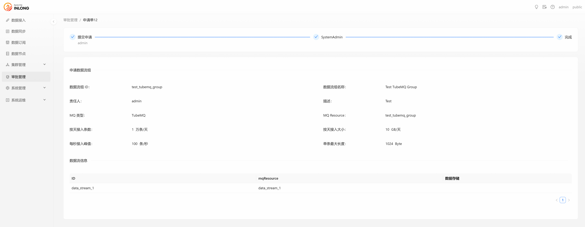

## 常见问题

### 数据流配置错误

一般是 `MQ` 或者 `Flink` 集群配置错误导致，可以在页面查看错误信息，或者进入 `Manager` 容器查看详细日志。