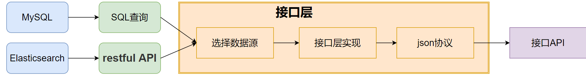

InLong审计是独立于InLong的一个子系统，对InLong系统的Agent、DataProxy、Sort模块的入流量、出流量进行实时审计对账。
对账的粒度有分钟、小时、天三种粒度。

审计对账以日志上报时间为统一的口径，参与审计的各个服务将按照相同的日志时间进行实时对账。通过审计对账，我们可以清晰的了解InLong
各个模块的传输情况，以及数据流是否有丢失或者重复

## 架构

1. 审计SDK嵌套在需要审计的服务，对服务进行审计，将审计结果发送到审计接入层。
2. 审计接入层将审计数据写到MQ(kafak或者pulsar)。
3. 分发服务消费MQ的审计数据，将审计数据写到MySQL、Elasticsearch。
4. 接口层将MySQL、Elasticsearch的数据进行封装。
5. 应用场景主要包括报表展示、审计对账等等。

## 审计维度
| | | || | | | | | |
| ---- | ---- | ---- | ---- | ---- | ---- | ---- | ---- | ---- | ---- |
| 机器ip |  容器ID | 线程ID | 日志时间(分钟) | 审计ID | inlong_group_id | inlong_stream_id | 条数 | 大小 | 传输时延(ms) |

## 审计项ID
每个模块的接收与发送分别为一个独立的审计项ID

|Inlong服务模块 |审计ID |
|----|----|
|Inlong api接收成功	|1 |
|Inlong api发送成功	|2|
|Inlong agent接收成功	|3|
|Inlong agent发送成功	|4|
|Inlong DataProxy接收成功	|5|
|Inlong DataProxy发送成功	|6|
|Inlong分发服务1接收成功	|7|
|Inlong分发服务1发送成功	|8|
|Inlong分发服务2接收成功	|9|
|Inlong分发服务2发送成功	|10|

## 数据传输协议
sdk、接入层、分发层之间的传输协议为Protocol Buffers
```markdown
syntax = "proto3";

package org.apache.inlong.audit.protocol;

message BaseCommand {
    enum Type {
        PING          = 0;
        PONG          = 1;
        AUDITREQUEST  = 2;
        AUDITREPLY    = 3;
    }
    Type type                            = 1;
    optional AuditRequest audit_request  = 2;
    optional AuditReply audit_reply      = 3;
    optional Ping ping                   = 4;
    optional Pong pong                   = 5;
}

message Ping {
}

message Pong {
}

message AuditRequest {
  AuditMessageHeader msg_header = 1;   //包头
  repeated AuditMessageBody msg_body = 2;   //包体
}

message AuditMessageHeader {
  string ip = 1;            //sdk客户端ip
  string docker_id = 2;     //sdk所在容器ID
  string thread_id = 3;     //sdk所在的线程ID
  uint64 sdk_ts = 4;        //sdk上报时间
  uint64 packet_id = 5;     //sdk上报的包ID
}

message AuditMessageBody {
  uint64 log_ts = 1;    //日志时间
  string inlong_group_id= 2;   //inlong_group_id
  string inlong_stream_id= 3; //inlong_stream_id
  string audit_id = 4;   //审计ID
  uint64 count = 5;     //条数
  uint64 size = 6;      //大小
  int64  delay = 7;      //总传输延时
}

message AuditReply {
  enum RSP_CODE {
    SUCCESS  = 0;  //成功
    FAILED   = 1;   //失败
    DISASTER = 2; //容灾
  }
  RSP_CODE rsp_code = 1;   //服务端返回码
  optional string message = 2;
}
```
## 审计SDK实现细节
### 目标
***1.支持本地容灾***  
***2.数据唯一性***  
***3.减少异常重启导致的数据丢失***  

### 主要逻辑图
  
1.sdk对外提供add接口，参数为:audit_id, inlong_group_id，inlong_stream_id，条数，大小 
2.sdk以日志时间+audit_id+inlong_group_id+inlong_stream_id为key，进行实时统计  
3.满足发送周期或者业务程序主动触发，SDK将统计结果进行PB协议组包，发送审计接入层  
4.如果(4)发送失败，则放入失败队列，下个周期继续发送  
5.当失败队列大于阈值时，通过本地文件进行容灾  

### 服务发现
审计sdk与接入层之间的名字发现，支持插件化，包括域名、vip等

### 容灾逻辑
   
1.sdk发送接入层失败时，会放入失败队列  
2.失败队列达到阈值时，将写到本地容灾文件  
3.本地容灾文件达到阈值时，将淘汰旧数据(按时间淘汰)  

## 接入层实现细节
### 目标
***1.高可靠***
***2.at least once***

### 主要逻辑

1.接入层收到sdk发送的包之后，写消息队列  
2.写消息队列成功之后，则对sdk返回成功  
3.消息队列的数据协议为PB协议  
4.写消息队列的ack设置成-1或者all  

## Elasticsearch分发实现
### 目标
***1.高实时性(分钟级)***  
***2.可运营每天百亿级别的审计数据***  
***3.可去重***  

### 主要逻辑图

1.分发服务AuditDds实时消费消息  
2.根据审计数据中的审计ID，将数据路由到对应的Elasticsearch集群  
3.每个审计ID对应一个Elasticsearch索引  

### 索引设计
#### 索引名  
索引名由日期+审计项ID组成，如20211019_1,20211019_2  
#### 索引字段格式

|字段               |类型        |说明 |
|----               |----       |----|
|audit_id	        |keyword    |审计ID |
|inlong_group_id	|keyword    |inlong_group_id |
|inlong_stream_id	|keyword    |inlong_stream_id |
|docker_id	        |keyword    |sdk所在容器ID |
|thread_id	        |keyword    |线程ID |
|packet_id	        |keyword    |sdk上报的包ID |
|ip	                |keyword    |机器IP |
|log_ts	            |keyword    |日志时间 |
|sdk_ts	            |long       |审计SDK上报时间 |
|count	            |long       |日志条数 |
|size	            |long       |日志大小 |
|delay	            |long       |日志传输时间，等于当前机器时间减去日志时间 |

#### 索引的存储周期
按天存储，存储周期动态可配置

## Elasticsearch写入设计
### inlong_group_id、inlong_stream_id、审计ID与Elasticsearch索引的关系

系统设计与服务实现上inlong_group_id、inlong_stream_id、审计ID与Elasticsearch索引为1:N的关系  

### 写入路由策略

使用inlong_group_id、inlong_stream_id路由到Elasticsearch分片，保证相同的inlong_group_id、inlong_stream_id存储在相同的分片
将相同的inlong_group_id、inlong_stream_id写到同一个分片，查询以及聚合的时候，只需要处理一个分片，能够大大提高性能  

### 可选按doc_id去重
Elasticsearch实时去重比较耗资源，此功能通过配置可选。

### 使用bulk批量方式
使用bulk写入，每批5000条，提高Elasticsearch集群的写入性能

## MySQL分发实现
### 目标
***1.高实时性(分钟级)***   
***2.部署简单***  
***3.可去重***

### 主要逻辑图

MySQL分发支持根据审计ID分发到不同的MySQL实例，支持水平扩展。

### 使用介绍
  1.当业务的审计规模比较小，小于千万级/天时，就可以考虑采用MySQL作为审计的存储。因为MySQL的部署相对Elasticsearch要简单的多， 资源成本也会少很多。   
  2.如果审计数据规模很大，MySQL支撑不了时，就可以考虑采用Elasticsearch作为存储，毕竟单个Elasticsearch集群能够支持百亿级别的审计数据，也支持水平扩容。
  
## 审计使用接口设计
### 主要逻辑图

审计接口层通过SQL查MySQL或者restful查Elasticsearch。接口具体怎么查哪一种存储，取决使用了哪一种存储

### UI 界面展示
### 主要逻辑图

前端页面通过接口层，拉取各个模块的审计数据，进行展示