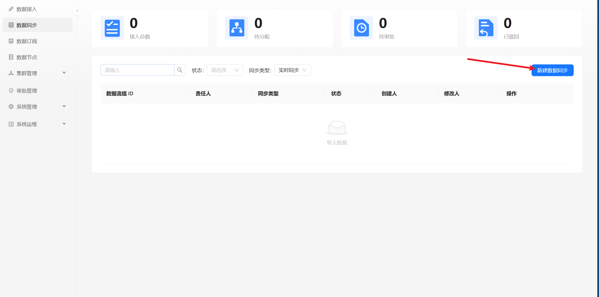
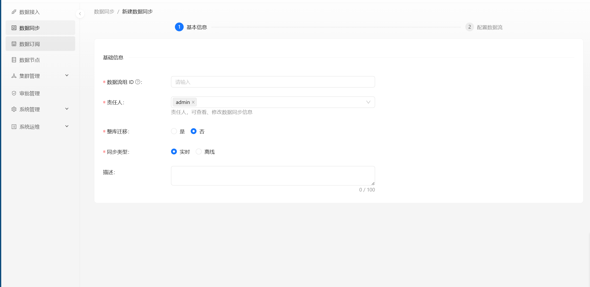
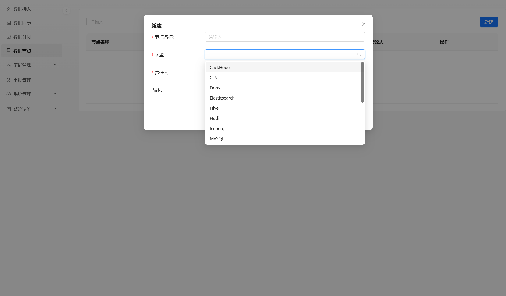
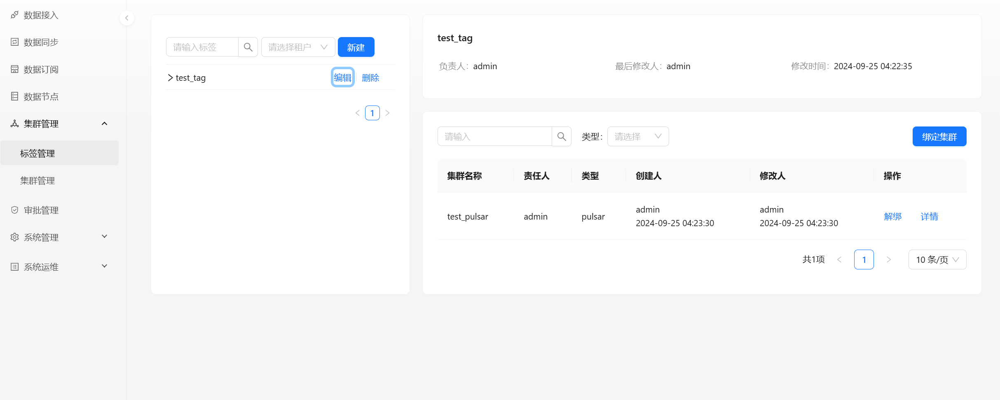
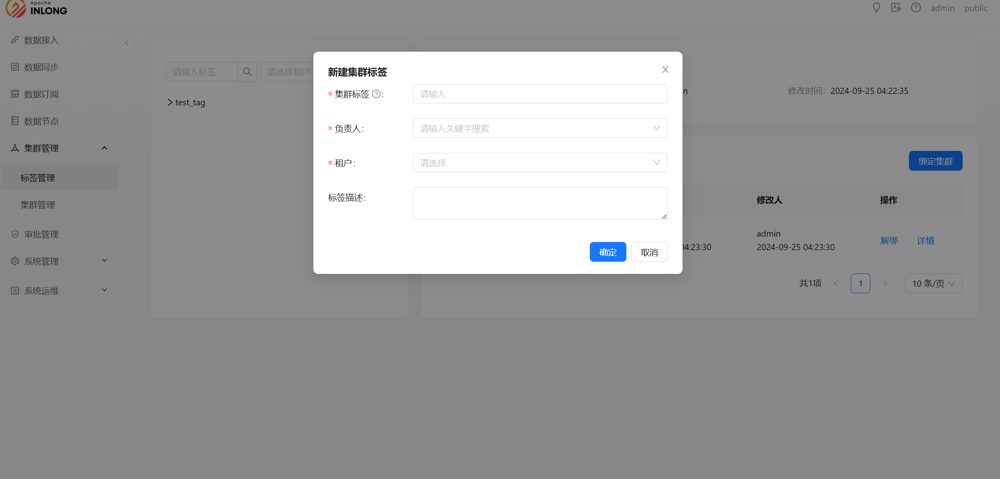
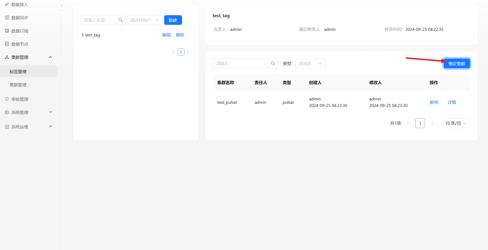
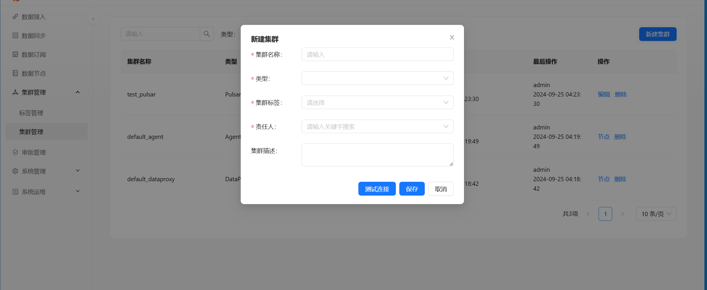

## 用户登录

需系统使用用户输入账号名称和密码，默认账号是`admin inlong`。

## 数据接入

数据接入模块展示目前用户权限内接入系统所有任务列表，可以对这些任务详情查看、编辑更新和删除操作。

点击【新建接入】接入流程，数据接入信息填写有两个步骤：Group 信息、数据流。

### 数据流 Group 信息

#### 接入要求

接入要求需要用户进行选择消息中间件：高吞吐（TUBE）或者高可靠（PULSAR）：

- 高吞吐（InLong TubeMQ）：高吞吐消息传输组件，适用于日志类的消息传递。
- 高可靠（Apache Pulsar）：高可靠消息传输组件，适用于计费等场景。

#### Group 信息

需要用户对接入任务填写基础数据流 Group 信息。

- Group 英文名称：统一小写英文名称，请尽量包含产品名和简洁规范，如pay_base
- Group 中文名称：Group 的中文描述，便于使用与检索，最多128个字
- Group 责任人：至少1人，Group 责任人可查看、修改Group 信息，新增和修改所有接入配置项
- Group 介绍：简短对此次接入任务Group 背景和应用进行介绍：

#### 接入规模

接入规模需要用户预先针对接入数据进行规模判断，以便后续分配计算和存储资源。

### 数据流

点击【下一步】进入到数据流信息填写步骤，数据流信息填写有四个模块：基础信息、数据来源、数据信息、数据流向。

在数据流流程中可以点击【新建】，创建一个新的数据流信息填写页面：

#### 基础信息

需用户对该接入任务中数据流的基础信息进行填写：

- 数据流ID：前缀根据产品/项目自动生成，这在某个具体的接入中是唯一的，与数据源和入库的表中的数据流ID保持一致
- 数据流名称：接口信息说明，长度限制为64个英文字符（对应32个中文字符）
- 数据流责任人：数据流责任人可查看、修改数据流信息，新增和修改所有接入配置项
- 数据流介绍：数据流简单文本介绍

#### 数据来源

需用户选择该数据流的消息来源，目前支持文件、自主推送两种方式，并且可以在高级选项中补充该数据来源详细信息：

- 文件：采集数据以文件形式存放，采集机器部署 InLong Agent，根据定制的策略规则进行读取
- 自主推送：通过 SDK 向消息中间件推送数据

#### 数据信息

需用户填写该数据流中数据相关信息：

- 数据格式：数据来源格式，是普通文本类型，或者KV键值对数据
- 数据编码
- 源字段分隔符
- 源数据字段

#### 数据流向

需用户对此任务的流向终流向进行选择，此部分为非必填项，目前支持Hive和自主推送两种：

HIVE流向：

- 目标库：hive数据库名（需要提前准备创建好）
- 目标表：hive表名
- 一级分区：hive数据划分hdfs数据一级子目录的字段名
- 二级分区：hive数据划分hdfs数据一级子目录的字段名
- 用户名：hiveserver连接账户名
- 用户密码：hiveserver连接账密码
- HDFS url：hive底层hdfs连接
- JDBC url：hiveserver 的jdbcurl
- 字段相关信息： 源字段名、源字段类型、HIVE字段名、HIVE字段类型、字段描述，并支持删除和新增字段

## 我的申请

审批管理功能模块目前包含了我的申请和我的审批，管理系统中数据接入和数据消费申请审批全部任务。

展示目前申请人在系统中数据接入、消费提交的任务列表，点击【详情】可以查看目前该任务基础信和审批进程：

#### 申请数据接入详情

数据接入任务详细展示目前该申请任务基础信息包括：申请人相关信息、申请接入基础信息，以及目前审批进程节点：

## 数据消费

数据消费目前不支持直接消费接入数据，需走数据审批流程后方可正常消费数据； 点击【新建消费】，进入数据消费流程，需要对消费信息相关信息进行填写：

### 消费信息

申请人需在该信息填写模块中逐步填写数据消费申请相关基础消费数据流 Group 信息：

- 消费组名称：消费者的简要名称，必须是小写字母、数字、下划线组成，最后审批会根据简称拼接分配出消费者名称
- 消费责任人：自行选择责任人，必须至少2人；责任人可查看、修改消费信息
- 消费目标数据流Group ID：需要选择消费数据的数据流Group ID，可以点击【查询】后，在弹窗页面中选择合适的数据流Group ID，如下图所示：
- 数据用途：选择数据使用用途
- 数据用途说明：需申请人根据自身消费场景，简要说明使用的项目和数据的用途

信息填完完成后，点击【提交】后，会将次数据消费流程正式提交待审批人审批后方可生效。

## 数据同步

数据同步模块展示目前用户权限内同步系统所有任务列表，可以对这些任务详情查看、编辑更新和删除操作。
点击【新建数据同步】，进入数据同步流程，需要对同步信息相关信息进行填写，可选择两种同步类型：实时或者离线。

### 基础信息

- 数据流组 ID：同步任务的简要名称，必须是小写字母、数字、下划线组成。
- 责任人：责任人可查看、修改同步信息。
- 整库迁移：根据自身需求是否选择是否需要进行整库迁移。
- 
#### 实时同步

填写好相关基础信息之后即可进行下一步

#### 离线同步

填写好相关基础信息后，还需要填写离线同步相关信息，比如：调度规则、依赖配置。

调度类型：根据自身需求选择常规或者Crontab类型。

##### 常规类型

- 调度单位：根据自身需求选择分钟、小时、天、周等。
- 调度周期：根据自身需求选择周期，其单位根据调度单位的选择决定。
- 延迟时间：填写需要的延迟时间。
- 有效时间：配置离线规则的有效时间。

##### Crontab类型

- 有效时间: 可填写时间区间，格式为：2021-01-01 00:00-2021-12-31 23:59
- Crontab 表达式：根据自身需求填写Crontab表达式。

## 数据节点

数据节点模块展示目前用户权限内数据节点列表，可以对这些节点详情查看、编辑更新和删除操作。
点击【新建】，弹出新建节点的对话框，可选择不同的节点类型，比如：Redis，Kafka，MySQL等。

- 节点名称：节点的简要名称，必须是小写字母、数字、下划线组成。
- 节点类型：选择节点的类型。
- 责任人：节点责任人可查看、修改节点信息。

## 集群管理

集群管理模块分为集群标签管理和集群管理两个模块，集群标签管理用于管理集群标签，集群管理用于管理集群。

### 标签管理

集群标签管理可以对集群标签进行新增、删除、修改以及查看集群列表、绑定集群等操作

#### 新增集群标签

- 集群标签：标签的简要名称，必须是小写字母、数字、下划线组成，修改集群标签名称，会同时修改所有绑定了此标签的集群中的标签名，且需确保此标签没有被 InlongGroup 所使。
- 负责人：负责人可查看、修改集群标签信息。
- 租户：选择需要绑定的租户。

#### 绑定集群

- 集群名称：当集群列表为空时，需要去集群管理页面创建需要的集群，集群标签才能绑定集群

### 集群管理

集群管理可以对集群进行新增、删除、修改以及查看集群列表、查看集群详情、查看集群节点等操作

#### 新建集群

点击【新建集群】 ，弹出新建集群的对话框，可选择不同的集群类型，比如：Agent，Kafka等。

- 集群名称：集群的简要名称，必须是小写字母、数字、下划线组成。
- 集群类型：选择集群的类型。
- 负责人：集群责任人可查看、修改集群信息。
- 集群标签：选择需要绑定的标签。

