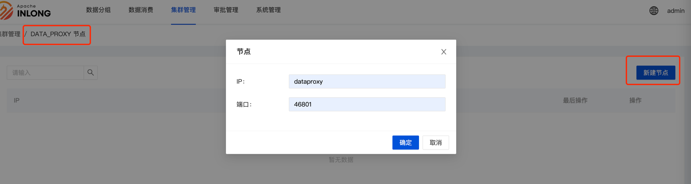
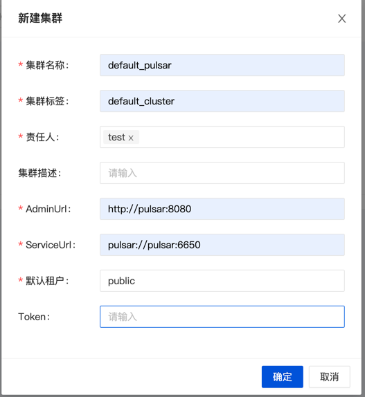

通过 Docker Compose 部署 InLong，这种部署方式只适用于开发与调试，不适用于生产环境。

*注意：Docker 部署默认使用 Apache Pulsar 作为消息队列服务。*

## 环境要求
- [Docker](https://docs.docker.com/engine/install/) 19.03.1+
- Docker Compose 1.29.2+

## 编译

可以参考[如何编译](quick_start/how_to_build.md).

## 部署

启动所有组件：
```
cd docker/docker-compose
docker-compose up -d
```

## 注册集群

### DataProxy 集群

打开 Inlong-Dashboard 页面（默认是 <http://127.0.0.1>），在 [集群管理] 页签中选择添加 DataProxy 集群：


点击 [新建集群] 按钮，在弹出的框中填写 集群名称、集群标签、责任人 即可保存。

> 说明：[集群标签] 是一个逻辑概念，同名的标签将被视为同一套集群，比如相同集群标签的 DataProxy 集群和 Pulsar 集群，属于同一套集群。

然后为此 DataProxy 集群添加节点 —— 一个 DataProxy 集群可以支持添加多个节点：


填写 DataProxy 节点的 IP 和端口即可。



### Pulsar 集群

与上述 DataProxy 集群的添加入口相似，填写示例如下：



## 使用

当所有容器都成功启动后，可以访问 `http://localhost`，并使用以下默认账号登录:
```
User: admin
Password: inlong
```

## 销毁

```
docker-compose down
```
