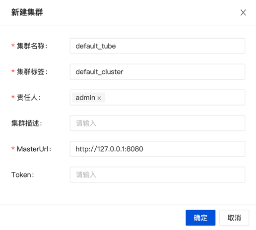

## 环境准备

- 安装并启动 MySQL 5.7+
- 初始化数据库
  `inlong-manager` 目录下有 `sql/apache_inlong_manager.sql`文件，通过下述命令加载此文件，完成表结构及基础数据的初始化：

  ```shell
  # 通过用户名和密码，创建DB和表：
  mysql -uDB_USER -pDB_PASSWD < sql/apache_inlong_manager.sql
  ```

## 添加依赖
- 下载 Sort [Connector Binary file](https://inlong.apache.org/download/main), 并解压放入`inlong-sort/connectors`目录。
- 如果使用 MySQL 数据库，请下载 [mysql-connector-java-8.0.27.jar](https://repo1.maven.org/maven2/mysql/mysql-connector-java/8.0.27/mysql-connector-java-8.0.27.jar)，将其放入 `lib/` 目录。
- 如果使用 PostgreSQL 数据库，则无需额外下载依赖包。

## 修改配置

前往 `inlong-manager` 目录，修改 `conf/application.properties` 文件：

```properties
# manager 服务的端口号
server.port=8083

# 默认使用的配置文件为 dev
spring.profiles.active=dev
```

上面指定了 dev 配置，接下来修改 `conf/application-dev.properties` 文件：
> 如果指定了 test 或 prod，则修改对应的 application-xxx.properties 文件。 

```properties
spring.datasource.druid.url=jdbc:mysql://127.0.0.1:3306/apache_inlong_manager?useSSL=false&allowPublicKeyRetrieval=true&characterEncoding=UTF-8&nullCatalogMeansCurrent=true&serverTimezone=GMT%2b8
spring.datasource.druid.username=root
spring.datasource.druid.password=inlong
```

## 配置 Flink 插件

InLong Manager 可启动 Sort 任务进行数据的消费和落地，需要先配置 Flink 环境信息。配置文件为 `plugins/flink-sort-plugin.properties`。

```properties
# Flink host split by coma if more than one host, such as 'host1,host2'
flink.rest.address=127.0.0.1
# Flink port
flink.rest.port=8081
# Flink job manager port
flink.jobmanager.port=6123
# InLong Audit Proxy Address
metrics.audit.proxy.hosts=127.0.0.1:10081
```

## 启动服务

```shell
bash +x bin/startup.sh
```

## 注册 MQ 集群

### Pulsar 集群

若使用 Pulsar 作为数据缓存的消息队列，则需要添加其配置到 InLong-Manager 中：

打开 Inlong-Dashboard 页面（默认是 <http://127.0.0.1>），在 [集群管理] 页签中选择添加 Pulsar 集群：


点击 [新建集群] 按钮，在弹出的框中填写 集群名称、集群标签、责任人、AdminUrl、ServiceUrl 及默认租户等必填信息即可保存。

> 说明：[集群标签] 是一个逻辑概念，同名的标签将被视为同一套集群，比如相同集群标签的 DataProxy 集群和 Pulsar 集群，属于同一套集群。

填写示例：


### TubeMQ 集群

若使用 InLong TubeMQ 作为数据缓存的消息队列，则需要添加其配置到 InLong-Manager 中：

与上述 Pulsar 集群的添加入口相似，填写示例如下：


