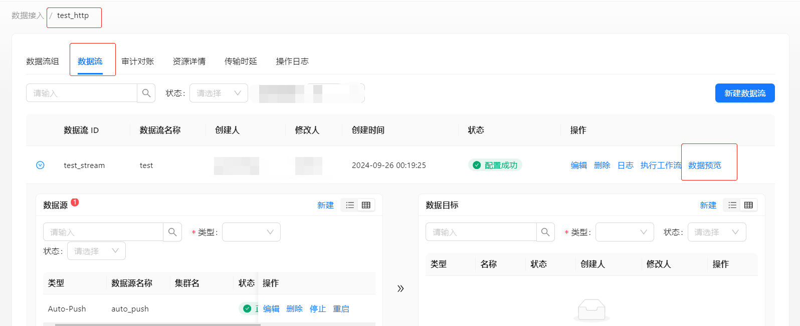

在下面的内容中，我们将通过一个完整的示例介绍如何使用 HTTP 上报数据，快速验证申请的 {groupId, streamId} 是否已生效，数据是否被 InLong DataProxy 接纳并正确地写入到 MQ 集群。

## 准备上报资源
### 申请 InLong group 和 stream
我们需要先在 InLong 的 Manager 里申请上报所需的 {groupId, streamId} 信息，如下图示，我们已经申请了 {test_http, test_stream} 信息并且管理员已审批通过：


在申请的上报流里，我们定义了该上报流的数据采用 CSV 格式上报数据，数据内容由三个字段（ID，Name，Desc）组成，并以竖线（"|"）分隔：


### 查找支持 HTTP 接入的 DataProxy 节点 IP 及端口号
InLong 支持通过 HTTP 直接上报数据，这个上报示例里我们直接从 InLong group 的资源详情页面选一台支持 HTTP 上报的 DataProxy 进行消息上报。在演示环境里 DataProxy 开启的 HTTP 接收端口是 47805，如下图示：


至此，我们已经获得了数据上报所需要的 InLong group 和 stream 信息，以及 HTTP 上报所要上报的 DataProxy 节点 IP 及端口信息，接下来我们就可以通过 HTTP 上报数据，验证申请的 InLong group 和 stream，以及管道是否可用。

## 通过 HTTP 上报数据
按照 InLong 的 HTTP 上报协议要求，我们用 curl 构造一个如下示例的 HTTP 指令进行执行，其中 body 部分我们按照 test_stream 的格式定义构造包含 3 个字段值的记录， {dataproxy_ip:dataproxy_httpport} 为接收上报消息的 DataProxy IP 及端口，大家可以替换为各自环境里的对应信息：
```bash
curl -X POST -d 'groupId=test_http&streamId=test_stream&dt=data_time&body=1|name_1|desc_record_one&cnt=1' http://{dataproxy_ip:dataproxy_httpport}/dataproxy/message
```

- 参数说明：

| 参数       | 含义       | 备注  |
|----------|----------|-----|
| groupId  | 数据流组 id  |     |
| streamId | 数据流 ID   |     |
| body     | 推送的数据内容  |     |
| dt       | 推送的数据时间  |毫秒为单位的时间戳 |
| cnt      | 推送条数     |     |

- 返回值：

| 返回码 | 含义  |
|-----|-----|
| 0   | 成功  |
| 非0  | 失败  |

## 检查数据上报情况
我们通过数据流 test_http:test_stream 的数据预览功能查看 HTTP 上报情况，该功能直接从数据流对应的 MQ 集群抽检最新数据：


我们可以看到刚才上报的数据已经成功写入 MQ 集群：


到这里，我们就可以快速、清楚地知道申请的 InLong group 和 stream，以及管道资源已经可用。

## 常见问题
HTTP 上报的返回结果里返回码及错误信息会很清楚指出具体错误原因，比如 group 或 stream 不存在，上报协议格式不对等，按照对应的错误提示进行调整或者与系统管理员进行对齐即可快速解决问题。