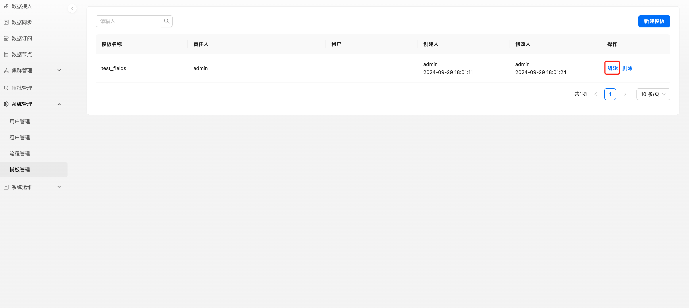
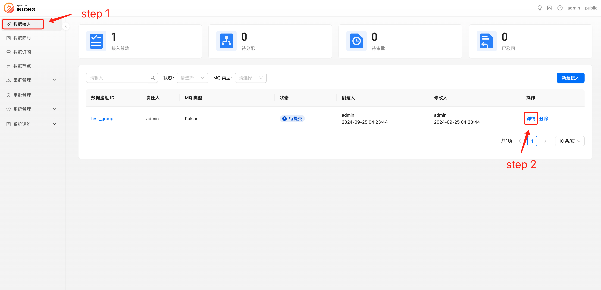
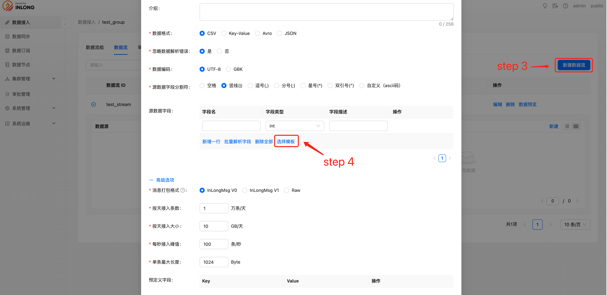
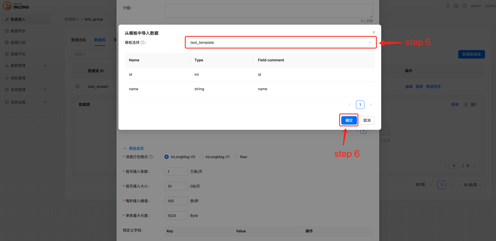

模板管理主要提供字段模板复用的能力，用户可以在新建、修改、删除模板，并且在进行数据接入时，复用配置好的字段模板信息。

### 新建模板

用户可以通过新建模板来生成一个常用的字段模板信息：

- 模板名称：用户自定义名，用来标识此字段模板配置。
- 责任人：该模板负责人，只有责任人能够修改该模板的配置信息。
- 可视范围：该模板可视范围，包括租户、责任人、全局可见三个选项。处于可视范围的用户可以使用该模板。
- 字段信息：该模板配置的字段信息。

### 删除模板

用户可以对已创建的模板进行删除，删除后此模板将停止使用：

### 修改模板

用户可以修改已创建的模板：

### 使用模板

用户配置好字段模板后，可以在数据接入中使用已经配置好的字段模板信息：

- 选择【数据接入】，点击【详情】
  
- 选择【新建数据流】，并点击【选择模板】。
  
- 选择【新建数据流】，并点击【选择模板】，选择已经配置好的数，并完善其他配置后点击保存。
  

  至此完成了字段模板的使用。
