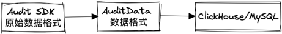

## 概述

在 InLong 系统架构中，采集层、汇聚层和分拣层等模块通过 Audit SDK 将审计数据上报至Audit系统。Audit Proxy 组件负责接收这些数据，并将其转换为
AuditData 格式，随后存储在 MQ 消息的消息体中。
接下来，Audit Store 从 MQ 中提取这些数据，并将其持久化至如 ClickHouse 等存储系统。本文将深入分析和讲解 Audit 系统相关的数据协议。



## Audit SDK 原始数据格式

Audit SDK 的原始数据采用 Protobuf 协议进行封装，其中包含请求类型、数据通用头部和数据主体等信息。以下是相关协议的详细描述：

```protobuf
syntax = "proto3";

package org.apache.inlong.audit.protocol;

message BaseCommand {
  enum Type {
    PING = 0;
    PONG = 1;
    AUDIT_REQUEST = 2;
    AUDIT_REPLY = 3;
  }
  Type type = 1;
  AuditRequest audit_request = 2;
  AuditReply audit_reply = 3;
  Ping ping = 4;
  Pong pong = 5;
}

message Ping {
}

message Pong {
}

message AuditRequest {
  uint64 request_id = 1;
  AuditMessageHeader msg_header = 2;
  repeated AuditMessageBody msg_body = 3;
}

message AuditMessageHeader {
  string ip = 1;
  string docker_id = 2;
  string thread_id = 3;
  uint64 sdk_ts = 4;
  uint64 packet_id = 5;
}

message AuditMessageBody {
  uint64 log_ts = 1;
  string inlong_group_id = 2;
  string inlong_stream_id = 3;
  string audit_id = 4;
  uint64 count = 5;
  uint64 size = 6;
  int64  delay = 7;
  string audit_tag = 8;
  uint64 audit_version = 9;
}

message AuditReply {
  enum RSP_CODE {
    SUCCESS = 0;
    FAILED = 1;
    DISASTER = 2;
  }
  uint64 request_id = 1;
  RSP_CODE rsp_code = 2;
  string message = 3;
}
```

#### Audit Header

审计数据的头部包含以下机器元数据信息：机器 IP、容器 ID、线程 ID、当前机器时间以及数据包 ID。以下是具体的协议描述：

```protobuf
message AuditMessageHeader {
  string ip = 1;
  string docker_id = 2;
  string thread_id = 3;
  uint64 sdk_ts = 4;
  uint64 packet_id = 5;
}
```

- IP：记录生成或处理数据的机器的 IP 地址;
- Docker ID：标识数据所属的容器;
- Thread ID：标识生成或处理数据的线程;
- SdkTs：记录 SDK 上报数据的机器时间戳;
- Packet ID：用于标识每个数据包。

这些机器元数据信息的用途在于实现审计数据的去重以及运营监控。通过记录和分析这些信息，可以确保数据的唯一性，同时有助于进行运营监控和故障排查等操作。

#### Audit Body

审计数据的主体包含以下信息：数据时间、InLong GroupId、InLong StreamId、AuditId、AuditTag、Audit版本、条数、大小以及传输时延。以下是具体的协议描述：

```protobuf
message AuditMessageBody {
  uint64 log_ts = 1;
  string inlong_group_id = 2;
  string inlong_stream_id = 3;
  string audit_id = 4;
  uint64 count = 5;
  uint64 size = 6;
  int64  delay = 7;
  string audit_tag = 8;
  uint64 audit_version = 9;
}
```

- LogTs：记录数据生成或处理的时间戳；
- InLong GroupId：标识数据所属的 InLong 组；
- InLong StreamId：标识数据所属的 InLong 流；
- AuditId：用于唯一标识每个审计记录；
- AuditTag：用于标记审计记录的特定标签；
- Audit Version：记录审计记录的版本号；
- Count：记录数据中包含的条目数量；
- Size：记录数据的大小；
- Delay：记录数据传输所花费的时间。

这些审计信息的目的是用于对账，以确保数据的完整性和准确性。通过对这些信息进行统计，可以实现数据验证、故障排查以及性能分析等操作。

## AuditData 数据格式

Audit Proxy负责接收来自 Audit SDK 发送的 Protobuf 格式数据，并对其进行解析。解析完成后，它将 Audit Header 和Audit Body
组装成一条完整的审计数据，随后将该数据写入消息队列（ MQ ）。AuditData 代表组装后的数据格式，具体细节如下：

```json
{
  "ip": "127.0.0.1",
  "dockerId": "1",
  "threadId": "1",
  "sdkTs": 1727600278000,
  "packetId": 1,
  "logTs": 1727600278000,
  "inlongGroupId": "groupId",
  "inlongStreamId": "streamId",
  "auditId": "auditId",
  "auditTag": "auditTag",
  "count": 1,
  "size": 1,
  "delay": 1,
  "auditVersion": 1
}
```

## 审计数据存储格式

Audit Store 从消息队列（ MQ ）中消费 `AuditData` 审计数据，对其进行协议解析后，将数据持久化至 ClickHouse、MySQL
等存储系统中。具体的存储目标 Schema 如下所示：

### ClickHouse 表 Schema

```sql
CREATE TABLE apache_inlong_audit.audit_data
(
    `log_ts`           DateTime COMMENT 'Log timestamp',
    `audit_id`         String COMMENT 'Audit id',
    `inlong_group_id`  String COMMENT 'The target inlong group id',
    `inlong_stream_id` String COMMENT 'The target inlong stream id',
    `audit_tag`        String COMMENT 'Audit tag',
    `audit_version`    Int64 DEFAULT -1 COMMENT 'Audit version',
    `ip`               String COMMENT 'Client IP',
    `docker_id`        String COMMENT 'Client docker id',
    `thread_id`        String COMMENT 'Client thread id',
    `sdk_ts`           DateTime COMMENT 'SDK timestamp',
    `packet_id`        Int64 COMMENT 'Packet id',
    `count`            Int64 COMMENT 'Message count',
    `size`             Int64 COMMENT 'Message size',
    `delay`            Int64 COMMENT 'Message delay',
    `update_time`      DateTime COMMENT 'Update time'
) ENGINE = ReplicatedMergeTree('/clickhouse/tables/{uuid}/{shard}', '{replica}')
  PARTITION BY toDate(log_ts)
  ORDER BY (log_ts, audit_id, inlong_group_id, inlong_stream_id, audit_tag, audit_version, ip)
  TTL toDateTime(log_ts) + toIntervalDay(8)
  SETTINGS index_granularity = 8192
```

如上所述，该表采用 ReplicatedMergeTree 存储引擎，以实现分布式存储和高可用性。数据将根据 log_ts 列进行分区，并按照( log_ts,
audit_id, inlong_group_id, inlong_stream_id, audit_tag, audit_version, ip )的顺序进行存储和管理，以优化查询性能。

### MySQL 表 Schema

```sql
CREATE TABLE IF NOT EXISTS `audit_data`
(
    `id`               int(32)      NOT NULL PRIMARY KEY AUTO_INCREMENT COMMENT 'Incremental primary key',
    `ip`               varchar(32)  NOT NULL DEFAULT '' COMMENT 'Client IP',
    `docker_id`        varchar(100) NOT NULL DEFAULT '' COMMENT 'Client docker id',
    `thread_id`        varchar(50)  NOT NULL DEFAULT '' COMMENT 'Client thread id',
    `sdk_ts`           TIMESTAMP    NOT NULL DEFAULT CURRENT_TIMESTAMP COMMENT 'SDK timestamp',
    `packet_id`        BIGINT       NOT NULL DEFAULT '0' COMMENT 'Packet id',
    `log_ts`           TIMESTAMP    NOT NULL DEFAULT CURRENT_TIMESTAMP COMMENT 'Log timestamp',
    `inlong_group_id`  varchar(100) NOT NULL DEFAULT '' COMMENT 'The target inlong group id',
    `inlong_stream_id` varchar(100) NOT NULL DEFAULT '' COMMENT 'The target inlong stream id',
    `audit_id`         varchar(100) NOT NULL DEFAULT '' COMMENT 'Audit id',
    `audit_tag`        varchar(100)          DEFAULT '' COMMENT 'Audit tag',
    `audit_version`    BIGINT                DEFAULT -1 COMMENT 'Audit version',
    `count`            BIGINT       NOT NULL DEFAULT '0' COMMENT 'Message count',
    `size`             BIGINT       NOT NULL DEFAULT '0' COMMENT 'Message size',
    `delay`            BIGINT       NOT NULL DEFAULT '0' COMMENT 'Message delay count',
    `update_time`      timestamp    NOT NULL DEFAULT CURRENT_TIMESTAMP ON UPDATE CURRENT_TIMESTAMP COMMENT 'Update time',
    INDEX group_stream_audit_id (`inlong_group_id`, `inlong_stream_id`, `audit_id`, `log_ts`)
) ENGINE = InnoDB
  DEFAULT CHARSET = UTF8 COMMENT ='Inlong audit data table';
```

如上所述，该表采用 InnoDB 存储引擎以确保数据一致性。同时，通过使用 INDEX 子句创建了名为 group_stream_audit_id 的索引，该索引涵盖了
inlong_group_id、inlong_stream_id、audit_id 和 log_ts 列。
这一索引的创建有助于提高查询效率，尤其是在基于这些列进行筛选和排序时。