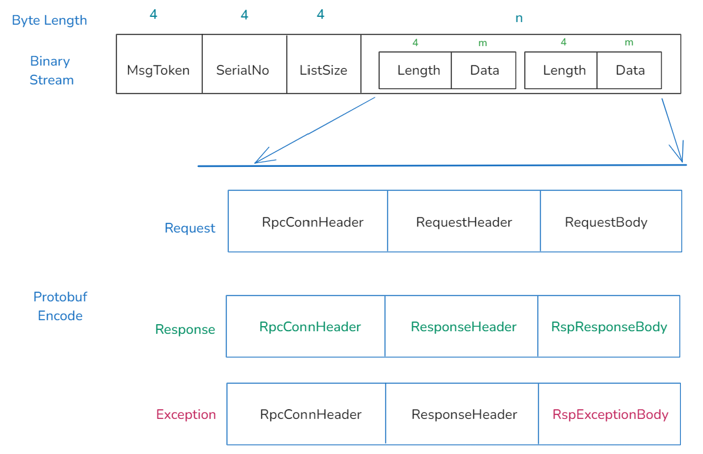
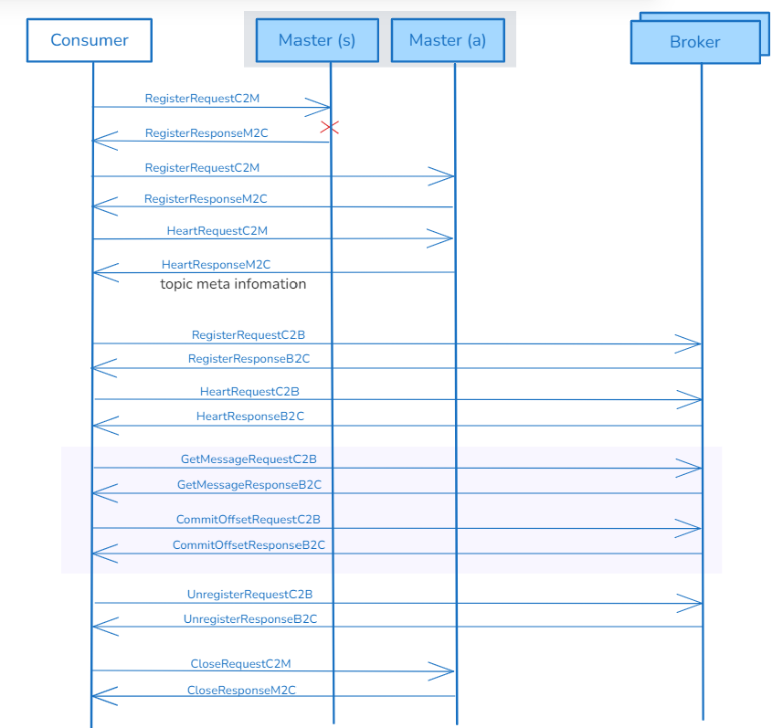
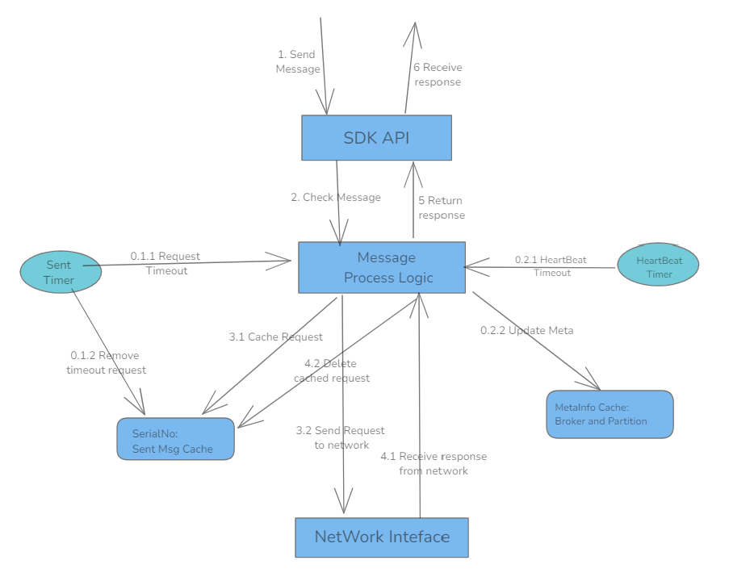

## 概述

InLong TubeMQ 模块的各个节点间（Client、Master、Broker）以 TCP 长连接方式进行交互，采用自定义的二进制编码协议构造交互的请求和响应消息。本文主要介绍该二进制协议的定义，及示例如何通过该协议完成 TubeMQ 的生产和消费交互全过程。

## TubeMQ 消息格式

下图是 TubeMQ 消息格式定义示意图：



从上图可以看出，每条交互消息都是由固定 3 个部分组成：

- MsgToken： 该字段用来标识 TubeMQ 消息合法性，每个 TubeMQ 消息都会携带规定的 `RPC_PROTOCOL_BEGIN_TOKEN` 参数值。客户端收到不是以该字段开始的消息时，说明消息非 TubeMQ 发送的合法消息，可以根据策略关闭该连接，提示错误退出或者重连；

- SerialNo：消息序列号，由请求方生成，并由请求的接收方在响应消息里原样返回，供响应接收方关联响应消息锁对应的请求；

- 消息内容部分：该部分由 Protobuf 编码，通过几个复合部分组成：

  - ListSize：4 字节，表示按照 Protobuf 编码后的数据以一定长度切割后的数据块总个数，目前协议定义下该字段不为 0；
  
  - `[<Length><Data>]`： 数据块，采用 2 个字段组成，表示发送的数据块长度及数据内容，其中：
    
    - Length：标识数据块长度
    
    - Data：标识数据块的二进制数据内容

为什么会以 `ListSize [<Length><Data>]` 形式来定义 Protobuf (下文简称 PB) 编码的数据内容？
主要原因是 TubeMQ 最初实现中序列化后的 PB 数据采用的是 ByteBuffer 对象保存，Java 里 ByteBuffer 单个最大块长上限是 8196 字节，超过单个块长度的 PB 消息内容就被多个 ByteBuffer 保存；而数据序列化到 TCP 消息时没有统计总长，直接按照 PB 序列化的 ByteBuffer 列表写入到了消息中。 
**在多语言实现时候，这块需要特别注意：** 需要将 PB 数据内容序列化成块数组（PB 编解码里有对应支持）。

消息内容部分的 PB 编解码文件存储在 `org.apache.inlong.tubemq.corerpc` 模块下，详细的格式定义参考相关文件。

### PB格式编码

PB 协议分为三个部分：
 
- RPC 框架定义：`RPC.proto`

- Master 相关的消息编码：`MasterService.proto`

- Broker 相关的消息编码：`BrokerService.proto`

这些协议定义文件在通过 PB 直接编译后获得对应的实现类。

以 RPC.proto 为例介绍，RPC.proto 定义了 6 个结构，分为 2 种类型：

- 请求消息

- 响应消息，包括正常响应返回以及抛异常情况下的响应返回

请求消息编码及响应消息解码可以参考 `NettyClient.java` 类实现，这个部分的定义存在一些改进空间，具体见 [TUBEMQ-109](https://issues.apache.org/jira/browse/TUBEMQ-109)，但由于兼容性考虑，会逐步的替换，按照当前 proto 版本实现至少在 1.0.0 版本前交互不是问题，但 1.0.0 时会考虑用新协议，协议实现模块需要各个 SDK 预留出改进空间。

以请求消息填写为例，RpcConnHeader 等相关结构如下：

```protobuf
message RpcConnHeader {
    required int32 flag = 1;
    optional int64 traceId = 2;
    optional int64 spanId = 3;
    optional int64 parentId = 4;
}

message RequestHeader {
    optional int32 serviceType = 1;
    optional int32 protocolVer = 2;
}

message RequestBody {
    required int32 method = 1;
    optional int64 timeout = 2;
    optional bytes request = 3;
}
```
其中：

- `RpcConnHeader` 的 `flag` 标记的是否请求消息，后面 3 个字段标记的是消息跟踪的相关内容，目前没有使用；

- `RequestHeader` 包含了服务类型，协议版本相关信息；

- `RequestBody` 包含了请求方法，超时时间，请求内容，其中 `timeout` 是一个请求被服务器收到到实际处理时的最大允许等待时间长，超过就丢弃，目前缺省为 10 秒。

请求填写具体实现见如下部分：

```java
RequestWrapper requestWrapper =
                new RequestWrapper(PbEnDecoder.getServiceIdByServiceName(targetInterface),
                        RpcProtocol.RPC_PROTOCOL_VERSION,
                        RpcConstants.RPC_FLAG_MSG_TYPE_REQUEST,
                        requestTimeout); // 请求超时时间
```
至此，TubeMQ 的协议格式定义介绍完成，接下来我们以这些协议格式组成的消息完成数据生产和消费。

## 客户端请求响应交互

### Producer 生产交互图

Producer 一共使用了 4 对指令：与 Master 节点进行注册，保持心跳，以及退出注册操作；与 Broker 节点交互上报消息：


从这里我们可以看到，Producer 从 Master 获取指定 Topic 对应的分区列表等元数据信息，获得这些信息后按照客户端的规则选择分区并把消息发送给对应的 Broker。

Producer 在 **多语言实现时需要注意：**

- Master 是有主备节点的，只有主节点可以提供服务，当 Producer 链接到备节点时会收到 `StandbyException` 异常响应。此时客户端实现需要选择其他的 Master 节点进行注册，并最终选择注册上主 Master 节点为止；

- 生产过程中遇到 Master 连接失败时，比如超时，链接被动断开等，Producer 必须发起到 Master 重注册请求；

- Producer 从 Master 收到 Topic 的元数据信息后要提前做到 Broker 预连接操作，避免数据生产时突增大量链接请求影响消息上报性能；

- Producer 到 Broker 的连接要做异常检测：长期运行场景要能检测出 Broker 故障节点，并且对于长期不发消息的链接要将其回收，提高数据上报服务的稳定性。

### Consumer 消费交互图

Consumer 一共使用了 8 对指令：与 Master 进行注册，心跳，注销操作；与 Broker 进行注册，注销，心跳，拉取消息，确认消息操作；其中到 Broker 的注册、注销使用了同一个命令名携带不同的状态码方式来标识和区分不同操作：



从上图示例我们可以看到：

- Consumer 注册到主 Master 节点时，Master 并没有返回元数据信息到 Consumer，而是后续心跳环节返回。其原因在于示例的 Consumer 采用的是服务器端负载均衡模式，需要等待服务器派发消费分区信息后才能获得对应的消费分区；

- Consumer 到 Broker 存在注册、注销操作，其原因在于消费时候分区是独占消费，即同一时刻同一分区者只能被同组的一个消费者进行消费，客户端通过注册操作获得分区的消费权限；

- Consumer 消息拉取与消费确认需要成对出现，通过数据消费二次确认来尽可能减少重复消费问题，异常情况下的数据被漏消费问题。


### 客户端与服务器端 RPC 交互过程

如下图示：



- 客户端与 TubeMQ 服务端交互时要维持已发请求消息的本地保存，直到 RPC 超时，或者收到响应消息；

- 客户端通过响应消息携带的 SerialNo 值与之前缓存的已发送请求记录相关联；

- 从 Master 收到 Broker 及 Topic 元数据信息后，客户端要保存本地并使用最新的元数据进行更新，同时将缓存的元数据定期上报给 Master；

- 客户端要维持到 Master 或者 Broker 的心跳，如果发现 Master 反馈注册超时错误时，要进行重注册操作；

- 客户端要基于 Broker 进行连接建立，同一个进程不同对象之间允许业务选择按对象或按进程建立连接。

#### Producer 到 Master 注册

----------

```protobuf
message RegisterRequestP2M {
    required string clientId = 1;
    repeated string topicList = 2;
    required int64 brokerCheckSum = 3;
    required string hostName = 4;
    optional MasterCertificateInfo authInfo = 5;
    optional string jdkVersion = 6;
    optional ApprovedClientConfig appdConfig = 7;
}

message RegisterResponseM2P {
    required bool success = 1;
    required int32 errCode = 2;
    required string errMsg = 3;
    required int64 brokerCheckSum = 4;
    repeated string brokerInfos = 5;
    optional MasterAuthorizedInfo authorizedInfo = 6;
    optional ApprovedClientConfig appdConfig = 7;
}
```

- clientId：标识 Producer 对象，该 ID 值在 Producer 启动时构造并在 Producer 生命周期内有效，目前 Java 版本的 SDK 构造规则是：

  ```java
  ClientId = consumerGroup + "_"
        + AddressUtils.getLocalAddress() + "_" // 本机IP (IPV4)
        + pid + "_" // 进程ID
        + timestamp + "_" // 时间戳
        + counter + "_" // 自增计数器
        + consumerType + "_" // 消费者类型，包含 Pull 和 Push 两种类型
        + clientVersion; // 客户端版本号
  ```
  建议其他语言增加如上标记，以便于问题排查；

- topicList：标识用户发布的 Topic 列表，Producer 在初始化时候会提供初始的待发布数据的 Topic 列表，在运行中也允许业务通过 Publish 函数延迟的增加新的 Topic 及减少已 Publish 的 Topic；

- brokerCheckSum：客户端本地保存的 Broker 元数据信息的校验值，初始启动时候 Producer 本地是没有该数据的，取 -1 值；SDK 需要在每次请求时把上次的 brokerCheckSum 值携带上，Master 通过比较该值来确定客户端的元数据是否需要更新；

- hostname：Producer 所在机器的 IPV4 地址值；

- success：操作是否成功，成功为 true，失败为 false；

- errCode：错误码，结合 errMsg 信息判定具体的错误原因；

- errMsg：错误信息，如果请求响应失败 SDK 需要把具体错误信息打出来

- authInfo：认证授权信息，如果用户配置里填写了启动认证处理，则进行填写；如果是要求认证，则按照用户名及密码的签名进行上报，如果是运行中，比如心跳时，如果 Master 强制认证处理，则按照用户名及密码签名上报，没有的话则根据之前交互时 Master 提供的授权 Token 进行认证；该授权 Token 在生产时候也用于到 Broker 的消息生产时携带。

- brokerInfos：Broker 元数据信息，该字段里主要是 Master 反馈给 Producer 的整个集群的 Broker 信息列表；其格式如下：

  ```java
  public BrokerInfo(String strBrokerInfo, int brokerPort) {
          String[] strBrokers =
                  strBrokerInfo.split(TokenConstants.ATTR_SEP);
          this.brokerId = Integer.parseInt(strBrokers[0]);
          this.host = strBrokers[1];
          this.port = brokerPort;
          if (!TStringUtils.isBlank(strBrokers[2])) {
              this.port = Integer.parseInt(strBrokers[2]);
          }
          this.buildStrInfo();
  }
  ```

- authorizedInfo：Master 提供的授权信息，格式如下：

  ```protobuf
  message MasterAuthorizedInfo {
      required int64 visitAuthorizedToken = 1;
      optional string authAuthorizedToken = 2;
  }
  ```

- visitAuthorizedToken：访问授权 Token，防止客户端绕开 Master 访问 Broker 节点，SDK 需要将该信息保存本地，并且在后续访问 Broker 时携带该信息；如果后续心跳时该字段有变更，则需要更新本地缓存的该字段数据；

- authAuthorizedToken：认证通过的授权 Token，如果有该字段数据 SDK 需要保存并在后续访问 Master 及 Broker 时携带该字段信息；如果后续心跳时该字段有变更，则需要更新本地缓存的该字段数据；


#### Producer 到 Master 心跳

----------

```protobuf
message HeartRequestP2M {
    required string clientId = 1;
    required int64 brokerCheckSum = 2;
    required string hostName = 3;
    repeated string topicList = 4;
    optional MasterCertificateInfo authInfo = 5;
    optional ApprovedClientConfig appdConfig = 6;
}

message HeartResponseM2P {
    required bool success = 1;
    required int32 errCode = 2;
    required string errMsg = 3;
    required int64 brokerCheckSum = 4;
    /* brokerId:host:port-topic:partitionNum */
    repeated string topicInfos = 5;
    repeated string brokerInfos = 6;
    optional bool requireAuth = 7;
    optional MasterAuthorizedInfo authorizedInfo = 8;
    optional ApprovedClientConfig appdConfig = 9;
}
```

- topicInfos：SDK 发布的 Topic 元数据信息，包括分区信息以及所在的 Broker 节点，具体解码方式如下：

  ```java
  public static Tuple2<Map<String, Integer>, List<TopicInfo>> convertTopicInfo(
              Map<Integer, BrokerInfo> brokerInfoMap, List<String> strTopicInfos) {
          List<TopicInfo> topicList = new ArrayList<>();
          Map<String, Integer> topicMaxSizeInBMap = new ConcurrentHashMap<>();
          if (strTopicInfos == null || strTopicInfos.isEmpty()) {
              return new Tuple2<>(topicMaxSizeInBMap, topicList);
          }
          String[] strInfo;
          String[] strTopicInfoSet;
          String[] strTopicInfo;
          BrokerInfo brokerInfo;
          for (String info : strTopicInfos) {
              if (info == null || info.isEmpty()) {
                  continue;
              }
              info = info.trim();
              strInfo = info.split(TokenConstants.SEGMENT_SEP, -1);
              strTopicInfoSet = strInfo[1].split(TokenConstants.ARRAY_SEP);
              for (String s : strTopicInfoSet) {
                  strTopicInfo = s.split(TokenConstants.ATTR_SEP);
                  brokerInfo = brokerInfoMap.get(Integer.parseInt(strTopicInfo[0]));
                  if (brokerInfo != null) {
                      topicList.add(new TopicInfo(brokerInfo,
                              strInfo[0], Integer.parseInt(strTopicInfo[1]),
                              Integer.parseInt(strTopicInfo[2]), true, true));
                  }
              }
              if (strInfo.length == 2 || TStringUtils.isEmpty(strInfo[2])) {
                  continue;
              }
              try {
                  topicMaxSizeInBMap.put(strInfo[0], Integer.parseInt(strInfo[2]));
              } catch (Throwable e) {
                  //
              }
          }
          return new Tuple2<>(topicMaxSizeInBMap, topicList);
      }
  ```

- requireAuth：标识 Master 之前的授权访问码（authAuthorizedToken）过期，要求 SDK 在下一次请求时携带用户名及密码的签名信息进行认证操作；

#### Producer 到 Master 关闭退出

----------

```protobuf
message CloseRequestP2M{
	required string clientId = 1;
	optional MasterCertificateInfo authInfo = 2;
}

message CloseResponseM2P{
    required bool success = 1;
    required int32 errCode = 2;
    required string errMsg = 3;
}
```

需要注意的是，如果认证开启，关闭会做认证，以避免外部干扰操作。

#### Producer 到 Broker 发送消息

----------

该部分的内容主要和 Message 的定义有关联，其中

```protobuf
message SendMessageRequestP2B {
    required string clientId = 1;
    required string topicName = 2;
    required int32 partitionId = 3;
    required bytes data = 4;
    required int32 flag = 5;
    required int32 checkSum = 6;
    required int32 sentAddr = 7;
    optional string msgType = 8;
    optional string msgTime = 9;
    optional AuthorizedInfo authInfo = 10;
}

message SendMessageResponseB2P {
    required bool success = 1;
    required int32 errCode = 2;
    required string errMsg = 3;
    optional bool requireAuth = 4;
    optional int64 messageId = 5;
    optional int64 appendTime = 6;
    optional int64 appendOffset = 7;
}
```

- data：Message 的二进制字节流信息，实现如下：

```java
private byte[] encodePayload(final Message message) {
    final byte[] payload = message.getData();
    final String attribute = message.getAttribute();
    if (TStringUtils.isBlank(attribute)) {
        return payload;
    }
    byte[] attrData = StringUtils.getBytesUtf8(attribute);
    final ByteBuffer buffer = yteBuffer.allocate(4 + attrData.length + payload.length);
    buffer.putInt(attrData.length);
    buffer.put(attrData);
    buffer.put(payload);
    return buffer.array();
}
```

- sentAddr：SDK 所在本机的 IPv4，这里将IP地址转为 32 位的数字 ID；

- msgType：消息所属的 stream 值，消费过滤时使用；

- msgTime SDK 发消息时的消息时间，其值来源于构造 Message 时通过 putSystemHeader 填写的值;

- requireAuth：到 Broker 进行数据生产的是否要求认证标识，考虑性能问题，目前未生效，发送消息里填写的 authAuthorizedToken 值以 Master 侧提供的值为准，并且随 Master 侧改变而改变。

#### 分区负载均衡过程

----------

InLong TubeMQ 模块目前支持服务器端负载均衡及客户端均衡共 2 种均衡模式，由业务根据需要选择不同的均衡方式。

服务器均衡过程由服务器管理维护，对 Consumer 消费端实现要求比较低，其负载均衡过程如下：

1. Master 进程启动后启动负载均衡线程 balancerChore，balancerChore 定时检查当前已注册的消费组，进行负载均衡处理。过程简单来说就是将消费组订阅的分区均匀的分配给已注册的客户端，并定期检测客户端当前分区数是否超过预定的数量，如果超过则将多余的分区拆分给其他数量少的客户端。

2. Master 检查当前消费组是否需要做负载均衡，如果需要，则将消费组订阅的 Topic 集合的所有分区，以及这个消费组的所有消费者 ID 进行排序，然后按照消费组的所有分区数以及客户端个数进行整除及取模，获得每个客户端至多订阅的分区数；然后给每个客户端分配分区，并在消费者订阅时将分区信息在心跳响应里携带；如果客户端当前已有的分区有多，则给该客户端一条分区释放指令，将该分区从该消费者这里进行分区释放，同时给被分配的消费者一条分区分配的指令，告知分区分配给了对应客户端，具体指令如下：
  
    ```protobuf
    message EventProto{
        optional int64 rebalanceId = 1;
        optional int32 opType = 2;
        optional int32 status = 3;
        /* consumerId@group-brokerId:host:port-topic:partitionId */
        repeated string subscribeInfo = 4;
    }
    ```
    其中：
    
    - rebalanceId：自增的 long 数值 ID，表示负载均衡的轮次；
    
    - subscribeInfo：表示分配的分区信息；
    
    - opType：操作码，值在 EventType 中定义，目前已实现的操作码只有如下 4 个部分：释放连接，建立连接；only\_xxx 目前没有扩展开，收到心跳里携带的负载均衡信息后，Consumer 根据这个值做对应的业务操作；

      ```java
      switch (event.getType()) {
             case DISCONNECT:
             case ONLY_DISCONNECT:
                 disconnectFromBroker(event);
                 rebalanceResults.put(event);
                 break;
             case CONNECT:
             case ONLY_CONNECT:
                 connect2Broker(event);
                 rebalanceResults.put(event);
                 break;
             case REPORT:
                 reportSubscribeInfo();
                 break;
             case STOPREBALANCE:
                 break;
             default:
                 throw new TubeClientException(strBuffer
                         .append("Invalid rebalance opCode:")
                         .append(event.getType()).toString());
      }
      ```
   - status：表示该事件状态，在 EventStatus 里定义：

     ```java
     public enum EventStatus {
         /**
          * To be processed state.
          * */
         TODO(0, "To be processed"),
         /**
          * On processing state.
          * */
         PROCESSING(1, "Being processed"),
         /**
          * Processed state.
          * */
         DONE(2, "Process Done"),
        
         /**
          * Unknown state.
          * */
         UNKNOWN(-1, "Unknown event status"),
         /**
          * Failed state.
          * */
         FAILED(-2, "Process failed");
     }
     ```

3. Master 构造好负载均衡处理任务时设置指令时状态为 TODO；客户端心跳请求过来时，Master 将该任务写到响应消息里，设置该指令状态为 PROCESSING；客户端从心跳响应里收到负载均衡指令，进行实际的连接或者断链操作，操作结束后，设置指令状态为 DONE，并等待下一次心跳请求发出时反馈给 Master；

4. 消费端操作：Consumer 收到 Master 返回的元数据信息后，就进行连接建立和释放操作，见上面 opType 的注解，在连接建立好后，返回事件的处理结果给到 Master，从而完成相关的收到任务，执行任务，以及返回任务处理结果的操作；需要注意的是，负载均衡注册是尽力而为的操作，如果消费端发起连接操作，但之前占用分区的消费者还没有来得及退出时，会收到 `PARTITION_OCCUPIED` 的错误响应，这个时候就将该分区从尝试队列删除；而之前分区消费者在收到对应响应后仍会做删除操作，从而下一轮的负载均衡时分配到这个分区的消费者成功注册到分区上。

至此，消费端的消费均衡操作完成，消费者拿到分区信息后进行注册并消费数据。
