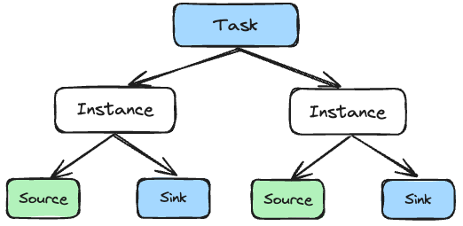
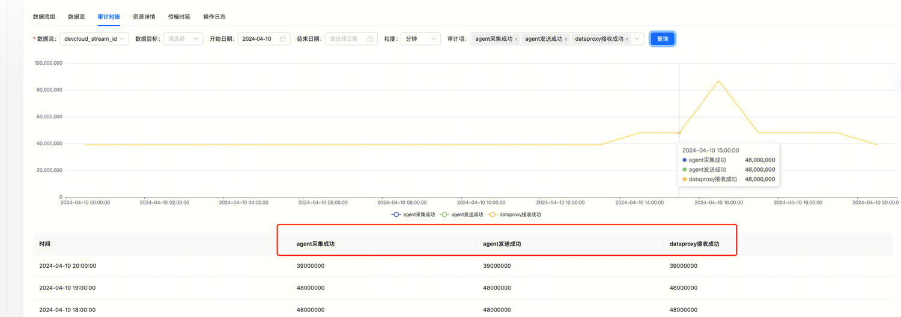

## 概述

在 Standard Architecture 中，我们可以通过 InLong Agent 来采集各种类型的数据源。InLong Agent 支持以插件的方式扩展新的采集类型，本文将指导开发者如何自定义新的 Agent 采集数据源插件。

## 核心概念
### Task 和 Instance
Task 和 Instance 是 Agent 最核心的两个概念，简单理解：Task 对应管理平台上配置的一个采集任务，而 Instance 则是由 Task 生成的一个具体的采集实例。举个例子，管理平台上有个采集任务的配置： `127.0.0.1 -> /data/log/YYMMDDhh.log._[0-9]+`，表示用户需要在  `127.0.0.1` 这台机器上采集符合 `/data/log/YYMMDDhh.log._[0-9]+`，这个路径规则的数据，**这就是一个 Task**。这个 Task 会根据这个路径规则去寻找满足条件的文件，**为每个符合条件的文件生成一个对应的 Instance**，比如说有`/data/log/2024040221.log.0，/data/log/2024040221.log.1，/data/log/2024040221.log.3` 3个文件，那么 Task 就会生成 3 个 Instance 分别采集这三个文件的数据。


### Source 和 Sink
Source 和 Sink 属于 Instance 下一级的概念，可以简单理解为每个 Instance 都有一个 Source 和 一个 Sink。顾名思义，Source 用于从数据源读取数据；Sink 用于向目标存储写入数据。

## 开发流程（以 Pulsar 为例）
### 主流程
- 新增 Task：实现初始化、销毁、配置校验等逻辑。
- 新增 Instance：实现节点信息设置等逻辑。
- 新增 Source：实现初始化、销毁、采集数据、提供数据等逻辑。
- 新增 Sink：实现初始化、销毁、数据输入、数据输出等逻辑（本文只针对新增数据源，Sink 不做介绍，默认 Sink 是 ProxySink）
- 新增 TaskPojo: 处理 Agent 和 Manager 字段之间的差异，并绑定 Task、Source 等。

### 新增 Task
这里就是要在 org.apache.inlong.agent.plugin.task 新增一个 PulsarTask 类。

```java
public class PulsarTask extends AbstractTask {

    @Override
    public boolean isProfileValid(TaskProfile profile) {
        return false;
    }

    @Override
    protected void initTask() {

    }

    @Override
    protected List<InstanceProfile> getNewInstanceList() {
        return null;
    }
}
```
- initTask：初始化，比如文件采集可以在初始化时进行文件夹监听。
- isProfilevalid：判断任务配置是否合法，每种类型任务的配置会有不同的限制，可以在这里实现。
- releaseTask：释放任务资源，比如文件采集可以在这里取消文件夹监听。
- getNewInstanceList：获取新的实例，比如文件采集时发现有新的文件可以采集。

### 新增 Instance
在 `org.apache.inlong.agent.plugin.instance` 增加 PulsarInstance 类，这个类会比较空闲，主要逻辑都是在 CommonInstance 基类里。作用是创建 Source、Sink，从 Source 读数据，然后写入 Sink。我们这里只要实现一下 setInodeInfo 接口即可。除了 FileInstance 比较特殊需要设置文件的 Inode Info，其余的 Instance 类都只要设置成空字符串即可。

```java
public class PulsarInstance extends CommonInstance {

    @Override
    public void setInodeInfo(InstanceProfile profile) {
        profile.set(TaskConstants.INODE_INFO, "");
    }
}
```

### 新增 Source
在 `org.apache.inlong.agent.plugin.sources 增加 PulsarSource` 类：
```java
public class PulsarSource extends AbstractSource {

    @Override
    public boolean sourceExist() {
        return false;
    }

    @Override
    protected void initSource(InstanceProfile profile) {

    }

    @Override
    protected void printCurrentState() {

    }

    @Override
    protected boolean doPrepareToRead() {
        return false;
    }

    @Override
    protected List<SourceData> readFromSource() {
        return null;
    }

    @Override
    protected String getThreadName() {
        return null;
    }

    @Override
    protected boolean isRunnable() {
        return false;
    }

    @Override
    protected void releaseSource() {

    }
}
```
- initSource：初始化该数据源的基本资源。
- sourceExist：返回当前数据源是否存在，例如文件采集时文件是否被删除。
- printCurrentState：打印当前采集状态，定时调用。
- doPrepareToRead：在读数据之前可以做一些检查，例如文件采集时文件是否被覆盖。
- readFromSource：真正从数据源读取数据，例如从 Kafka SDK、Pulsar SDK 消费数据。
- getThreadName：获取该数据源的工作线程名。
- isRunnable：返回该数据源是否应该继续。
- releaseSource：释放该数据源的资源

### 新增 TaskPojo
新增 PulsarTask 类到 `org.apache.inlong.agent.pojo`:
```java
public class PulsarTask {

    private String topic;
    private String subscription;

    public static class PulsarTaskConfig {

        private String topic;
        private String subscription;
    }
}
```
- PulsarTaskConfig 中的字段名称是 Manager 传递的名称，必须与 Manager 定义的字段名称一致。
- PulsarTask 中的字段名称和类型是 Agent 所要求的。

## 任务配置
从上面看我们新建了 Task、Instance、Source 等类，而任务配置就是将这些了类串联起来
```json
{
    "task.id": "74",
    "task.groupId": "test_group_pulsar",
    "task.streamId": "test_stream_pulsar",
    "task.source": "org.apache.inlong.agent.plugin.sources.PulsarSource",
    "task.sink": "org.apache.inlong.agent.plugin.sinks.ProxySink",
    "task.taskClass": "org.apache.inlong.agent.plugin.task.PulsarTask"
}
```
- task.source：指定了 Source 类
- task.sink：指定了 Sink 类
- task.taskClass：指定了 Task 类

## 位点控制
```java
protected class SourceData {

    private byte[] data;
    private Long offset;
}
```
```java
protected List<SourceData> readFromSource() {
    return null;
}
```
我们可以看到，Source 读取数据时每一条数据都会记录其对应的 Offset，这个 Offset 最终在 Sink 端写入成功后才会由 Agent 自动记录。
而在 Source 初始化时会自动读取其对应的 Offset，保存在 AbstractSource 的成员变量 offsetProfile，通过 offsetProfile.getOffset() 可以
获得其 Offset 用于初始化数据源。
```java
protected void initOffset() {
    offsetProfile = OffsetManager.getInstance().getOffset(taskId, instanceId);
}
```

## 测试
- **审计指标对齐**

要求 Agent 采集、Agent 发送、DataProxy 接收 三个指标完全对齐


