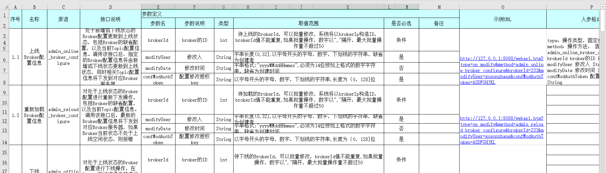

HTTP API 是 Master 或者 Broker 对外功能暴露的接口，管控台的各项操作都是基于这些 API 进行；如果有最新的功能，或者管控台没有涵盖的功能，业务都可以直接通过调用 HTTP API 接口完成。

该部分接口一共有 4 个部分：

- Master 元数据配置相关的操作接口，接口数量 24 个
- Master 消费权限操作接口，接口数量 33 个 
- Master 订阅关系接口，接口数量 2 个
- Broker 相关操作接口定义，接口数量 6 个

由于接口众多且参数繁杂，md 格式不能比较好的表达，因而以 excel 附件形式提供给到大家：
<a target="_blank" href="/appendixfiles/http_access_api_definition_cn.xls">TubeMQ HTTP API</a>

---
<a href="#top">Back to top</a>