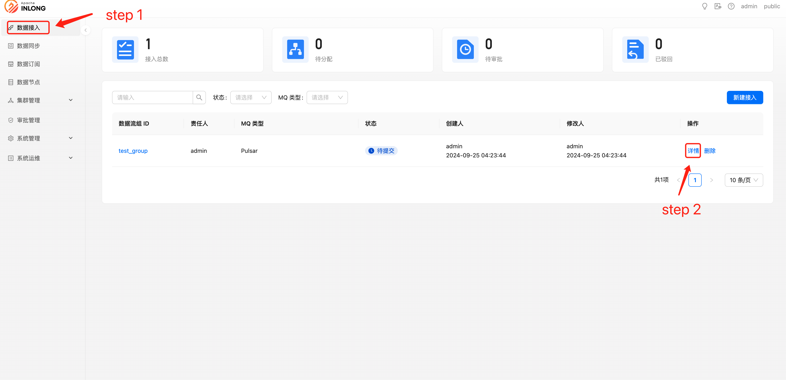
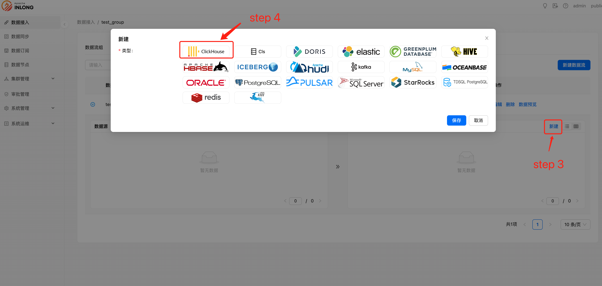
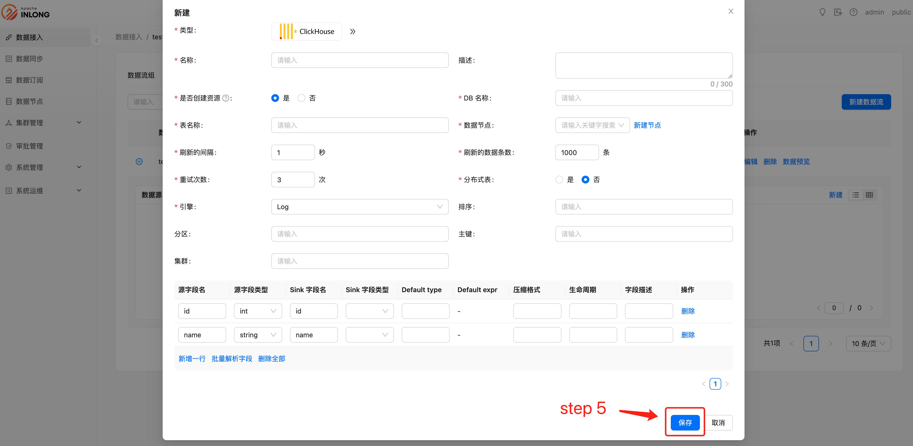

# 前提条件
- 配置好 Clickhouse 数据节点
- 配置好 Inlong group、 Inlong stream

# 创建数据目标
当配置好 Clickhouse 数据节点、Inlong group 和 Inlong stream 后，就可以创建 Clickhouse 数据目标了:

选择【数据接入】，点击【详情】

选择数据目标【新建】，选择 Clickhouse 类型。

填好 Clickhouse 所需配置信息，并点击保存。

- 名称：用户自定义名，用来标识此订阅信息。
- 描述：该订阅描述信息。
- 是否创建资源：决定该订阅是否进行建表操作。
- DB 名称：Clickhouse 数据库名。
- 表名称：Clickhouse 表名。
- 数据节点：Clickhouse 节点信息。

至此完成了订阅的创建。