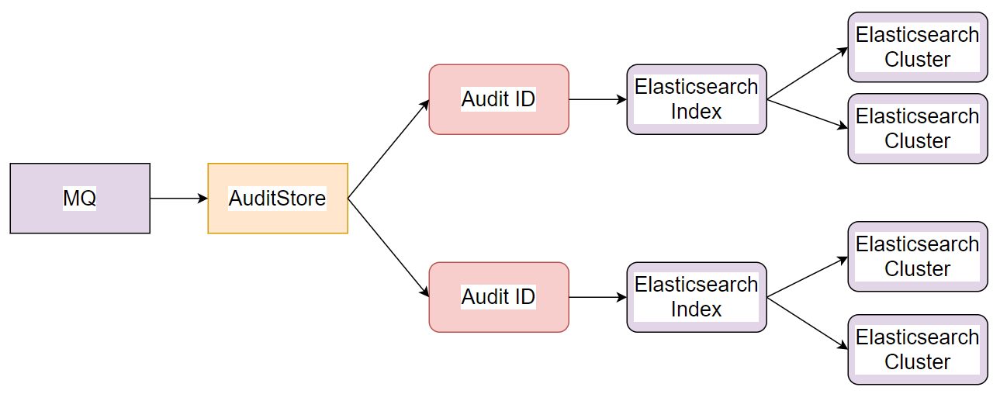
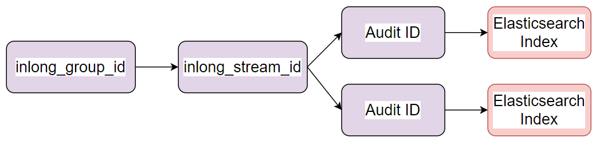

InLong audit is a subsystem independent of InLong, which performs real-time audit and reconciliation on the incoming and outgoing traffic of the Agent, DataProxy, and Sort modules of the InLong system.
There are three granularities for reconciliation: minutes, hours, and days.

The audit reconciliation is based on the log reporting time, and each service participating in the audit will conduct real-time reconciliation according to the same log time. Through audit reconciliation, we can clearly understand InLong
The transmission status of each module, and whether the data stream is lost or repeated

## Architecture

1. The audit SDK is nested in the service that needs to be audited, audits the service, and sends the audit result to the audit access layer
2. The audit proxy writes audit data to MQ (Pulsar or TubeMQ)
3. The distribution service consumes the audit data of MQ, and writes the audit data to MySQL and Elasticsearch
4. The interface layer encapsulates the data of MySQL and Elasticsearch
5. Application scenarios mainly include report display, audit reconciliation, etc.

## Audit Dimension
| | | || | | | | | |
| ---- | ---- | ---- | ---- | ---- | ---- | ---- | ---- | ---- | ---- |
| Machine ip | Container ID | Thread ID | Log time (minutes) | Audit ID | inlong_group_id | inlong_stream_id | Number of records | Size | Transmission delay (ms) |
## Audit ID
The receiving and sending of each module are respectively an independent audit item ID

|Inlong Service Module |Audit ID |
|----|----|
|Inlong API Received Successfully	|1 |
|Inlong API Send Successfully	|2|
|Inlong Agent Received Successfully	|3|
|Inlong Agent Send Successfully	|4|
|Inlong DataProxy Received Successfully	|5|
|Inlong DataProxy Send Successfully	|6|
|Inlong Sort Received Successfully	|7|
|Inlong Sort Send Successfully	|8|

## Data Transfer Protocol
The transmission protocol between sdk, access layer, and distribution layer is Protocol Buffers
```markdown
syntax = "proto3";

package org.apache.inlong.audit.protocol;

message BaseCommand {
    enum Type {
        PING          = 0;
        PONG          = 1;
        AUDITREQUEST  = 2;
        AUDITREPLY    = 3;
    }
    Type type                            = 1;
    optional AuditRequest audit_request  = 2;
    optional AuditReply audit_reply      = 3;
    optional Ping ping                   = 4;
    optional Pong pong                   = 5;
}

message Ping {
}

message Pong {
}

message AuditRequest {
  AuditMessageHeader msg_header = 1;   
  repeated AuditMessageBody msg_body = 2;   
}

message AuditMessageHeader {
  string ip = 1;            
  string docker_id = 2;     
  string thread_id = 3;     
  uint64 sdk_ts = 4;        
  uint64 packet_id = 5;     
}

message AuditMessageBody {
  uint64 log_ts = 1;   
  string inlong_group_id= 2;   
  string inlong_stream_id= 3; 
  string audit_id = 4;   
  uint64 count = 5;     
  uint64 size = 6;      
  int64  delay = 7;      
}

message AuditReply {
  enum RSP_CODE {
    SUCCESS  = 0;  
    FAILED   = 1;   
    DISASTER = 2; 
  }
  RSP_CODE rsp_code = 1;   
  optional string message = 2;
}
```
## Audit SDK Implementation Details
### Target
***1. Support local disaster recovery***
***2. Data Uniqueness***
***3. Reduce data loss caused by abnormal restart***

### Main Logic Diagram


1. The sdk provides the add interface externally. The parameters are: audit_id, inlong_group_id, inlong_stream_id, number, size.
2. The sdk uses log time+audit_id+inlong_group_id+inlong_stream_id as the key to perform real-time statistics.
3. When the sending cycle is satisfied or the business program is actively triggered, the SDK will package the statistical results with the PB protocol and send the audit access layer.
4. If (4) fails to send, put it into the failure queue, and continue to send in the next cycle.
5. When the failure queue is greater than the threshold, perform disaster recovery through local files.

### Service Discovery
Audit name discovery between sdk and access layer, support plug-in, including domain name, vip, etc.

### Disaster Recovery

1. When the SDK fails to send the access layer, it will be placed in the failure queue.
2. When the failure queue reaches the threshold, it will be written to the local disaster recovery file.
3. When the local disaster recovery file reaches the threshold, the old data will be eliminated (eliminated by time).

## Access layer Implementation
### Target
***1.High reliability***  
***2.at least once***  

### Main Logic Diagram

1. After the access layer receives the packet sent by the sdk, it writes the message queue.
2. After writing the message queue successfully, return success to the sdk.
3. The data protocol of the message queue is the PB protocol.
4. Set the ack of the write message queue to -1 or all.

## Elasticsearch Distribution Implementation
### Target
***1. High real-time performance (minute level)***
***2. Can operate tens of billions of audit data per day***
***3. Can be deduplicated***

### Main Logic Diagram

1. Distribution service AuditDds consumes messages in real time.
2. According to the audit ID in the audit data, route the data to the corresponding Elasticsearch cluster.
3. Each audit ID corresponds to an Elasticsearch index.

### Elasticsearch Index Design
#### Index Name
The index name consists of date + audit item ID, such as 20211019_1, 20211019_2.
#### Index Field Schema

|field               |type        |instruction |
|----               |----       |----|
|audit_id	        |keyword    |Audit ID |
|inlong_group_id	|keyword    |inlong_group_id |
|inlong_stream_id	|keyword    |inlong_stream_id |
|docker_id	        |keyword    |ID of the container where the dk is located|
|thread_id	        |keyword    |thread ID |
|packet_id	        |keyword    |Package ID reported by sdk |
|ip	                |keyword    |Machine IP |
|log_ts	            |keyword    |log time |
|sdk_ts	            |long       |Audit SDK reporting time |
|count	            |long       |Number of logs |
|size	            |long       |size of log  |
|delay	            |long       |The log transfer time, equal to the current machine time minus the log time |

#### Elasticsearch Index Storage Period
Storage by day, storage period is dynamically configurable

## Elasticsearch Write Design
### The relationship between inlong_group_id, inlong_stream_id, audit ID and Elasticsearch index

The relationship between inlong_group_id, inlong_stream_id, audit ID and Elasticsearch index is 1:N in system design and service implementation

### Write Routing Policy

Use inlong_group_id and inlong_stream_id to route to Elasticsearch shards to ensure that the same inlong_group_id and inlong_stream_id are stored in the same shard
When writing the same inlong_group_id and inlong_stream_id to the same shard, when querying and aggregating, only one shard needs to be processed, which can greatly improve performance

### Optional DeduplicationBy doc_id
Elasticsearch is resource-intensive for real-time deduplication. This function is optional through configuration.

### Use bulk batch method
Use bulk to write, each batch of 5000, improve the write performance of the Elasticsearch cluster

## MySQL Distribution Implementation
### Target
***1. High real-time performance (minute level)***  
***2. Simple to deploy***  
***3. Can be deduplicated***  

### Main Logic Diagram

MySQL distribution supports distribution to different MySQL instances according to the audit ID, and supports horizontal expansion.

### Usage introduction
  1. When the audit scale of the business is relatively small, less than ten million per day, you can consider using MySQL as the audit storage. Because the deployment of MySQL is much simpler than that of Elasticsearch, the resource cost will be much less.
  2. If the scale of audit data is large and MySQL cannot support it, you can consider using Elasticsearch as storage. After all, a single Elasticsearch cluster can support tens of billions of audit data and horizontal expansion.
  
## Audit Usage Interface Design
### Main Logic Diagram

The audit interface layer uses SQL to check MySQL or restful to check Elasticsearch. How to check which type of storage the interface uses depends on which type of storage is used.

### UI Interface Display
### Main Logic Diagram

The front-end page pulls the audit data of each module through the interface layer and displays it.