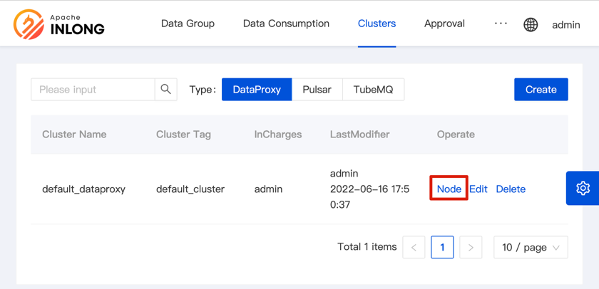

All deploying files at `inlong-dataproxy` directory.
## Configuration

### Configure InLong-Manager URL

configuration file: `conf/common.properties`:
```
# local IP
proxy.local.ip=127.0.0.1
# manager address
manager.hosts=127.0.0.1:8083
# audit proxy address
audit.proxys=127.0.0.1:10081
```

## run

```
# Default using Pulsar to cache data, and the dataproxy-pulsar.conf configuration file is loaded.
bash +x bin/dataproxy-start.sh
# or
bash +x bin/dataproxy-start.sh pulsar
# If using Inlong TubeMQ to cache data
# bash +x bin/dataproxy-start.sh tube
```
	

## check
```
telnet 127.0.0.1 46801
```

## Add DataProxy configuration to InLong-Manager

After installing the DataProxy, you need to add the IP of the DataProxy service into the InLong-Manager.

Open the Inlong-Dashboard page (the default is <http://127.0.0.1>), and select to add a DataProxy cluster on the [Clusters] tab:


Click the [Create] button, and fill in the cluster name, cluster label, and responsible person in the pop-up box to save.

> Note: [Cluster Tag] is a logical concept. Tags with the same name will be regarded as the same cluster.
>
> For example, the DataProxy cluster and the Pulsar cluster with the same cluster tag belong to the same cluster.

Then add nodes to this DataProxy cluster - a DataProxy cluster can support adding multiple nodes:



Just fill in the IP and port of the DataProxy node.


