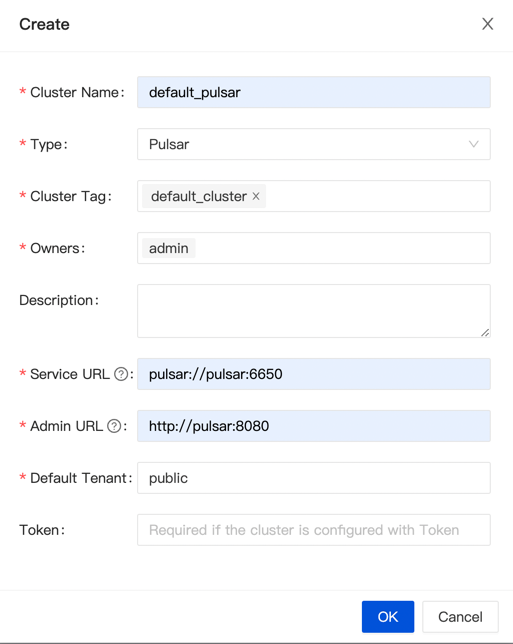

Deploy all InLong module by Docker Compose, it's only available for development. 

:::note
Docker Compose deploys all components for Standard Architecture, and choose [Apache Pulsar](https://pulsar.apache.org/docs/concepts-overview) as the default message queue.
:::

## Environment Requirements
- [Docker](https://docs.docker.com/engine/install/) 19.03.1+
- Docker Compose 1.29.2+

## Download
You can get `apache-inlong-[version]-bin.tar.gz` from [Download Page](https://inlong.apache.org/download) ,or you can build the InLong refer to [How to Build](quick_start/how_to_build.md).

## Deploy
Start all components.
```shell
cd docker/docker-compose
docker-compose up -d
```

### Create Cluster Tag
Click [Clusters]->[ClusterTags]->[Create] on the page to specify the cluster label name and person in charge:


:::caution
Since each component reports the ClusterTags as `default_cluster` by default, do not use other names.
:::

### Register Pulsar Cluster
Click [Clusters]->[ClusterTags]->[Create] on the page to register Pulsar Cluster:


:::note
The ClusterTags selects the newly created `default_cluster`, the Pulsar cluster deployed by docker:

Service URL is `pulsar://pulsar:6650`, Admin URL is `http://pulsar:8080`.
:::

### Create Data Stream
You can refer [Pulsar Example](quick_start/pulsar_example.md) to create Data Stream.

## Destroy
```shell
docker-compose down
```
