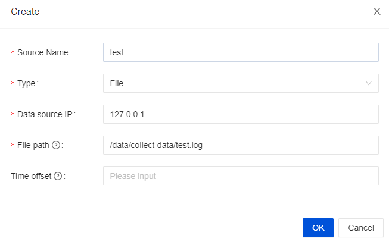

Here we use a simple example to help you experience InLong.

## Install Hive
Hive is the necessary component. If you don't have Hive in your machine, we recommand using Docker to install it. Details can be found [here](https://github.com/big-data-europe/docker-hive).

> Note that if you use Docker, you need to add a port mapping `8020:8020`, because it's the port of HDFS DefaultFS, and we need to use it later.

## Install InLong
Before we begin, we need to install InLong. Here we provide two ways:
1. Install InLong with Docker by according to the [instructions here](deployment/docker.md).(Recommanded)
2. Install InLong binary according to the [instructions here](deployment/bare_metal.md).

## Create a data access
After deployment, we first enter the "Data Access" interface, click "Create an Access" in the upper right corner to create a new date access, and fill in the data streams group information as shown in the figure below.


Then we click the next button, and fill in the stream information as shown in the figure below.


Note that the message source is "File", you can create a data source manually and configure `Agent Address` and `File Path`.



Then we fill in the following information in the "data information" column below.


Then we select Hive in the data flow and click "Add" to add Hive configuration


Note that the target table does not need to be created in advance, as InLong Manager will automatically create the table for us after the access is approved. Also, please use connection test to ensure that InLong Manager can connect to your Hive.

Then we click the "Submit for Approval" button, the connection will be created successfully and enter the approval state.

## Approve the data access
Then we enter the "Approval Management" interface and click "My Approval" to approve the data access that we just applied for.

At this point, the data access has been created successfully. We can see that the corresponding table has been created in Hive, and we can see that the corresponding topic has been created successfully in the management GUI of TubeMQ.

## Configure the agent file
Then we need to create a new file `/data/collect-data/test.log` and add content to it to trigger the agent to send data to the dataproxy.

``` shell
mkdir collect-data
END=100000
for ((i=1;i<=END;i++)); do
    sleep 3
    echo "name_$i | $i" >> /data/collect-data/test.log
done
```

Then you can observe the Audit Data Pages, and see that the data has been collected and sent successfully.