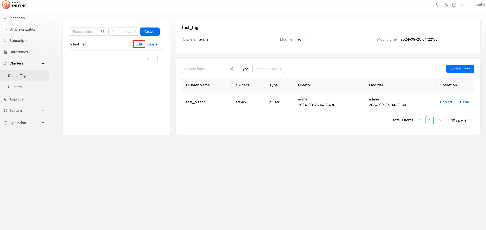
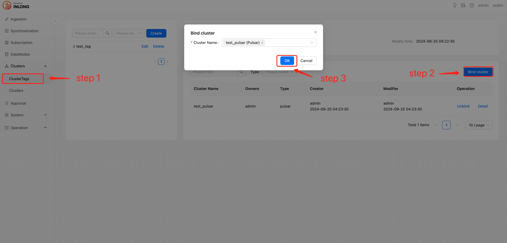

Tag management allows system administrators or tenant administrators to create, modify, and delete cluster tags, as well as bind and unbind cluster information to these tags. Below is a detailed operation guide.

### Create cluster tag

Users with system administrator or tenant administrator privileges can create new cluster tags. When creating, the following information needs to be filled in:

- Cluster tag：A custom name used to uniquely identify this tag.
- Owners：Specifies the person responsible, who alone can modify the configuration information of this tag.
- Tenant：Specifies the tenant to which it belongs, ensuring that only users under the corresponding tenant can see this tag.
- Description：Provide a brief description of the cluster tag.

### Delete cluster tag

System administrators or tenant administrators have the right to delete cluster tags that are no longer needed. Once deleted, the tag will no longer be available.

### Update cluster tag

If you need to update the information of a cluster tag, system administrators or tenant administrators can perform modification operations.

### Bind cluster

Administrators can bind created cluster tags with specific cluster information for classification and management purposes.

### Unbind cluster

When adjustments are needed for the association of cluster tags, administrators can perform unbinding operations to remove clusters from a certain tag.

