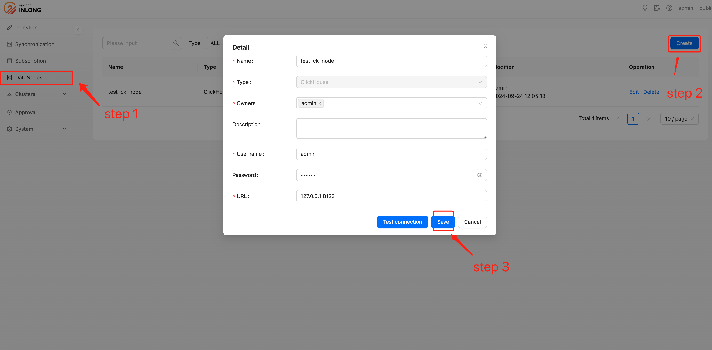
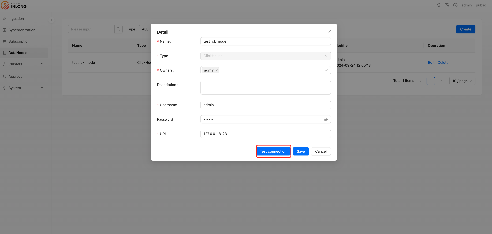
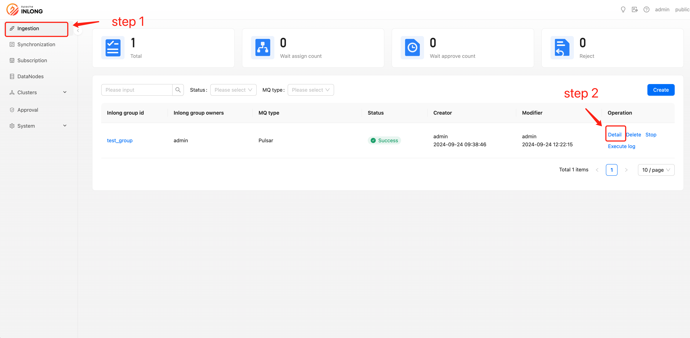
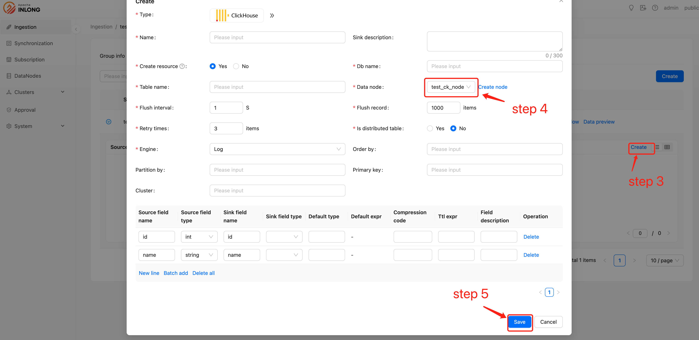

## Overview

In Long, a data node represents a set of server address configurations, which can serve as both the source end for data collection and the storage end for data subscription. For example, when using a MySQL node, the registered information includes the MySQL address, username, and password. During data collection or subscription, this node information can be used to indicate that data collection or storage operations are performed from this MySQL server.

Node management provides users with the ability to reuse data node information, allowing users to create, modify, and delete data nodes, and reuse configured data node information during data access:

### Create data node

Users can create data node to generate a commonly used node information:

- name： A user-defined name to identify this node information.
- type：The type of the node.
- owners：The person responsible for this node, only the person in charge can modify the configuration information of this node.
- description：Node description information.

The above are the common configurations of the node. In addition, according to different node types, there will be different configuration information. For example, ClickHouse nodes need to fill in the username, password, and ClickHouse address information.

### Delete data node

Users can delete data node. After delete, this node will stop being used:

### Update data node

Users can update node information. Click [Edit], enter the new node information, and after confirmation, this node configuration will take effect:

### Test connection

Users can use the test connection to verify whether the node status is normal:

### Use data node

After configuring the node, users can use the configured node information in data subscription:

- select 【Ingestion】，and click 【Detail】
  
- When selecting a data target, choose 【Create】, select a configured data node, complete other configurations, and then click Save.
  
  At this point, the node usage process is complete.
