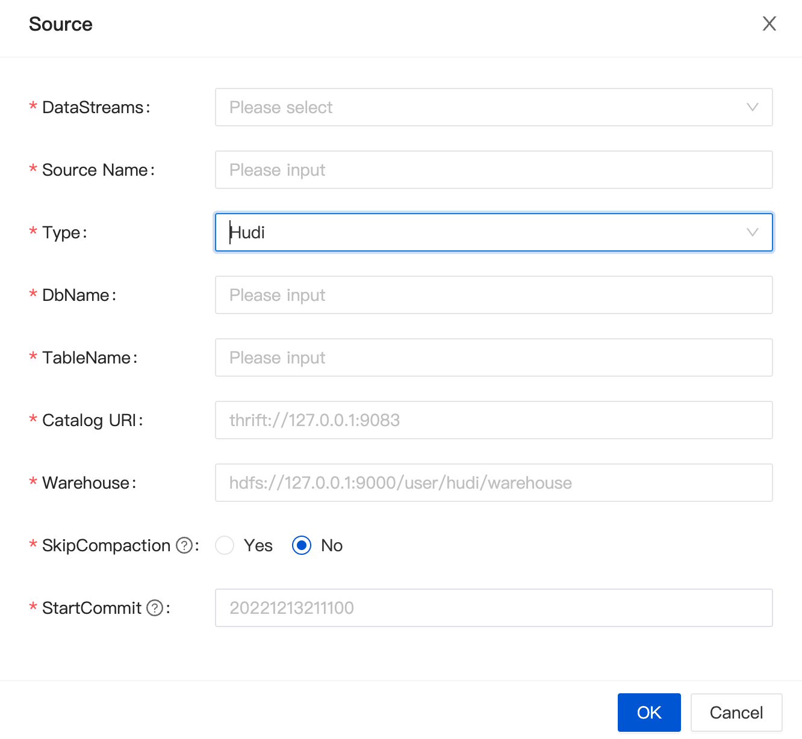

import {siteVariables} from '../../version';

## Overview

[Apache Hudi](https://hudi.apache.org/cn/docs/overview/) (pronounced "hoodie") is a next-generation streaming data lake platform.
Apache Hudi brings core warehouse and database functionality directly into the data lake.
Hudi provides tables, transactions, efficient upserts/deletes, advanced indexing, streaming ingestion services, data clustering/compression optimizations, and concurrency while keeping data in an open source file format.

## Supported Version

| Load Node         | Version                                                          |
| ----------------- | ---------------------------------------------------------------- |
| [Hudi](./hudi.md) | [Hudi](https://hudi.apache.org/cn/docs/quick-start-guide): 0.12+ |

### Dependencies

Introduce `sort-connector-hudi` through `Maven` to build your own project.
Of course, you can also directly use the `jar` package provided by `INLONG`.
([sort-connector-hudi](https://inlong.apache.org/download/))

### Maven dependency

```xml
<dependency>
    <groupId>org.apache.inlong</groupId>
    <artifactId>sort-connector-hudi</artifactId>
    <version>${siteVariables.inLongVersion}</version>
</dependency>
```

## How to create a Hudi Extract Node

### Usage for SQL API

The example below shows how to create a Hudi Load Node with `Flink SQL Cli` :

```sql
CREATE TABLE `hudi_table_name` (
  id STRING,
  name STRING,
  uv BIGINT,
  pv BIGINT
) WITH (
    'connector' = 'hudi-inlong',
    'path' = 'hdfs://127.0.0.1:90001/data/warehouse/hudi_db_name.db/hudi_table_name',
    'uri' = 'thrift://127.0.0.1:8091',
    'hoodie.database.name' = 'hudi_db_name',
    'hoodie.table.name' = 'hudi_table_name',
    'read.streaming.check-interval'='1',
    'read.streaming.enabled'='true',
    'read.streaming.skip_compaction'='true',
    'read.start-commit'='20221220121000',
    --
    'hoodie.bucket.index.hash.field' = 'id',
    -- compaction
    'compaction.tasks' = '10',
    'compaction.async.enabled' = 'true',
    'compaction.schedule.enabled' = 'true',
    'compaction.max_memory' = '3096',
    'compaction.trigger.strategy' = 'num_or_time',
    'compaction.delta_commits' = '5',
    'compaction.max_memory' = '3096',
    --
    'hoodie.keep.min.commits' = '1440',
    'hoodie.keep.max.commits' = '2880',
    'clean.async.enabled' = 'true',
    --
    'write.operation' = 'upsert',
    'write.bucket_assign.tasks' = '60',
    'write.tasks' = '60',
    'write.log_block.size' = '128',
    --
    'index.type' = 'BUCKET',
    'metadata.enabled' = 'false',
    'hoodie.bucket.index.num.buckets' = '20',
    'table.type' = 'MERGE_ON_READ',
    'clean.retain_commits' = '30',
    'hoodie.cleaner.policy' = 'KEEP_LATEST_COMMITS'
);
```

### Usage for Dashboard

#### Configuration

When creating a data stream, select `Hudi` for the data stream direction, and click "Add" to configure it.



| Config Item                          | prop in DDL statement                         | remark                                                                                                                                                                               |
| ------------------------------------ | --------------------------------------------- | ------------------------------------------------------------------------------------------------------------------------------------------------------------------------------------ |
| `DbName`                             | `hoodie.database.name`                        | the name of database                                                                                                                                                                 |
| `TableName`                          | `hudi_table_name`                             | the name of table                                                                                                                                                                    |
| `EnableCreateResource`               | -                                             | If the library table already exists and does not need to be modified, select [Do not create], <br/>otherwise select [Create], and the system will automatically create the resource. |
| `Catalog URI`                        | `uri`                                         | The server uri of catalog                                                                                                                                                            |
| `Warehouse`                          | -                                             | The location where the hudi table is stored in HDFS<br/>In the SQL DDL, the path attribute is to splice the `warehouse path` with the name of db and table                           |
| `StartCommit` | `read.start-commit`     | Start commit instant for reading, the commit time format should be `yyyyMMddHHmmss`, by default reading from the latest instant for streaming read |
| `SkipCompaction` | `read.streaming.skip_compaction`  | Whether to skip compaction instants for streaming read, there are two cases that this option can be used to avoid reading duplicates: 1) you are definitely sure that the consumer reads faster than any compaction instants, usually with delta time compaction strategy that is long enough, for e.g, one week; 2) changelog mode is enabled, this option is a solution to keep data integrity  |

### Usage for InLong Manager Client
TODO

## Hudi Extract Node Options

| Option                                      | Required | Default | Type   | Description                                                                                                                                                                                                                   |
| ------------------------------------------- | -------- | ------- | ------ | ----------------------------------------------------------------------------------------------------------------------------------------------------------------------------------------------------------------------------- |
| connector                                   | required | (none)  | String | Specify what connector to use, here should be `hudi-inlong`.                                                                                                                                                                  |
| uri                                         | required | (none)  | String | Metastore uris for hive sync                                                                                                                                                                                                  |
| hoodie.database.name                        | optional | (none)  | String | Database name that will be used for incremental query.If different databases have the same table name during  incremental query,  we can set it to limit the table name under a specific database                             |
| hoodie.table.name                           | optional | (none)  | String | Table name that will be used for registering with Hive. Needs to be same across runs.                                                                                                                                         |
| `read.start-commit`     | optional  | newest commit id |String | Start commit instant for reading, the commit time format should be `yyyyMMddHHmmss`, by default reading from the latest instant for streaming read |
| `read.streaming.skip_compaction`  | option | false | String | Whether to skip compaction instants for streaming read, there are two cases that this option can be used to avoid reading duplicates: 1) you are definitely sure that the consumer reads faster than any compaction instants, usually with delta time compaction strategy that is long enough, for e.g, one week; 2) changelog mode is enabled, this option is a solution to keep data integrity  |
| inlong.metric.labels                        | optional | (none)  | String | Inlong metric label, format of value is groupId=xxgroup&streamId=xxstream&nodeId=xxnode.                                                                                                                                      |

## Data Type Mapping

| Hive type     | Flink SQL type |
| ------------- | -------------- |
| char(p)       | CHAR(p)        |
| varchar(p)    | VARCHAR(p)     |
| string        | STRING         |
| boolean       | BOOLEAN        |
| tinyint       | TINYINT        |
| smallint      | SMALLINT       |
| int           | INT            |
| bigint        | BIGINT         |
| float         | FLOAT          |
| double        | DOUBLE         |
| decimal(p, s) | DECIMAL(p, s)  |
| date          | DATE           |
| timestamp(9)  | TIMESTAMP      |
| bytes         | BINARY         |
| array         | LIST           |
| map           | MAP            |
| row           | STRUCT         |
