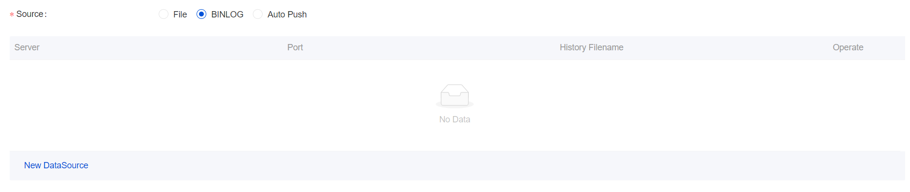
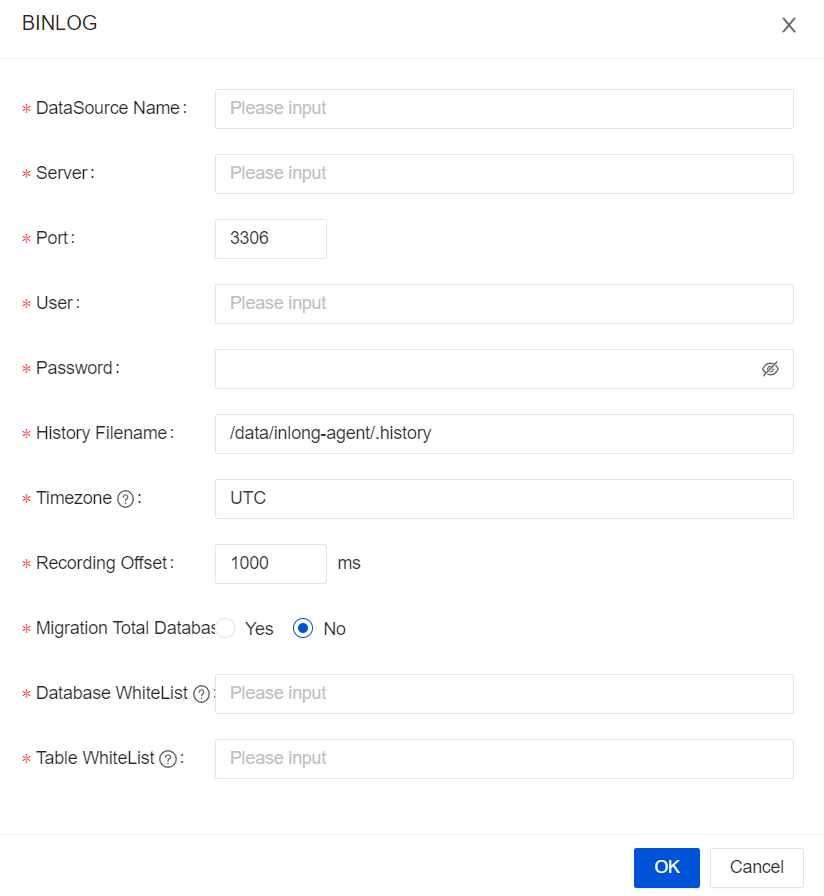

import {siteVariables} from '../../version';

## Overview

The MySQL Extract Node allows for reading snapshot data and incremental data from MySQL database. This document describes how to set up the MySQL Extract Node to run SQL queries against MySQL databases.

## Supported Version
| Extract Node                | Version                                                                                                                                                                                                                                                                                                                                                                                                | Driver                  |
|-----------------------------|--------------------------------------------------------------------------------------------------------------------------------------------------------------------------------------------------------------------------------------------------------------------------------------------------------------------------------------------------------------------------------------------------------|-------------------------|
| [MySQL-CDC](./mysql-cdc.md) | [MySQL](https://dev.mysql.com/doc): 5.6, 5.7, 8.0.x <br/> [RDS MySQL](https://www.aliyun.com/product/rds/mysql): 5.6, 5.7, 8.0.x <br/> [PolarDB MySQL](https://www.aliyun.com/product/polardb): 5.6, 5.7, 8.0.x <br/> [Aurora MySQL](https://aws.amazon.com/cn/rds/aurora): 5.6, 5.7, 8.0.x <br/> [MariaDB](https://mariadb.org): 10.x <br/> [PolarDB X](https://github.com/polardb/polardbx-sql): 2.0.1 | JDBC Driver: 8.0.21     |

## Dependencies

In order to set up the MySQL Extract Node, the following table provides dependency information for both projects using a build automation tool (such as Maven or SBT) and SQL Client with Sort Connectors JAR bundles.

### Maven dependency

```xml
<dependency>
    <groupId>org.apache.inlong</groupId>
    <artifactId>sort-connector-mongodb-cdc</artifactId>
    <version>${siteVariables.inLongVersion}</version>
</dependency>
```

The MySQL driver dependency is also required to connect to MySQL database. Please download [mysql-connector-java-8.0.21.jar](https://repo1.maven.org/maven2/mysql/mysql-connector-java/8.0.21/mysql-connector-java-8.0.21.jar) and put it into `FLINK_HOME/lib/`.

## Setup MySQL server

You have to define a MySQL user with appropriate permissions on all databases that the Debezium MySQL connector monitors.

1. Create the MySQL user:

```sql
mysql> CREATE USER 'user'@'localhost' IDENTIFIED BY 'password';
```

2. Grant the required permissions to the user:

```sql
mysql> GRANT SELECT, SHOW DATABASES, REPLICATION SLAVE, REPLICATION CLIENT ON *.* TO 'user' IDENTIFIED BY 'password';
```
**Note:** The RELOAD permissions is not required any more when `scan.incremental.snapshot.enabled` is enabled (enabled by default).

3. Finalize the user’s permissions:

```sql
mysql> FLUSH PRIVILEGES;
```

See more about the [permission explanation](https://debezium.io/documentation/reference/1.5/connectors/mysql.html#mysql-creating-user).

## Notes

### Set a different SERVER ID for each reader

Every MySQL database client for reading binlog should have an unique id, called server id. MySQL server will use this id to maintain network connection and the binlog position. Therefore, if different jobs share a same server id, it may result to read from wrong binlog position.
Thus, it is recommended to set different server id for each reader via the [SQL Hints](https://ci.apache.org/projects/flink/flink-docs-release-1.11/dev/table/sql/hints.html),
e.g.  assuming the source parallelism is 4, then we can use `SELECT * FROM source_table /*+ OPTIONS('server-id'='5401-5404') */ ;` to assign unique server id for each of the 4 source readers.


### Setting up MySQL session timeouts

When an initial consistent snapshot is made for large databases, your established connection could timeout while the tables are being read. You can prevent this behavior by configuring interactive_timeout and wait_timeout in your MySQL configuration file.
- `interactive_timeout`: The number of seconds the server waits for activity on an interactive connection before closing it. See [MySQL documentations](https://dev.mysql.com/doc/refman/8.0/en/server-system-variables.html#sysvar_interactive_timeout).
- `wait_timeout`: The number of seconds the server waits for activity on a noninteractive connection before closing it. See [MySQL documentations](https://dev.mysql.com/doc/refman/8.0/en/server-system-variables.html#sysvar_wait_timeout).

:::caution
If you use MySQL with the version above 8.0 with SSL mode disable, you should try one of these to make connector work normally:
- Giving RSA of server when connecting  
- Enable `allowPublicKeyRetrieval` (Maybe cause MITM)  
- Using MySQL native password mode (Do not recommend this for safety reason)  
:::

## How to create a MySQL Extract Node

### Usage for SQL API

The example below shows how to create an MySQL Extract Node with `Flink SQL` :

```sql
-- Set checkpoint every 3000 milliseconds                       
Flink SQL> SET 'execution.checkpointing.interval' = '3s';   

-- Create a MySQL table 'mysql_extract_node' in Flink SQL
Flink SQL> CREATE TABLE mysql_extract_node (
     order_id INT,
     order_date TIMESTAMP(0),
     customer_name STRING,
     price DECIMAL(10, 5),
     product_id INT,
     order_status BOOLEAN,
     PRIMARY KEY(order_id) NOT ENFORCED
     ) WITH (
     'connector' = 'mysql-cdc-inlong',
     'hostname' = 'YourHostname',
     'port' = '3306',
     'username' = 'YourUsername',
     'password' = 'YourPassword',
     'database-name' = 'YourDatabaseName',
     'table-name' = 'YourDatabaseName.YourTableName');
  
-- Read snapshot and binlogs from mysql_extract_node
Flink SQL> SELECT * FROM mysql_extract_node;
```

### Usage for InLong Dashboard

- Choose the `BINLOG` Data Source


- Configure the MySQL Source


### Usage for InLong Manager Client

TODO: It will be supported in the future.

## MySQL Extract Node Options

| Option                                   | Required | Default | Type     | Description                                                                                                                                                                                                                                                                                                                                                                                                                                                                                                                                                                                                                                                                                                                                                                                                                                        |
|------------------------------------------|----------|---------|----------|----------------------------------------------------------------------------------------------------------------------------------------------------------------------------------------------------------------------------------------------------------------------------------------------------------------------------------------------------------------------------------------------------------------------------------------------------------------------------------------------------------------------------------------------------------------------------------------------------------------------------------------------------------------------------------------------------------------------------------------------------------------------------------------------------------------------------------------------------|
| connector                                | required | (none)  | String   | 	Specify what connector to use, here should be `'mysql-cdc-inlong'`.                                                                                                                                                                                                                                                                                                                                                                                                                                                                                                                                                                                                                                                                                                                                                                               |
| hostname                                 | required | (none)  | String   | 	IP address or hostname of the MySQL database server.                                                                                                                                                                                                                                                                                                                                                                                                                                                                                                                                                                                                                                                                                                                                                                                              |
| username                                 | required | (none)  | String   | 	Name of the MySQL database to use when connecting to the MySQL database server.                                                                                                                                                                                                                                                                                                                                                                                                                                                                                                                                                                                                                                                                                                                                                                   |
| password                                 | required | (none)  | String   | 	Password to use when connecting to the MySQL database server.                                                                                                                                                                                                                                                                                                                                                                                                                                                                                                                                                                                                                                                                                                                                                                                     |
| database-name                            | required | (none)  | String   | Database name of the MySQL server to monitor. The database-name also supports regular expressions to monitor multiple tables matches the regular expression.                                                                                                                                                                                                                                                                                                                                                                                                                                                                                                                                                                                                                                                                                       |
| table-name                               | required | (none)  | String   | 	Table name of the MySQL database to monitor. The table-name also supports regular expressions to monitor multiple tables matches the regular expression. The format should be DatabaseName.TableName                                                                                                                                                                                                                                                                                                                                                                                                                                                                                                                                                                                                                                              |
| port                                     | optional | 3306    | Integer  | 	Integer port number of the MySQL database server.                                                                                                                                                                                                                                                                                                                                                                                                                                                                                                                                                                                                                                                                                                                                                                                                 |
| server-id                                | optional | (none)  | Integer  | 	A numeric ID or a numeric ID range of this database client, The numeric ID syntax is like `5400`, the numeric ID range syntax is like `5400-5408`, The numeric ID range syntax is recommended when `scan.incremental.snapshot.enabled` enabled. Every ID must be unique across all currently-running database processes in the MySQL cluster. This connector joins the MySQL cluster as another server (with this unique ID) so it can read the binlog. By default, a random number is generated between 5400 and 6400, though we recommend setting an explicit value.                                                                                                                                                                                                                                                                            |
| scan.incremental.snapshot.enabled        | optional | true    | Boolean  | 	Incremental snapshot is a new mechanism to read snapshot of a table. Compared to the old snapshot mechanism,the incremental snapshot has many advantages, including:(1) source can be parallel during snapshot reading, (2) source can perform checkpoints in the chunk granularity during snapshot reading, (3) source doesn't need to acquire global read lock (FLUSH TABLES WITH READ LOCK) before snapshot reading. If you would like the source run in parallel, each parallel reader should have an unique server id, so the `server-id` must be a range like `5400-6400`, and the range must be larger than the parallelism. Please see [Incremental Snapshot Reading](https://ververica.github.io/flink-cdc-connectors/release-2.2/content/connectors/mysql-cdc.html#incremental-snapshot-reading) section for more detailed information. |
| scan.incremental.snapshot.chunk.size     | optional | 8096    | Integer  | 	The chunk size (number of rows) of table snapshot, captured tables are split into multiple chunks when read the snapshot of table.                                                                                                                                                                                                                                                                                                                                                                                                                                                                                                                                                                                                                                                                                                                |
| scan.snapshot.fetch.size                 | optional | 1024    | Integer  | 	The maximum fetch size for per poll when read table snapshot.                                                                                                                                                                                                                                                                                                                                                                                                                                                                                                                                                                                                                                                                                                                                                                                     |
| scan.startup.mode                        | optional | initial | String   | 	Optional startup mode for MySQL CDC consumer, valid enumerations are "initial", "earliest-offset", "latest-offset", "specific-offset" and "timestamp". Please see [Startup Reading Position](#startup-reading-position) section for more detailed information.                                                                                                                                                                                                                                                                                                                                                                                                                                                                                                                                                                                    |
| scan.startup.specific-offset.file        | optional | (none)  | String   | Optional binlog file name used in case of "specific-offset" startup mode                                                                                                                                                                                                                                                                                                                                                                                                                                                                                                                                                                                                                                                                                                                                                                           |
| scan.startup.specific-offset.pos         | optional | >(none) | Long     | Optional binlog file position used in case of "specific-offset" startup mode                                                                                                                                                                                                                                                                                                                                                                                                                                                                                                                                                                                                                                                                                                                                                                       | 
| scan.startup.specific-offset.gtid-set    | optional | none)   | String   | Optional GTID set used in case of "specific-offset" startup mode                                                                                                                                                                                                                                                                                                                                                                                                                                                                                                                                                                                                                                                                                                                                                                                   |
| scan.startup.specific-offset.skip-events | optional | (none)  | Long     | number of events to skip after the specific starting offset                                                                                                                                                                                                                                                                                                                                                                                                                                                                                                                                                                                                                                                                                                                                                                                        | 
| scan.startup.specific-offset.skip-rows   | optional | (none)  | Long     | Optional number of rows to skip after the specific starting offset                                                                                                                                                                                                                                                                                                                                                                                                                                                                                                                                                                                                                                                                                                                                                                                 |
| server-time-zone                         | optional | UTC     | String   | The session time zone in database server, e.g. "Asia/Shanghai".  It controls how the TIMESTAMP type in MYSQL converted to STRING. See more [here](https://debezium.io/documentation/reference/1.5/connectors/mysql.html#mysql-temporal-types").                                                                                                                                                                                                                                                                                                                                                                                                                                                                                                                                                                                                    |
| debezium.min.row.count.to.stream.result  | optional | 1000    | Integer  | During a snapshot operation, the connector will query each included table to produce a read event for all rows in that table. This parameter determines whether the MySQL connection will pull all results for a table into memory (which is fast but requires large amounts of memory), or whether the results will instead be streamed (can be slower, but will work for very large tables). The value specifies the minimum number of rows a table must contain before the connector will stream results, and defaults to 1,000. Set this parameter to `0` to skip all table size checks and always stream all results during a snapshot.                                                                                                                                                                                                       |
| connect.timeout                          | optional | 30s     | Duration | The maximum time that the connector should wait after trying to connect to the MySQL database server before timing out.                                                                                                                                                                                                                                                                                                                                                                                                                                                                                                                                                                                                                                                                                                                            |
| connect.max-retries                      | optional | 3       | Integer  | The max retry times that the connector should retry to build MySQL database server connection.                                                                                                                                                                                                                                                                                                                                                                                                                                                                                                                                                                                                                                                                                                                                                     |
| connection.pool.size                     | optional | 20      | Integer  | The connection pool size.                                                                                                                                                                                                                                                                                                                                                                                                                                                                                                                                                                                                                                                                                                                                                                                                                          |
| jdbc.properties.*                        | optional | 20      | String   | Option to pass custom JDBC URL properties. User can pass custom properties like `jdbc.properties.useSSL` = `false`.                                                                                                                                                                                                                                                                                                                                                                                                                                                                                                                                                                                                                                                                                                                                |
| heartbeat.interval                       | optional | 30s     | Duration | The interval of sending heartbeat event for tracing the latest available binlog offsets.                                                                                                                                                                                                                                                                                                                                                                                                                                                                                                                                                                                                                                                                                                                                                           |
| append-mode                              | optional | false   | Boolean  | Whether to support append only, if true the MySQL Extract Node will Convert all upsert streams to append streams to support downstream scenarios where upsert streams are not supported.                                                                                                                                                                                                                                                                                                                                                                                                                                                                                                                                                                                                                                                           |
| migrate-all                              | optional | false   | Boolean  | Whether it is a full database migration scenario, if it is `true`, MySQL Extract Node will compress the physical fields and other meta fields of the table into `json`. The special `data` meta field of the format, currently supports two data formats, if you need data in `canal json` format, then use the `data_canal` metadata field, or use the `data_debezium` metadata field if data in `debezium json` format is required.                                                                                                                                                                                                                                                                                                                                                                                                              |
| row-kinds-filtered                       | optional | false   | Boolean  | The specific operation type that needs to be retained, where +U corresponds to the data before the update, -U corresponds to the updated data, and +I corresponds to the data before the update. Inserted data (the existing data is the data of the insert type), -D represents the deleted data, if you want to keep multiple operation types, use & connection. For example +I&-D, the connector will only output the inserted and deleted data, and the updated data will not be output.                                                                                                                                                                                                                                                                                                                                                       |
| debezium.*                               | optional | (none)  | String   | Pass-through Debezium's properties to Debezium Embedded Engine which is used to capture data changes from MySQL server. For example: `'debezium.snapshot.mode' = 'never'`. See more about the [Debezium's MySQL Connector properties](https://debezium.io/documentation/reference/1.5/connectors/mysql.html#mysql-connector-properties)                                                                                                                                                                                                                                                                                                                                                                                                                                                                                                            | 
| inlong.metric.labels                     | optional | (none)  | String   | Inlong metric label, format of value is groupId=[groupId]&streamId=[streamId]&nodeId=[nodeId].                                                                                                                                                                                                                                                                                                                                                                                                                                                                                                                                                                                                                                                                                                                                                     |

## Available Metadata

The following format metadata can be exposed as read-only (VIRTUAL) columns in a table definition.

| Key | DataType | Description| 
| ---  | --- | --- | 
| meta.table_name | STRING NOT NULL | Name of the table that contain the row.|
| meta.database_name | STRING NOT NULL | Name of the database that contain the row.|
| meta.op_ts | TIMESTAMP_LTZ(3) NOT NULL | It indicates the time that the change was made in the database. <br/>If the record is read from snapshot of the table instead of the binlog, the value is always 0.|
| meta.op_type | STRING | Type of database operation, such as INSERT/DELETE, etc.|
| meta.data_canal | STRING/BYTES | Data for rows in `canal-json` format only exists when the `migrate-all` option is `true`.|
| meta.data_debezium | STRING/BYTES | Data for `debezium-json` formatted lines only exists if the `migrate-all` option is `true`.|
| meta.is_ddl | BOOLEAN | Whether the DDL statement. | meta.ts | TIMESTAMP_LTZ(3) NOT NULL | The current time when the row was received and processed.|
| meta.ts | TIMESTAMP_LTZ(3) NOT NULL | The current time when the row was received and processed. |
| meta.sql_type | MAP | Mapping of sql_type table fields to java data type IDs.|
| meta.mysql_type | MAP | Structure of the table.|
| meta.pk_names | ARRAY | Primay key name of the table.|
| meta.batch_id | BIGINT | Batch id of the Binlog.|
| meta.update_before | ARRAY | Data of the row before update.|

The extended CREATE TABLE example demonstrates the syntax for exposing these metadata fields:

```sql
CREATE TABLE `mysql_extract_node` (
     `id` INT,
     `name` STRING,
     `database_name` string METADATA FROM 'meta.database_name',
     `table_name`    string METADATA FROM 'meta.table_name',
     `op_ts`         timestamp(3) METADATA FROM 'meta.op_ts',
     `op_type` string METADATA FROM 'meta.op_type',
     `batch_id` bigint METADATA FROM 'meta.batch_id',
     `is_ddl` boolean METADATA FROM 'meta.is_ddl',
     `update_before` ARRAY<MAP<STRING, STRING>> METADATA FROM 'meta.update_before',
     `mysql_type` MAP<STRING, STRING> METADATA FROM 'meta.mysql_type',
     `pk_names` ARRAY<STRING> METADATA FROM 'meta.pk_names',
     `data` STRING METADATA FROM 'meta.data_canal',
     `sql_type` MAP<STRING, INT> METADATA FROM 'meta.sql_type',
     `ingestion_ts` TIMESTAMP(3) METADATA FROM 'meta.ts',
     PRIMARY KEY (`id`) NOT ENFORCED
) WITH (
      'connector' = 'mysql-cdc-inlong',
      'hostname' = 'YourHostname',
      'migrate-all' = 'true',
      'port' = '3306',
      'username' = 'YourUsername',
      'password' = 'YourPassword',
      'database-name' = 'YourDatabase',
      'table-name' = 'YourDatabase.YourTable',
      'row-kinds-filtered' = '+I'
      );
```

## Data Type Mapping

| MySQL type | Flink SQL type | NOTE |
| --- | --- | --- |
| TINYINT | TINYINT |     |
| SMALLINT<br/>TINYINT UNSIGNED | SMALLINT |     |
| INT<br/>MEDIUMINT<br/>SMALLINT UNSIGNED | INT |     |
| BIGINT<br/>INT UNSIGNED | BIGINT |     |
| BIGINT UNSIGNED | DECIMAL(20, 0) |     |
| REAL<br/>FLOAT | FLOAT |     |
| DOUBLE | DOUBLE |     |
| NUMERIC(p, s)<br/>DECIMAL(p, s)<br/>where p <= 38 | DECIMAL(p, s) |     |
| NUMERIC(p, s)<br/>DECIMAL(p, s)<br/>where 38 < p <= 65 | STRING | The precision for DECIMAL data type is up to 65 in MySQL, but the precision for DECIMAL is limited to 38 in Flink. So if you define a decimal column whose precision is greater than 38, you should map it to STRING to avoid precision loss. |
| BOOLEAN<br/>TINYINT(1)<br/>BIT(1) | BOOLEAN |     |
| DATE | DATE |     |
| TIME [(p)] | TIME [(p)] |     |
| TIMESTAMP [(p)]<br/>DATETIME [(p)] | TIMESTAMP [(p)] |     |
| CHAR(n) | CHAR(n) |     |
| VARCHAR(n) | VARCHAR(n) |     |
| BIT(n) | BINARY(⌈n/8⌉) |     |
| BINARY(n) | BINARY(n) |     |
| VARBINARY(N) | VARBINARY(N) |     |
| TINYTEXT<br/>TEXT<br/>MEDIUMTEXT<br/>LONGTEXT | STRING |     |
| TINYBLOB<br/>BLOB<br/>MEDIUMBLOB<br/>LONGBLOB | BYTES | Currently, for BLOB data type in MySQL, only the blob whose length isn't greater than 2,147,483,647(2 ** 31 - 1) is supported. |
| YEAR | INT |     |
| ENUM | STRING |     |
| JSON | STRING | The JSON data type will be converted into STRING with JSON format in Flink. |
| SET | ARRAY&lt;STRING&gt; | As the SET data type in MySQL is a string object that can have zero or more values, it should always be mapped to an array of string |

## Features

### Multi-database multi-table synchronization

Mysql Extract node supports whole database and multi-table synchronization. After this function is enabled, the Mysql Extract node will compress the physical fields of the table into a special meta field `data_canal` in the `canal-json` format, and can also be configured as a metadata field `data_debezium` in the `debezium-json` format.

Configuration parameters:

| Parameter | Required | Default Value | Data Type | Description |
|---------------| ---| ---| ---|--------------------- ----------------------------------------|
| migrate-all |optional| false|String| Enable the entire database migration mode, all physical fields are obtained through the data_canal field |
| table-name |optional| false|String| The regular expression of the table to be read, use "\." to separate between database and table, and use "," to separate multiple regular expressions |
| database-name |optional| false|String| The expression of the library to be read, multiple regular expressions are separated by "," |

The CREATE TABLE example demonstrates the function syntax:

```sql
CREATE TABLE `table_1`(
    `data` STRING METADATA FROM 'meta.data_canal' VIRTUAL)
WITH (
    'inlong.metric.labels' = 'groupId=1&streamId=1&nodeId=1',
    'migrate-all' = 'true',
    'connector' = 'mysql-cdc-inlong',
    'hostname' = 'localhost',
    'database-name' = 'test,test01',
    'username' = 'root',
    'password' = 'inlong',
    'table-name' = 'test01\.a{2}[0-9]$, test\.[\s\S]*'
)
````

### Startup Reading Position

The config option `scan.startup.mode` specifies the startup mode for MySQL CDC consumer. The valid enumerations are:

- `initial` (default): Performs an initial snapshot on the monitored database tables upon first startup, and continue to read the latest binlog.
- `earliest-offset`: Skip snapshot phase and start reading binlog events from the earliest accessible binlog offset.
- `latest-offset`: Never to perform snapshot on the monitored database tables upon first startup, just read from
  the end of the binlog which means only have the changes since the connector was started.
- `specific-offset`: Skip snapshot phase and start reading binlog events from a specific offset. The offset could be
  specified with binlog filename and position, or a GTID set if GTID is enabled on server.
- `timestamp`: Skip snapshot phase and start reading binlog events from a specific timestamp.

For example in DataStream API:
```java
MySQLSource.builder()
    .startupOptions(StartupOptions.earliest()) // Start from earliest offset
    .startupOptions(StartupOptions.latest()) // Start from latest offset
    .startupOptions(StartupOptions.specificOffset("mysql-bin.000003", 4L) // Start from binlog file and offset
    .startupOptions(StartupOptions.specificOffset("24DA167-0C0C-11E8-8442-00059A3C7B00:1-19")) // Start from GTID set
    .startupOptions(StartupOptions.timestamp(1667232000000L) // Start from timestamp
    ...
    .build()
```

and with SQL:

```sql
CREATE TABLE mysql_source (...) WITH (
    'connector' = 'mysql-cdc',
    'scan.startup.mode' = 'earliest-offset', -- Start from earliest offset
    'scan.startup.mode' = 'latest-offset', -- Start from latest offset
    'scan.startup.mode' = 'specific-offset', -- Start from specific offset
    'scan.startup.mode' = 'timestamp', -- Start from timestamp
    'scan.startup.specific-offset.file' = 'mysql-bin.000003', -- Binlog filename under specific offset startup mode
    'scan.startup.specific-offset.pos' = '4', -- Binlog position under specific offset mode
    'scan.startup.specific-offset.gtid-set' = '24DA167-0C0C-11E8-8442-00059A3C7B00:1-19', -- GTID set under specific offset startup mode
    'scan.startup.timestamp-millis' = '1667232000000' -- Timestamp under timestamp startup mode
    ...
)
```

:::caution

- MySQL source will print the current binlog position into logs with INFO level on checkpoint, with the prefix
   "Binlog offset on checkpoint {checkpoint-id}". It could be useful if you want to restart the job from a specific checkpointed position.
- If schema of capturing tables was changed previously, starting with earliest offset, specific offset or timestamp
   could fail as the Debezium reader keeps the current latest table schema internally and earlier records with unmatched schema cannot be correctly parsed.

:::