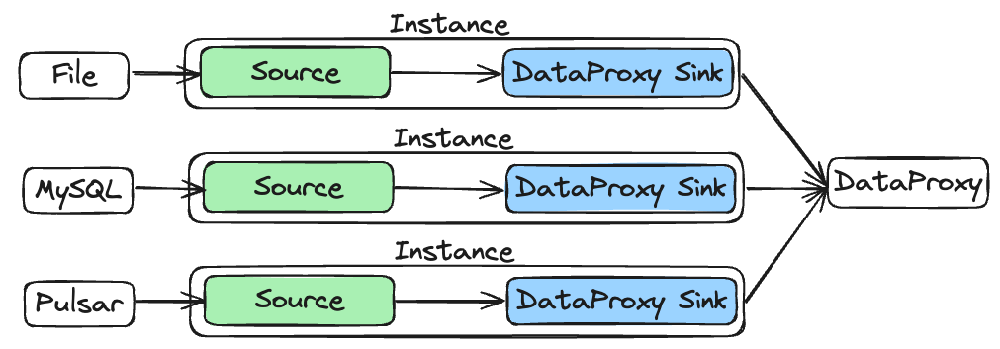
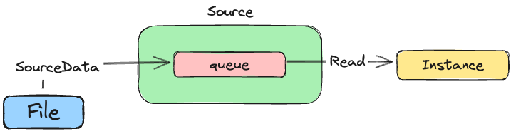
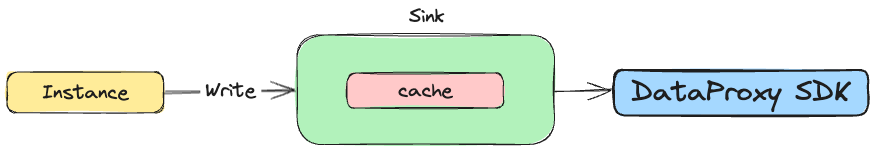
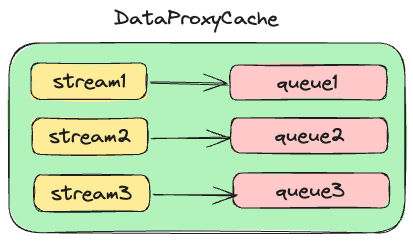
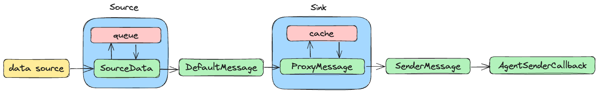

## Overview
This article mainly introduces the flow of Agent data between submodules and the corresponding binary protocol.
## Data flow


When introducing the Agent module, we know that there are Source and Sink modules in the Agent, where Source is responsible 
for collecting data from the data source; Sink is responsible for sending data downstream, and currently we believed that 
downstream only had DataProxy; Instance is responsible for moving data from Source to Sink.
## Binary protocol
### Source


Source has three main functions:

- Collect data from the data source and fill each data into a new SourceData object.

- Put the filled SourceData object into the cache queue of the Source module.

- When calling the Read method of the Source module externally, extract a SourceData from the cache queue, assemble it into a Message, and return it.
#### SourceData
```java 
public class SourceData {
    private byte[] data;
    private String offset;
}
```
The data collected from the data source may have various formats, so we use byte[] to store it (the original data is kept in byte[] during 
subsequent stages of circulation). At the same time, each piece of data will have corresponding positional information, and due to the diversity 
of positional information, we use String to store positional information.
#### Cache queue
As the name suggests, we put SourceData into the Queue for caching purposes, which can solve the problem of mismatched processing speeds between 
the data source and the Agent internally. The Queue type is LinkedBlockingQueue, which prevents problems with multi-threaded access. As it is a 
pure memory operation, it can ensure performance.
#### Message 
```java
public interface Message {

    byte[] getBody();
    Map<String, String> getHeader();
}
```
The return type of the Read method provided by Source is Message, and the specific implementation is as follows:
```java
public class DefaultMessage implements Message {

    private final byte[] body;
    protected final Map<String, String> header;
    
    ...
}
```
As mentioned earlier, Message is filled with SourceData, specifically in the case of DefaultMessage::body, which 
is filled with SourceData::data; The Default Message::header is filled with SourceData::offset and other attributes, 
each of which is a k/v pair of the Default Message::header. Usually, we also fill in the inlongStreamId of this message here.
### Instance
The main function of Instance is to retrieve the Message from the Source and write it to the Sink, without generating any 
new binary protocol during the process.
### Sink


Currently, in our implementation, there is only one type of Sink that can be considered, and that is DataProxy Sink. There are four main functions of DataProxy Sink:

- Call the Write method externally to write Message type data to the DataProxy Sink, and fill the ProxyMessage with Message internally within the method.

- Put the ProxyMessage into the ProxyMessageCache, which will store ProxyMessages with different inlongStreamId separately.

- Retrieve SenderMessage (composed of multiple ProxyMessages) from cache and call SenderManager::sendBatch to send.

- After receiving SenderMessage, SenderManager constructs the required callback object AgentSenderCallback for the DataProxy SDK method to send asynchronously.

#### ProxyMessage
```java
public class ProxyMessage implements Message {

    private final byte[] body;
    private final Map<String, String> header;
    OffsetAckInfo ackInfo;
```
The body and header of ProxyMessage are copied from the Message. In addition, a new ackInfo has been added to record the sending status:
```java
public class OffsetAckInfo {

    private String offset;
    private int len;
    private Boolean hasAck;
}
```
The offset comes from the Message::header; Len comes from Message::body len; HasAck indicates whether the information was successfully sent and is initialized to false.
#### ProxyMessageCache


The filled ProxyMessage will first be placed in the ProxyMessageCache:
```java
public class ProxyMessageCache {

    private final String taskId;
    private final String instanceId;
    private final int maxPackSize;
    private final int maxQueueNumber;
    private final String groupId;
    // streamId -> list of proxyMessage
    private final ConcurrentHashMap<String, LinkedBlockingQueue<ProxyMessage>> messageQueueMap;
    private long dataTime;
}
```
The core property of ProxyMessageCache is messageQueueMap, whose key is inlongStreamId and value is a queue. 
In addition, ProxyMessageCache will return SenderMessage through the fetchSenderMessage method. SenderMessage 
consists of multiple ProxyMessages, allowing for batch sending of data.
#### SenderMessage
```java
public class SenderMessage {

    private List<byte[]> dataList;
    private Map<String, String> extraMap;
    private List<OffsetAckInfo> offsetAckList;
}
```

SenderMessage is built inside the ProxyMessageCache and consists of multiple ProxyMessages with the same inlongStreamId:

- The dataList is filled with multiple ProxyMessage::body;

- ExtraMap includes audit versions and predefined fields (obtained from task configurations);

- OffsetAckList is filled with multiple ProxyMessage::ackInfo;
#### SenderManager
SenderManager directly calls the DataProxy SDK internally for data transmission, requiring three core parameters:
- Original data content
- Expand attributes
- Callback object
The original data content is provided by dataList; Extended attributes are provided by extraMap; The callback content needs to construct AgentSenderCallback to provide:
```java
private class AgentSenderCallback implements SendMessageCallback {

    private final SenderMessage message;
  
    AgentSenderCallback(SenderMessage message, int retry) {
        this.message = message;
    }

    @Override
    public void onMessageAck(SendResult result) {
    ...
    }
}
```
The onMessageAck method of the callback object will carry the sending result. After returning success, it will iterate through the 
SenderMessage::offsetAckList and set OffsetAckInfo::hasAck to true.
## Summary 
The data goes through the following data structure from the data source to the DataProxy SDK within the Agent:



We can see from the various data types introduced above that the original data content of each structure is stored using byte[]. On the one hand, it can preserve the original
data information without being affected by the encoding format, and on the other hand, it can reduce the cost of string conversion, making the overall efficiency higher.
