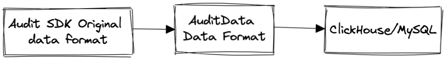

## Overview

In the InLong system architecture, modules such as the collection layer, aggregation layer, and sorting layer report
audit data to the Audit system through the Audit SDK. The Audit Proxy component is responsible for receiving this data
and converting it into the `AuditData` format, which is then stored in the message body of the MQ message.
Next, the Audit Store extracts this data from the MQ and persists it in storage systems such as ClickHouse. This article
will provide an in-depth analysis and explanation of the data protocol related to the Audit system.



## Audit SDK raw data format

The raw data of the Audit SDK is encapsulated using the Protobuf protocol, which includes information such as request
type, common data header, and data body. Here is a detailed description of the relevant protocol:

```protobuf
syntax = "proto3";

package org.apache.inlong.audit.protocol;

message BaseCommand {
  enum Type {
    PING = 0;
    PONG = 1;
    AUDIT_REQUEST = 2;
    AUDIT_REPLY = 3;
  }
  Type type = 1;
  AuditRequest audit_request = 2;
  AuditReply audit_reply = 3;
  Ping ping = 4;
  Pong pong = 5;
}

message Ping {
}

message Pong {
}

message AuditRequest {
  uint64 request_id = 1;
  AuditMessageHeader msg_header = 2;
  repeated AuditMessageBody msg_body = 3;
}

message AuditMessageHeader {
  string ip = 1;
  string docker_id = 2;
  string thread_id = 3;
  uint64 sdk_ts = 4;
  uint64 packet_id = 5;
}

message AuditMessageBody {
  uint64 log_ts = 1;
  string inlong_group_id = 2;
  string inlong_stream_id = 3;
  string audit_id = 4;
  uint64 count = 5;
  uint64 size = 6;
  int64  delay = 7;
  string audit_tag = 8;
  uint64 audit_version = 9;
}

message AuditReply {
  enum RSP_CODE {
    SUCCESS = 0;
    FAILED = 1;
    DISASTER = 2;
  }
  uint64 request_id = 1;
  RSP_CODE rsp_code = 2;
  string message = 3;
}
```

#### Audit Header

The header of the audit data contains the following machine metadata information: machine IP, container ID, thread ID,
current machine time, and data packet ID. Here is the specific protocol description:

```protobuf
message AuditMessageHeader {
  string ip = 1;
  string docker_id = 2;
  string thread_id = 3;
  uint64 sdk_ts = 4;
  uint64 packet_id = 5;
}
```

- IP: Record the IP address of the machine generating or processing the data;
- Docker ID: Identify the container to which the data belongs;
- Thread ID: Identify the thread generating or processing the data;
- SdkTs: Record the machine timestamp of the data reported by the SDK;
- Packet ID: Used to identify each data packet;

The purpose of these machine metadata information is to achieve deduplication of audit data and enable operational
monitoring. By recording and analyzing these information, it ensures the uniqueness of the data and facilitates
operations monitoring and troubleshooting activities.

#### Audit Body

The subject of audit data includes the following information: data time, InLong GroupId, InLong StreamId, AuditId,
AuditTag, Audit version, count, size, and transmission delay. Here is the specific protocol description:

```protobuf
message AuditMessageBody {
  uint64 log_ts = 1;
  string inlong_group_id = 2;
  string inlong_stream_id = 3;
  string audit_id = 4;
  uint64 count = 5;
  uint64 size = 6;
  int64  delay = 7;
  string audit_tag = 8;
  uint64 audit_version = 9;
}
```

- LogTs: Record the timestamp of data generation or processing;
- InLong GroupId: Identify the InLong group to which the data belongs;
- InLong StreamId: Identify the InLong stream to which the data belongs;
- AuditId: Used to uniquely identify each audit record;
- AuditTag: Used to tag specific audit records;
- Audit Version: Record the version number of the audit record;
- Count: Record the number of entries included in the data;
- Size: Record the size of the data;
- Delay: Record the time taken for data transmission.

The purpose of these audit information is for reconciliation to ensure the integrity and accuracy of the data. By
performing statistical analysis on this information, data validation, troubleshooting, and performance analysis
operations can be achieved.

## AuditData data format

The Audit Proxy is responsible for receiving Protobuf formatted data from the Audit SDK and parsing it. Once the parsing
is complete, it assembles the Audit Header and Audit Body into a complete audit record, which is then written to a
message queue ( MQ ). `AuditData` represents the format of the assembled data, with the following specific details:

```json
{
  "ip": "127.0.0.1",
  "dockerId": "1",
  "threadId": "1",
  "sdkTs": 1727600278000,
  "packetId": 1,
  "logTs": 1727600278000,
  "inlongGroupId": "groupId",
  "inlongStreamId": "streamId",
  "auditId": "auditId",
  "auditTag": "auditTag",
  "count": 1,
  "size": 1,
  "delay": 1,
  "auditVersion": 1
}
```

## Audit data storage format

The Audit Store consumes `AuditData` audit data from the message queue ( MQ ), performs protocol parsing, and persists the
data into storage systems such as ClickHouse, MySQL, etc. The specific storage target schema is as follows:

### ClickHouse table Schema

```sql
CREATE TABLE apache_inlong_audit.audit_data
(
    `log_ts`           DateTime COMMENT 'Log timestamp',
    `audit_id`         String COMMENT 'Audit id',
    `inlong_group_id`  String COMMENT 'The target inlong group id',
    `inlong_stream_id` String COMMENT 'The target inlong stream id',
    `audit_tag`        String COMMENT 'Audit tag',
    `audit_version`    Int64 DEFAULT -1 COMMENT 'Audit version',
    `ip`               String COMMENT 'Client IP',
    `docker_id`        String COMMENT 'Client docker id',
    `thread_id`        String COMMENT 'Client thread id',
    `sdk_ts`           DateTime COMMENT 'SDK timestamp',
    `packet_id`        Int64 COMMENT 'Packet id',
    `count`            Int64 COMMENT 'Message count',
    `size`             Int64 COMMENT 'Message size',
    `delay`            Int64 COMMENT 'Message delay',
    `update_time`      DateTime COMMENT 'Update time'
) ENGINE = ReplicatedMergeTree('/clickhouse/tables/{uuid}/{shard}', '{replica}')
  PARTITION BY toDate(log_ts)
  ORDER BY (log_ts, audit_id, inlong_group_id, inlong_stream_id, audit_tag, audit_version, ip)
  TTL toDateTime(log_ts) + toIntervalDay(8)
  SETTINGS index_granularity = 8192
```

As described above, the table uses the ReplicatedMergeTree storage engine to achieve distributed storage and high
availability. The data will be partitioned based on the log_ts column and stored and managed in the order of ( log_ts,
audit_id, inlong_group_id, inlong_stream_id, audit_tag, audit_version, ip ) to optimize query performance.

### MySQL table Schema

```sql
CREATE TABLE IF NOT EXISTS `audit_data`
(
    `id`               int(32)      NOT NULL PRIMARY KEY AUTO_INCREMENT COMMENT 'Incremental primary key',
    `ip`               varchar(32)  NOT NULL DEFAULT '' COMMENT 'Client IP',
    `docker_id`        varchar(100) NOT NULL DEFAULT '' COMMENT 'Client docker id',
    `thread_id`        varchar(50)  NOT NULL DEFAULT '' COMMENT 'Client thread id',
    `sdk_ts`           TIMESTAMP    NOT NULL DEFAULT CURRENT_TIMESTAMP COMMENT 'SDK timestamp',
    `packet_id`        BIGINT       NOT NULL DEFAULT '0' COMMENT 'Packet id',
    `log_ts`           TIMESTAMP    NOT NULL DEFAULT CURRENT_TIMESTAMP COMMENT 'Log timestamp',
    `inlong_group_id`  varchar(100) NOT NULL DEFAULT '' COMMENT 'The target inlong group id',
    `inlong_stream_id` varchar(100) NOT NULL DEFAULT '' COMMENT 'The target inlong stream id',
    `audit_id`         varchar(100) NOT NULL DEFAULT '' COMMENT 'Audit id',
    `audit_tag`        varchar(100)          DEFAULT '' COMMENT 'Audit tag',
    `audit_version`    BIGINT                DEFAULT -1 COMMENT 'Audit version',
    `count`            BIGINT       NOT NULL DEFAULT '0' COMMENT 'Message count',
    `size`             BIGINT       NOT NULL DEFAULT '0' COMMENT 'Message size',
    `delay`            BIGINT       NOT NULL DEFAULT '0' COMMENT 'Message delay count',
    `update_time`      timestamp    NOT NULL DEFAULT CURRENT_TIMESTAMP ON UPDATE CURRENT_TIMESTAMP COMMENT 'Update time',
    INDEX group_stream_audit_id (`inlong_group_id`, `inlong_stream_id`, `audit_id`, `log_ts`)
) ENGINE = InnoDB
  DEFAULT CHARSET = UTF8 COMMENT ='Inlong audit data table';
```

As described above, the table uses the InnoDB storage engine to ensure data consistency. Additionally, an index
named "group_stream_audit_id" has been created using the INDEX clause, which covers the columns inlong_group_id,
inlong_stream_id, audit_id, and log_ts. This index creation helps improve query efficiency, especially when filtering
and sorting based on these columns.