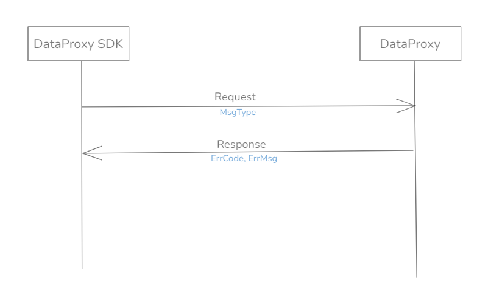
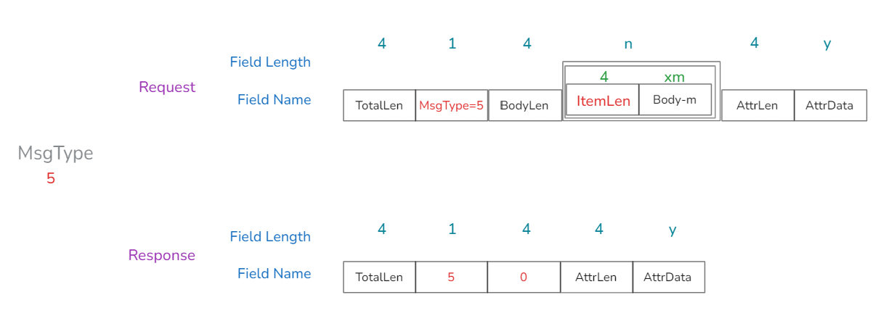

## Overview

When users report data to the InLong system through the SDK, the interaction between the SDK and DataProxy uses the InLong custom binary protocol. This article mainly introduces the definition of the DataProxy binary protocol and how to use the SDK to report data.

## DataProxy binary protocol

### Protocol framework

DataProxy and SDK use TCP long connection to transmit binary data packets in custom format. After receiving the report request message from SDK, DataProxy processes the data and returns the result to SDK through request response, as shown in the following figure:

The DataProxy node only passively receives messages reported by the SDK. The received message is called a request message, and the message sent to the SDK is called a response message. Both the request and response messages are defined in the following format, as shown in the following figure:

Among them:

- TotalLen: total length of the message, in bytes;

- MsgType: message type, identifies the encoding format of the message, and determines what encoding and decoding scheme is used in the subsequent Payload part

- Payload: message content, the encoding and decoding of this part is determined by the MsgType value

Different types of messages have different lengths and formats, but the 5 bytes of the message header received by DataProxy are fixed field values. DataProxy identifies different types of messages based on this feature and handles them accordingly.

In the current implementation, MsgType has 4 valid values: 3, 5, 7, and 8. 3, 5, and 7 are used to report data, and 8 is used to keep the link alive and synchronize status information between the SDK and DataProxy.

Next, we introduce different protocol encodings according to MsgType values:

### MsgType=3

In the message of MsgType=3 format, the MsgType field is fixed to 3. The Payload part of the request message carries {attribute set, data list} information; the message body length of the response message is 0 and only carries attribute set information, as shown in the following figure:

Among them:

- BodyLen: message body length, indicating the total length of the Body part that follows;

- Body: message body, if there are multiple data, the data is separated by a single byte '\n';

- AttrLen: attribute length, indicating the total length of the AttrData part that follows;

- AttrData: attribute value

DataProxy processes the request message and returns a response message. In the attribute information of the response, it will add attributes such as `errCode` and `errMsg` based on the request attribute value, and carry the processing result of the request back to the SDK for processing.

### MsgType=5

For messages in the MsgType=5 format, the MsgType field is fixed to 5, as shown in the following figure:

Compared with MsgType=3, MsgType=5 has a different message body definition in the Payload part of the request message. It is saved in the form of {length, data} instead of the fixed single-byte '\n' delimiter. In the field definition of this type:

- ItemLen: the length of a single data item, indicating the length of the Body part that follows;

- Body: the reported binary data content.

### MsgType=7

For messages in the MsgType=7 format, the MsgType field is fixed to 7, as shown in the following figure:

Compared with the previous MsgType=3 and 5 format definitions, the MsgType=7 message presents fixed attribute value information in the form of fixed fields, and adds a 2-byte message integrity check mark 0xee01 at the end of the message; to be compatible with multiple data packaging methods with different formats of MsgType=3 and MsgType=5, different type definitions are added to the message body and identified by the ExtField field; at the same time, the response message adopts a new format definition instead of reusing the request message format. The specific fields are explained as follows:

- MsgTYpe: In this message type, in addition to identifying the type, this field also uses other available bits to identify whether the relevant function is enabled;

- GroupNum: Identifies the ID value corresponding to the group, used when transmitting digital group information;

- StreamNum: Identifies the ID value corresponding to the stream, used when transmitting digital stream information;

- ExtField: Identifies the extended function enabling field, used to transmit the extended function enabled by the message, different bits have different meanings, see the ExtField bit definition table for details;

- DataTime: Identifies the data time, with precision in seconds;

- MsgCnt: Identifies the total number of messages carried;

- UniqueId: unique tag of 8-byte long type that identifies the message;

- BodyLen: identifies the total length of the message body and the length of the following binary message body data;

- BodyData: identifies the binary message content carried by the message. This part has different storage methods according to different data organization formats. See the schematic diagram of BodyData:

    - Use MsgType=3 to store data, and the data is separated by a single-byte '\n' delimiter;

    - Use MsgType=5 to store data, and the data is saved in the form of {length, data}

Under this type, the definitions of the MsgType fields are as follows:

| Bit    | Meaning        | Remark                                    |
|--------|----------------|-------------------------------------------|
| 0 ~ 4  | Message type   |                                           |
| 5      | Compress       | 1 indicates enabled, 0 indicates disabled |
| 6      | Encryption     | 1 indicates enabled, 0 indicates disabled |
| 7      | Authorization  | 1 indicates enabled, 0 indicates disabled |

For ExtField fields, each bit is defined as follows:

| Bit   | Meaning                                    | Remark                                    |
|-------|--------------------------------------------|-------------------------------------------|
| 0     | Reserved                                   |                                           |
| 1     | Report the node's IP and processing time   | 1 means report, 0 means do not report     |
| 2     | Whether to enable digital group, stream    | 0 indicates enabled, 1 indicates disabled |
| 3 ~ 4 | Reserved                                   |                                           |
| 5     | Multiple data are separated by line breaks | 1 indicates enabled, 0 indicates disabled |
| 6 ~ 7 | Reserved                                   |                                           |

The data format of the BodyData field uses MsgType=5 to store data when the value of the 5th bit of the ExtField field is 0; when it is 1, it uses MsgType=3 to store data.

### MsgType=8

The message in the MsgType=8 format is a link heartbeat keep-alive and status transfer message, and its MsgType field is fixed to 8, as shown in the following figure:

This message type is used as a heartbeat packet for a TCP long connection between the SDK and DataProxy. The heartbeat request and response message formats are the same. In addition to completing the heartbeat keepalive, the SDK also carries the SDK version information in the request Version field; DataProxy fills in the 2-byte node load information in the response BodyData.

## SDK reporting example

Refer to the introduction of the relevant part of the [DataProxy SDK](../../sdk/dataproxy-sdk/java.md), which is omitted here.
