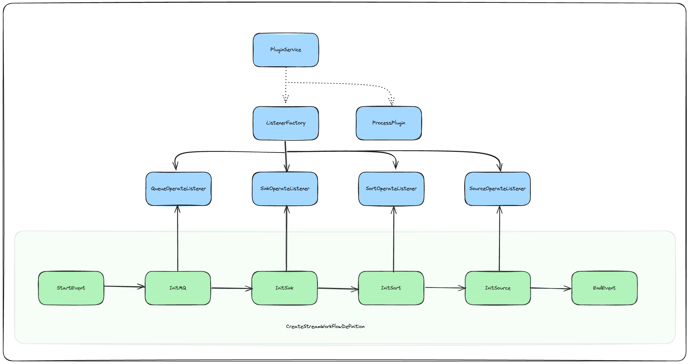
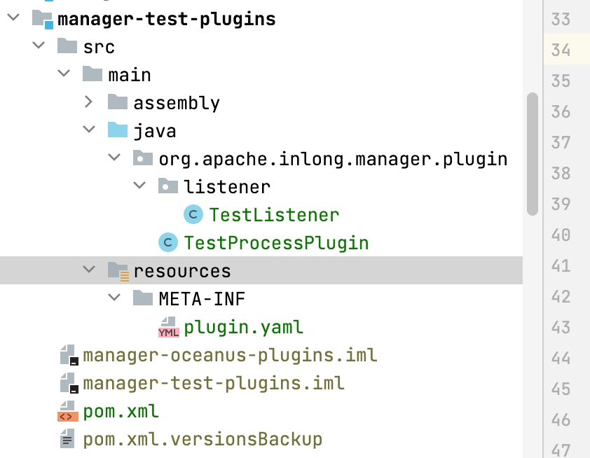
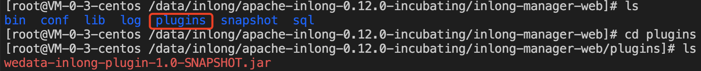
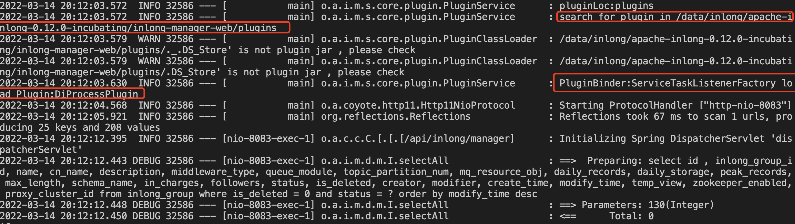
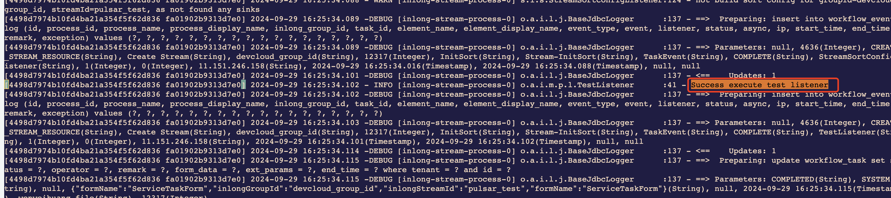

## Overview

This article is aimed at InLong-Manager plugin developers, trying to explain the process of developing an Manager plugin as comprehensively as possible, and strive to eliminate the confusion of developers and make plugin development easier.

## Before Development

- Inlong is stream processing framework constructed with a Group + Stream architecture.
- An Inlong Group contains more than one Inlong Stream, each Inlong Stream is capable of a single individual dataflow.
- Inlong Group is responsible for physical resource definition shared by all Inlong Streams included, especially middleware clusters and sort functions.
- In order to create Inlong Group, Inlong Manager use **CreateGroupWorkflowDefinition** to init all necessary physical resources, a workflow definition contains several individual service tasks. When it's created and processed, service tasks will be executed one after another.
- Service task is constructed in **observer pattern**, which also known as the **publish-subscribe pattern**, each service task will register several task listeners. Listener accepts workflow context and controls execution logic on physical resources.
- As a developer, you need to develop specific Listener with personalized logic.

## Demonstration

- The Inlong Manager plugin mechanism can be represented by the following figure:



As shown in the figure, plugins mainly serve the workflows in InLong. Each task in the workflow corresponds to a listener queue, such as Init Mq corresponding to QueueOperateListener, Init Sink corresponding to SinkOperateListener, Init Sort corresponding to SortOperateListener, and Init Source corresponding to SourceOperateListener.

When developers need to add a task to the workflow, they can add a Listener through the plugin and register the Listener to the task.

Below is an example of adding a TestListener process for the Init Sort task, mainly adding three files: TestListener, TestProcessPlugin, and plugin.yaml.



```java
@Slf4j
public class TestListener implements SortOperateListener {

    @Override
    public TaskEvent event() {
        return TaskEvent.COMPLETE;
    }

    @Override
    public boolean accept(WorkflowContext workflowContext) {
        return true;
    }

    @Override
    public ListenerResult listen(WorkflowContext context) throws Exception {
        log.info("Success execute test stream listener");
        return ListenerResult.success();
    }
}
```
TestListener implements SortOperateListener and overrides the listen method. When the execution reaches TestListener, it will print a line of log.

```java
@Slf4j
public class TestProcessPlugin implements ProcessPlugin {

    @Override
    public List<SourceOperateListener> createSourceOperateListeners() {
        return new LinkedList<>();
    }

    @Override
    public List<SortOperateListener> createSortOperateListeners() {
        List<SortOperateListener> listeners = new LinkedList<>();
        listeners.add(new TestListener());
        return listeners;
    }

    @Override
    public Map<DataSourceOperateListener, EventSelector> createSourceOperateListeners() {
        return new LinkedHashMap<>();
    }

    @Override
    public Map<QueueOperateListener, EventSelector> createQueueOperateListeners() {
        return new LinkedHashMap<>();
    }

    @Override
    public Map<SinkOperateListener, EventSelector> createSinkOperateListeners() {
        return new LinkedHashMap<>();
    }

}
```
TestProcessPlugin implements ProcessPlugin and overrides the createSortOperateListeners method. When the plugin is loaded, the Manager will load TestListener into the SortOperateListener queue. When the workflow executes to Init Sort, TestListener will be executed.


- After developing you plugin, you should prepare plugin definition file in **Yaml**, and put it under resources/META-INF.

```yaml
name: test
description: example for manager plugin
javaVersion: 1.8
pluginClass: org.apache.inlong.manager.plugin.TestProcessPlugin
```

- When Inlong Manager is deployed, plugins must be located under installation directory, then **Manager Process** will find the plugin jar and install the plugin automatically.



- As a developer, you can confirm your plugin be loaded successfully by searching logs below:



- In this way, after executing the workflow, the following log will be printed, indicating that the plugin has been successfully executed.



- To develop available Listeners , you can refer to the native Listeners in `org.apache.inlong.manager.service.workflow.listener.GroupTaskListenerFactory`

## Last but not Least

We provide the plugin mechanism in Inlong Manager make it easier and more convenient for developers to customize personalized logic when Inlong is not supported.
Plugin mechanism is far from perfect now and we will continuously devote to improve it.