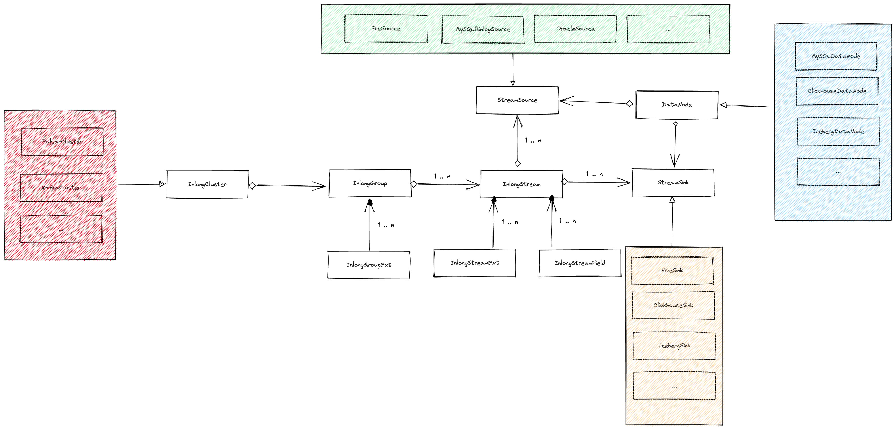

## Introduction

InLong Manager is a unified management platform for the Apache InLong project. The platform provides maintenance portals for various basic configurations (such as data flow configuration, consumption configuration, cluster management, etc.). Users can create data collection tasks and view indicator data.

## Module

| Modules   | Description |
| :---------| :--------------- |
| manager-common | Module common code, such as exception definition, tool class, enumeration, etc. |
| manager-dao   | database operations |
| manager-service | business logic layer |
| manager-workflow | Workflow Services |
| manager-plugins | Sort plugin service |
| manager-web | Front-end interactive interface layer |
| manager-client | Client Services |
| manager-client-examples | Client usage examples |
| manager-client-tools | Client command line tools |

## Interaction Flow

## Data Model

Currently, the InLong Manager mainly consists of the following data models:
- InlongGroup: Data Streams Group, it contains multiple data streams, and one InlongGroup represents one data business unit.
- InlongStream: Data Stream, a stream has a specific data source, data format and data sink.
- StreamSource: Data sources, including File collection, MySQL collection, etc.
- StreamSink: Data targets, including Hive, ClickHouse, and other locations where data ultimately flows into.
- DataNode: Data nodes, including information such as data collection address, username, password, etc.
- InlongCluster: Clusters, including cluster information such as Pulsar, TubeMQ, Kafka, etc.
