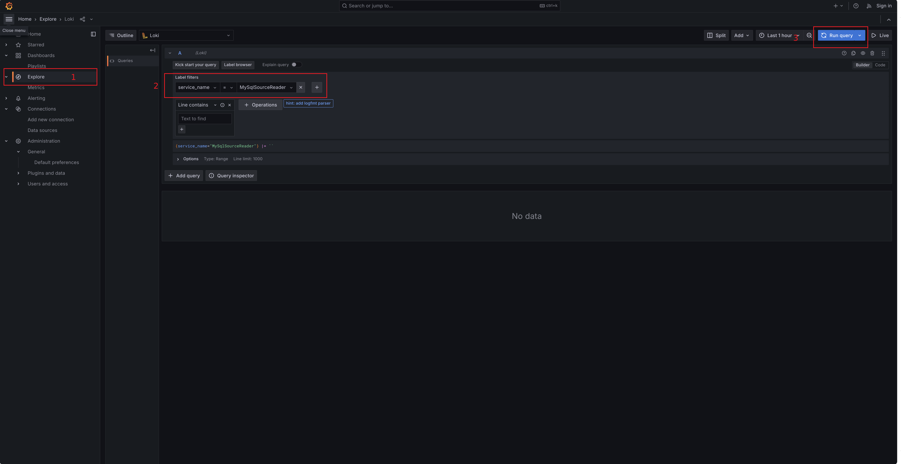
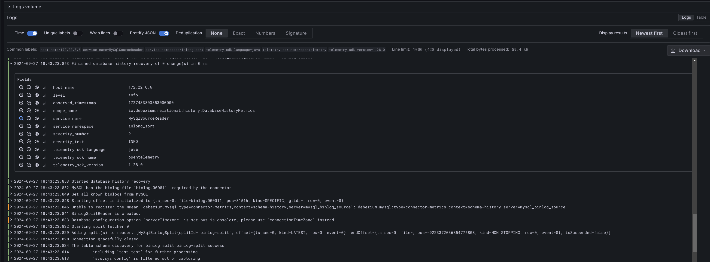

## Overview

As `InLong Sort` runs on different `Task Manager` nodes of `Apache Flink`, each node stores the logs independently, and it is inefficient to view the logs on each node. To solve this, a centralized log management solution based on [OpenTelemetry](https://opentelemetry.io/) is provided, which allows users to efficiently manage Flink logs.

InLong Sort can integrate the log reporting function into every `Connector`. The log processing flow is shown in the figure below. The logs are reported through [OpenTelemetry](https://opentelemetry.io/), collected and processed by [OpenTelemetry Collector](https://opentelemetry.io/docs/collector/), and then sent to [Grafana Loki](https://grafana.com/oss/loki/) for centralized management.


## Integrating Log Reporting for Connector

InLong Sort wraps the [OpenTelemetryLogger](https://github.com/apache/inlong/blob/6e78dd2de8e917b9fc17a18d5e990b43089bb804/inlong-sort/sort-flink/base/src/main/java/org/apache/inlong/sort/base/util/OpenTelemetryLogger.java) class, which provides a `Builder` to help users to quickly configure an ` OpenTelemetryLogger` and can enable or disable logging reporting by calling its `install` or `uninstall` functions. With the help of `OpenTelemetryLogger`, the connector can report logs more easily. The following steps describe how to use the OpenTelemetryLogger class to integrate log reporting for connector based on[FLIP-27](https://cwiki.apache.org/confluence/display/FLINK/FLIP-27%3A+Refactor+Source+Interface#FLIP27:RefactorSourceInterface-Motivation) standard:

1. Construct an `OpenTelemetryLogger` object using `OpenTelemetryLogger.Builder()` in the constructor method of connector `SourceReader`'s class.
2. Call `install()` method of the `OpenTelemetryLogger` object in `Start()` function of `SourceReader`.
3. Call `uninstall()` method of the `OpenTelemetryLogger` object in `close()` function of `SourceReader`.

**Note**: If the `maven-shade-plugin` plugin is used, the `opentelemetry` and `okhttp` related packages need to be included:

```xml
<build>
    <plugins>
        <plugin>
            <groupId>org.apache.maven.plugins</groupId>
            <artifactId>maven-shade-plugin</artifactId>
            <version>${plugin.shade.version}</version>
            <executions>
                <execution>
                    <id>shade-flink</id>
                    <goals>
                        <goal>shade</goal>
                    </goals>
                    <phase>package</phase>
                    <configuration>
                        <createDependencyReducedPom>false</createDependencyReducedPom>
                        <artifactSet>
                            <includes>
                                <include>io.opentelemetry*</include>
                                <include>com.squareup.*</include>
                            </includes>
                        </artifactSet>
                    </configuration>
                </execution>
            </executions>
        </plugin>
    </plugins>
</build>
```


The example is:
```java
import org.apache.inlong.sort.base.util.OpenTelemetryLogger;

public class XXXSourceReader<T>
{

    private static final Logger LOG = LoggerFactory.getLogger(XXXSourceReader.class);

    private final OpenTelemetryLogger openTelemetryLogger;

    public XXXSourceReader() {
        ...
        // initial OpenTelemetryLogger
        this.openTelemetryLogger = new OpenTelemetryLogger.Builder()
                .setServiceName(this.getClass().getSimpleName())
                .setLocalHostIp(this.context.getLocalHostName()).build();
    }

    @Override
    public void start() {
        openTelemetryLogger.install(); //  start log reporting
        ...
    }

    @Override
    public void close() throws Exception {
        super.close();
        openTelemetryLogger.uninstall(); // close log reporting
    }
    
    ...
}
```
The `OpenTelemetryLogger` currently provides the following configuration items:

| Configuration      | Description          | Default value |
| -----------        | -------------------- | ------------- |
|`endpoint`    | `OpenTelemetry Collector` address, if not specified,it will try to get from `OTEL_EXPORTER_ENDPOINT` environment variable; if the environment variable is not configured, then use the default value.| `localhost:4317` |
| `serviceName` |` OpenTelemetry`'s service name, which can be used to distinguish between different connectors. |`unnamed_service  `|
| `layout` | `Log4j2`'s log format, which is an instance of `PatternLayout` class |`%d{HH:mm:ss.SSS} [%t] %-5level %logger{36} - %msg%n`|
| `logLevel` | Log level |`Level.INFO`|
| `localHostIp` | IP of the `Flink` node, available in `SourceReader` via `this.context.getLocalHostName()`. |`null`|

## Docker Configuration

In addition to integrating the log reporting function for  Connector, you also need to add three docker containers(`opentelemetry-collector`, `grafana loki`,  `grafana`), and configure the `OTEL_EXPORTER_ENDPOINT` environment variable for the `Flink` container.

> This part of the configuration is already provided in `-inlong-docker-docker-compose-docker-compose.yml`. Just add the `--profile sort-report` option when starting `docker compose` to enable it. The full command is `docker compose --profile sort-report up -d`

You can also refer to the following content to configure your own application， the `docker-compose.yml` file is shown below:


```docker
# flink jobmanager
jobmanager:
  image: apache/flink:1.15-scala_2.12
  container_name: jobmanager
  environment:
    - |
      FLINK_PROPERTIES=
      jobmanager.rpc.address: jobmanager
    - OTEL_EXPORTER_ENDPOINT=logcollector:4317
  ports:
    - "8081:8081"
  command: jobmanager

# flink taskmanager
taskmanager:
  image: apache/flink:1.15-scala_2.12
  container_name: taskmanager
  environment:
    - |
      FLINK_PROPERTIES=
      jobmanager.rpc.address: jobmanager
      taskmanager.numberOfTaskSlots: 2
    - OTEL_EXPORTER_ENDPOINT=logcollector:4317
  command: taskmanager

# opentelemetry collector
logcollector:
  image: otel/opentelemetry-collector-contrib:0.110.0
  container_name: logcollector
  volumes:
    - ./log-system/otel-config.yaml:/otel-config.yaml
  command: [ "--config=/otel-config.yaml"]
  ports:
    - "4317:4317"

# grafana loki
loki:
  image: grafana/loki:3.0.0
  ports:
    - "3100:3100"
  volumes:
    - ./log-system/loki.yaml:/etc/loki/local-config.yaml
  command: -config.file=/etc/loki/local-config.yaml

# grafana
grafana:
  environment:
    - GF_PATHS_PROVISIONING=/etc/grafana/provisioning
    - GF_AUTH_ANONYMOUS_ENABLED=true
    - GF_AUTH_ANONYMOUS_ORG_ROLE=Admin
  entrypoint:
    - sh
    - -euc
    - |
      mkdir -p /etc/grafana/provisioning/datasources
      cat <<EOF > /etc/grafana/provisioning/datasources/ds.yaml
      apiVersion: 1
      datasources:
      - name: Loki
        type: loki
        access: proxy 
        orgId: 1
        url: http://loki:3100
        basicAuth: false
        isDefault: true
        version: 1
        editable: false
      EOF
      /run.sh
  image: grafana/grafana:latest
  ports:
    - "3000:3000"
```

You also need to provide configuration files (`otel-config.yaml` for logcollector and `loki.yaml` for Loki). The content of the otel-config.yaml file is:

```yaml
receivers:
  otlp:
    protocols:
      grpc:
        endpoint: logcollector:4317
processors:
  batch:

exporters:
  logging:
    verbosity: detailed
  otlphttp:
    endpoint: http://loki:3100/otlp
    tls:
      insecure: true

service:
  pipelines:
    logs:
      receivers: [otlp]
      processors: [batch]
      exporters: [otlphttp, logging]
```

And the content of the `loki.yaml` file is:

```yaml
auth_enabled: false

limits_config:
  allow_structured_metadata: true
  volume_enabled: true
  otlp_config:
    resource_attributes:
      attributes_config:
        - action: index_label
          attributes:
            - level
server:
  http_listen_port: 3100

common:
  ring:
    instance_addr: 0.0.0.0
    kvstore:
      store: inmemory
  replication_factor: 1
  path_prefix: /tmp/loki

schema_config:
  configs:
    - from: 2020-05-15
      store: tsdb
      object_store: filesystem
      schema: v13
      index:
        prefix: index_
        period: 24h

storage_config:
  tsdb_shipper:
    active_index_directory: /tmp/loki/index
    cache_location: /tmp/loki/index_cache
  filesystem:
    directory: /tmp/loki/chunks

pattern_ingester:
  enabled: true
```

## Usage

Execute `docker compose --profile sort-report up -d` in the `inlong/docker/` path to start the relevant containers, then create and start a task process according to [Data Ingestion](quick_start/data_ingestion/file_pulsar_clickhouse_example.md) (the involved connectors need to be integrated with OpenTelemetryAppender).

After that you can enter the `Grafana Loki` system by `http://127.0.0.1:3000/explore`, and query the logs by the `service_name` field:



Click on the log item to view the log details (**Note:** The default log reporting level is `ERROR`.):


