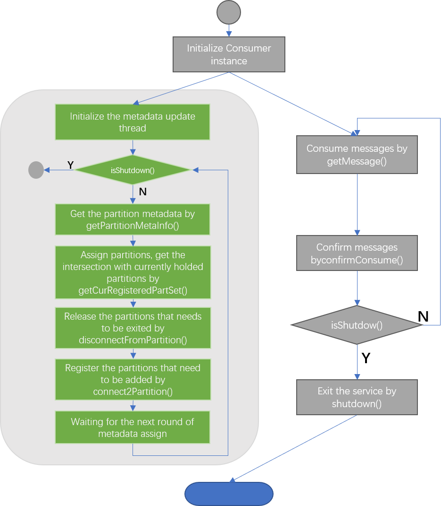
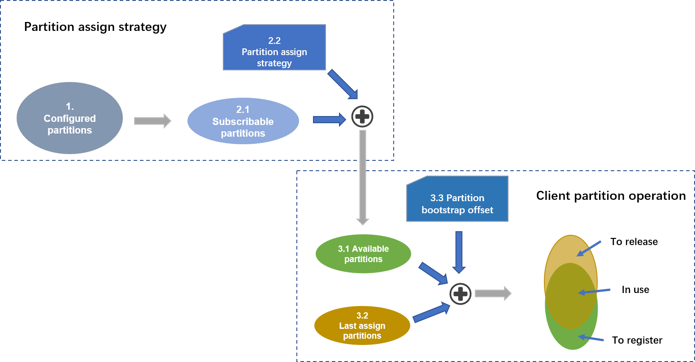
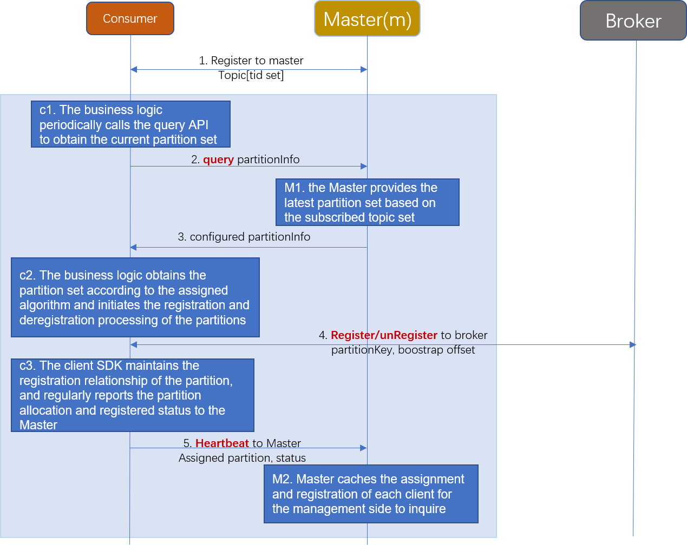

## 1 Preface
Before version 0.12.0, the partition allocation of TubeMQ was controlled by the server-side. The advantage of this solution is that the client is simple to implement, after the client registers, it only needs to wait for the server-side to distribute the partition and register and consume the distributed partition. But its shortcomings are also more obvious:
1. Data consumption waiting time is too long: the client has a relatively long time from startup to consumption to the first piece of data. In the best case, the client needs to wait for an allocation period (configurable, 30 seconds by default) to obtain the partition to be consumed and in extreme cases, it may exceed a few minutes. So the user is not satisfied with the waiting time;
2. The partition allocation plan is not rich enough: the current service-side partition allocation plan is based on the total set of Topic partitions subscribed by the client, and the total number of clients in the distribution of this consumer group is distributed in a Hash modulo mode, and when the business needs a special distribution plan is adopted, the current distribution plan on the server-side is not friendly enough and cannot be changed at any time according to business needs;
3. Does not support specified partition consumption: during the use of the version, the business feedback that the current server-side management and control is not flexible enough, for example, when the client needs to bind the consumption relationship between the consumer and the partition, or when you only want to consume certain partitions at a certain startup, The current service-side consumption control is not supported.
In response to these problems, the 0.12.0 version launched a new client partition allocation management and control consumption model, combined with the current consumption lag situation awareness function of the partition, allowing the business to autonomously control the distribution and consumption of the partition.

## 2 Usage Demo
The client of partition assign is defined based on the ClientBalanceConsumer interface class, including 17 APIs in total. For related demo codes, please refer to the [ClientBalanceConsumerExample.java](https://github.com/apache/inlong/blob/master/inlong- tubemq/tubemq-example/src/main/java/org/apache/inlong/tubemq/example/ClientBalanceConsumerExample.java). 

The overall code implementation logic is as follows:

## 3 Implementation details
### 3.1 The general idea
According to business needs and analysis of the implementation of similar MQs, we added the ClientBalanceConsumer class on the TubeMQ consumer end. Through the API provided by the SDK, the business can periodically query the partition set information corresponding to the topic to be consumed; and the business can specify the partition and initial The offset is used to register and to cancel the registered partition; at the same time, the server does not control the partition allocation of this type of consumer group, and the client completely controls the allocation and release the relationship between the client and the partition.

### 3.2 Field Definition
Before using this type of consumer, the business needs to pay attention to the following two field definition information:
- PartitionKey: Partition Key, String type, ID used to uniquely identify a partition in TubeMQ, globally unique within the cluster, in the format of "BrokerId:TopicName:PartitionId", the business query partition metadata information will return the result as PartitionKey gather;
- bootstrapOffset: reset Offset, long type, the initial consumption value provided by the business when registering consumption on the specified partition, the effective value is [0, +value); when this interface is called, the field is set to -1, indicating that the business is stored on the service side Offset position continues consumption data

### 4.3 Interactive Introduction
#### 4.3.1 Core Ideas

As shown above, the logic behind the client load balancing operation is mainly to deal with the partition set. The client must periodically obtain the subscribable partition set, and obtain the current consuming partition set of each client according to the allocation algorithm; the current consuming set is the same as The client is currently consuming the set of partitions to take the intersection to obtain the partitions that need to be released and newly registered; for the partitions that need to be newly registered, the client is supported to specify the offset value of the initial consumption.

The following two issues need to be paid attention to during the client partition allocation and use business:
- How to reduce the impact of partition expansion and contraction: TubeMQ will expand and contract at any time, such as abnormal Broker offline, operation and maintenance blacklist operation, operation and maintenance expansion topic partition, etc. In order to deal with this problem, business pull The partition metadata information obtained is the configuration information and the subscribed status of the partition; it is recommended that the business be distributed according to the complete set of configuration, and then the metadata status is unregistered and registered (there are examples in the sample code), so as to avoid the exception of Broker. Frequent release and join processing caused by operations such as online, blacklist, and temporary unsubscription.
- How to deal with the expansion and contraction on the client-side: By default, we believe that the business will use the number of partitions and the number of clients in the consumer group to allocate partitions based on the modulus. Therefore, we added sourceCount (consumer group) to the start() function of TubeMQ. The total number of nodes) and nodeId (the ID number of the current node) are two fields to tell the service side how many clients the consumer group will start, and what is the ID number of each client to ensure the consistency of the modulus distribution; When using a consumer group, you need to specify the above two parameters. The sourceCount must ensure that all consumers in the same group provide the same value, and the nodeId must ensure that the ID used by all consumers in the same group is unique. In this way, it is ensured that if the consumer group uses the modulo scheme, the corresponding basic parameters are not in conflict. It is possible that the business does not choose a modular solution. At this time, you only need to set the sourceCount to an invalid value (less than 0), and you can turn off the default parameter requirements.

#### 4.3.2 Interactive Process
The interaction between each node is as follows:

- The Master does not execute the balancing process on the Consumer controlled by the client. After the Master receives the consumer group registered by this type of client, it does not control partition assign, which is completely controlled by the client;
- Consumer provides a partition query API for businesses to periodically query the partition set information corresponding to the Topic set to be consumed;
- Consumer provides partition registration and deregistration APIs for the business to deregister the partitions that the client has registered and needs to be deregistered, register the designated unregistered partitions through the registration interface, and support the initial offset of the designated registration of the business during registration;
- Consumers regularly report status and partition registration information, so that the Master side can perceive the current partition assign and registration status of each SDK so that the server can obtain the partition allocation information of the entire group;
- Master provides a query API and supports operation and maintenance to query the partition allocation status of each node in the specified partition allocation consumer group through the API query interface.

## 5 Summary
At this point, we have completed the introduction of client partition assign and made a detailed example of partition allocation through the client hash modulus based on the total number of partitions and the total number of clients in the consumer group. There is no restriction on the partition allocation scheme, and you can also use other schemes when you use them,  only need to set the sourceCount value to -1 to turn off the system default allocation strategy.

In the implementation, the initial plan was to externalize the allocation plan in a callback mode and include the partition allocation thread into the SDK. However, later considering that the client may do a lot of fine processing, encapsulation may limit the use of the business. In contrast, the business only creates one more thread, so the current version does not carry out this encapsulation. The follow-up to see the effect of the implementation, if this is necessary, we will improve it.

---
<a href="#top">Back to top</a>