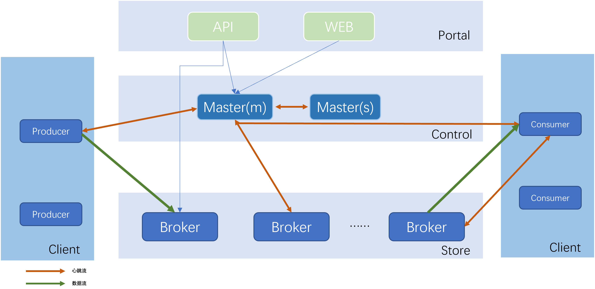
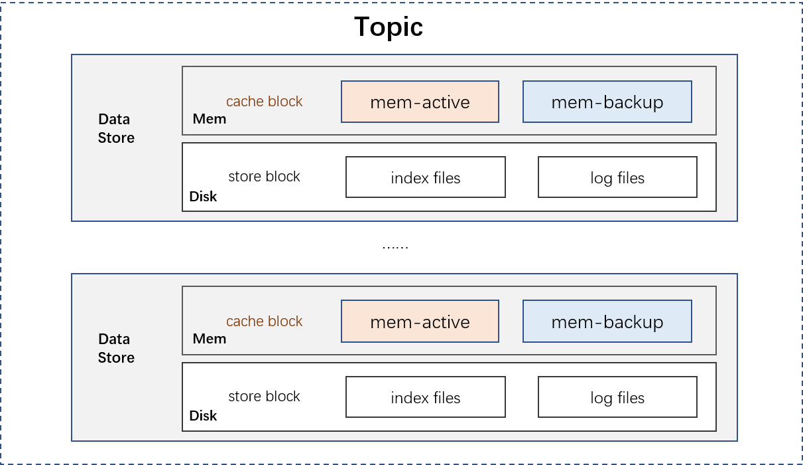

## TubeMQ Architecture:
After years of evolution, the TubeMQ cluster is divided into the following 4 parts:

- **Portal：** The Portal part responsible for external interaction and maintenance operations, including API and Web. 
  The API connects to the management system outside the cluster. The Web is a page encapsulation of daily operation 
  and maintenance functions based on the API;

- **Master：** It is responsible for the Control part of the cluster. This part is composed of one or more Master nodes.
  Master HA performs heartbeat keep-alive and real-time hot standby switching between master nodes (This is the reason 
  why everyone needs to fill in the addresses of all Master nodes corresponding to the cluster when using TubeMQ Lib).
  The main master is responsible for managing the status of the entire cluster, resource scheduling, permission 
  checking, metadata query, etc.;

- **Broker：** The Store part responsible for data storage. This part is composed of independent Broker nodes.
  Each Broker node manages the Topic set in this node, including the addition, deletion, modification, and inquiring
  about Topics. It is also responsible for message storage, consumption, aging, partition expansion, data consumption 
  offset records, etc. On the topic, and the external capabilities of the cluster, including the number of topics,
  throughput, and capacity, are completed by horizontally expanding the broker node;

- **Client：** The Client part responsible for data production and consumption. We provide this part in the form of Lib.
  The most commonly used is the consumer. Compared with the previous, the consumer now supports Push and Pull data pull
  modes, data consumption behavior support both order and filtered consumption. For the Pull consumption mode, the 
  service supports resetting the precise offset through the client to support the business extract-once consumption.
  At the same time, the consumer has launched a new cross-cluster switch-free Consumer client;

## Broker File Storage Scheme Improvement:
Systems that use disks as data persistence media are faced with various system performance problems caused by disk problems. The TubeMQ system is no exception, the performance improvement is largely to solve the problem of how to read, write and store message data. In this regard TubeMQ has made many improvements: storage instances is as the smallest Topic data management unit; each storage instance includes a file storage block and a memory cache block; each Topic can be assigned multiple storage instances. 

1. **File storage block:** The disk storage solution of TubeMQ is similar to Kafka, but it is not the same, as shown in the following figure: each file storage block is composed of an index file and a data file; the partiton is a logical partition in the data file; each Topic maintains and manages the file storage block separately, the related mechanisms include the aging cycle, the number of partitions, whether it is readable and writable, etc.

2. **Memory cache block:** We added a separate memory cache block on the file storage block, that is, add a block of memory to the original write disk to isolate the slow effect of the hard disk. The data is first flushed to the memory cache block, and then the memory cache block is batched flush the data to the disk file.

