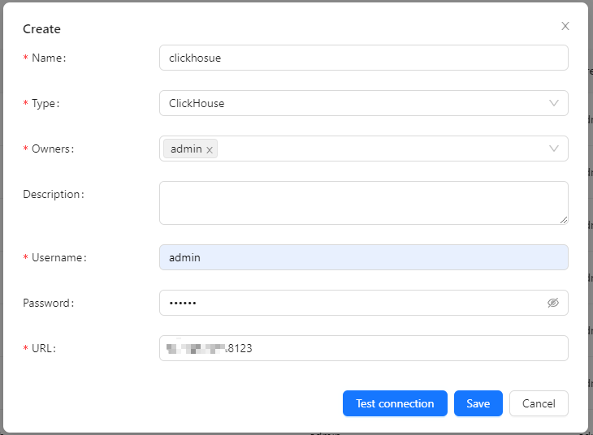
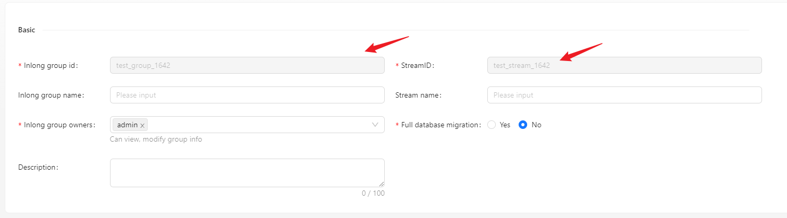
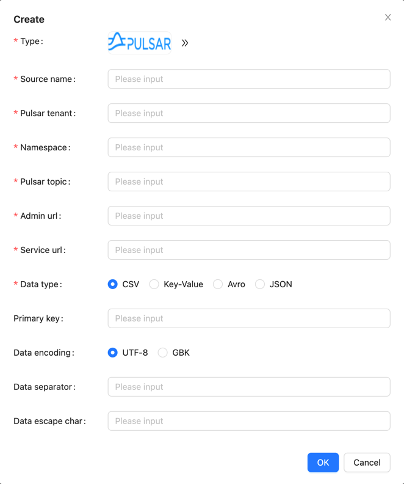
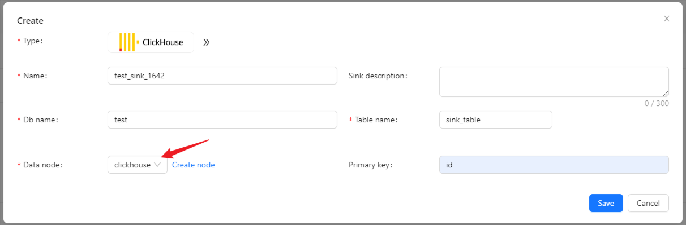
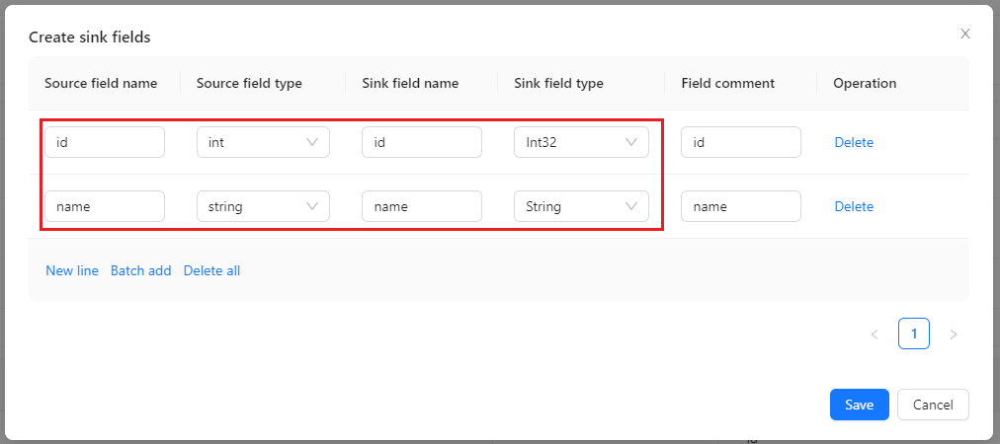
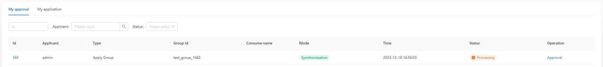
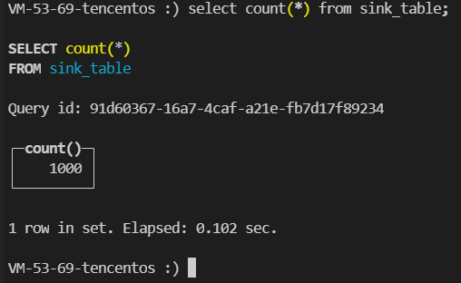

Here we use an example to introduce how to use Apache InLong creating `Pulsar -> ClickHouse` data synchronization.

## Deployment
### Install InLong

Before we begin, we need to install InLong. Here we provide two ways:
- [Docker Deployment](deployment/docker.md) (Recommended)
- [Bare Metal Deployment](deployment/bare_metal.md)

### Add Connectors

Download the [connectors](https://inlong.apache.org/downloads/) corresponding to Flink version, and after decompression, place `sort-connector-jdbc-[version]-SNAPSHOT.jar` in `/inlong-sort/connectors/` directory.

### Install ClickHouse
```shell
docker run -d --rm --net=host --name clickhouse -e CLICKHOUSE_USER=admin -e CLICKHOUSE_PASSWORD=inlong -e CLICKHOUSE_DEFAULT_ACCESS_MANAGEMENT=1 clickhouse/clickhouse-server:22.8
```

## Cluster Initialize
When all containers are successfully started, you can access the InLong dashboard address http://localhost, and use the following default account to log in.
```properties
User: admin
Password: inlong
```

### Register ClickHouse DataNodes

Click [DataNodes] -> [Create] on the page to register ClickHouse DataNodes.



## Create Task
### Create Data Streams Group

Click [Synchronization] → [Create] on the page and input the Group ID and Steam ID:



### Create Data Source
In the data source, click [New] → [Pulsar] to configure the source name, pulsar tenant, namespace, topic and other information.



:::note
- Please create the pulsar tenant, namespace and topic in advance, you can do it by [Pulsar-admin](https://pulsar.apache.org/docs/2.10.x/pulsar-admin/#create-3) 
:::

### Create Data Sink

In the data target, click [New] → [ClickHouse] to configure the name, DB name, table name, and created ck data node.



### Configuration Fields

Configure fields mapping in [Source Field] and [Target Field] respectively, and click [Submit] after completion.



### Approve Data Stream

Click [Approval] -> [MyApproval] -> [Approval] -> [Ok].



Back to [Synchronization] page, wait for [success].

## Test Data
### Send Data

Enter the pulsar container

```shell
docker exec -it pulsar /bin/bash
```

Insert 1000 pieces of data in total
```shell
#!/bin/bash

# Pulsar info
TENANT="public"
NAMESPACE="default"
TOPIC="test"

# Insert data in a loop
for ((i=1; i<=1000; i++))
do
# Generate data
id=$i
name="name_$i"

    # Build one message
    message="$id|$name"

    # Produce message to pulsar
    bin/pulsar-client produce persistent://$TENANT/$NAMESPACE/$TOPIC --messages $message
done
```

### Verify Data

Then enter the ClickHouse container and view the source table data:



## FAQ
ClickHouse fails to write data, you can view the error on the Flink page and check the permissions of the user and table engine used.